<div align="right">

[🇬🇧 English](./README.md) · **🇩🇪 Deutsch**

</div>

<div align="center">
  

  # Inspector Rust 🕵️‍♂️

  > **Ein Hotkey, dein ganzer Werkzeugkasten: Clipboard-History, Text-Expander, Launcher, Screenshots & OCR, Screen-Recording, systemweiter EQ und 70+ Power-Befehle — in einem einzigen nativen Popup für macOS, Windows 11 und Linux. Kein Electron, keine Cloud, keine Telemetrie.**

  Drück **`Ctrl+Space`** irgendwo → rahmenloses Popup über dem aktiven Monitor → Suche durch 1 000 deduplizierte Clipboard-Einträge → Enter pastet zurück in die zuvor fokussierte App. Ganzer Loop unter 200 ms, unter 50 MB RAM, AES-256-GCM-verschlüsselt at-rest mit Keys im OS-Keychain. **Gebaut für die Art Mensch, die schon Muskelgedächtnis für drei Clipboard-Manager hat und von allen genervt ist.**

  <p>
    <a href="https://www.paypal.com/donate/?business=martin.pfeffer@celox.io&item_name=Inspector+Rust&currency_code=EUR">
      
    </a>
  </p>

  <em>Kostenlos, Open-Source, null Telemetrie — eine Person, viele durchgemachte Nächte und eine unvernünftige Menge Espresso. Wenn Inspector Rust dir gerade ein paar hundert Tastenanschläge gespart hat, <a href="https://www.paypal.com/donate/?business=martin.pfeffer@celox.io&item_name=Inspector+Rust&currency_code=EUR">wirf einen Kaffee in die Kasse</a> ☕ — jede Tasse wird wortwörtlich zum nächsten Befehl.</em>

  ### ✨ Was es kann (in kurz)

  *Grob sortiert nach Alltagsnutzen × Engineering-Aufwand dahinter — Flagship-Features zuerst, Easter-Eggs zuletzt.*

  - 📋 **Clipboard-History** — Text, RTF, HTML, PNG, Datei-Listen; 1 000 Einträge per SHA-256 dedupliziert; **Substring-Suche** while-you-type; jeden Clip pinnen + mit Notiz versehen.
  - 🎯 **Text-Expander — 4 Modi**: passive **Auto-Expansion** (aText-Stil — expandiert beim Tippen, kein Hotkey) · In-Popup-Suche · systemweiter Hotkey (AX/UIA In-Place-Replace + Electron-Fallback) · Direkt-Hotkey → Snippet-Slots (geht auch in Terminals). **Dynamische Platzhalter** zur Paste-Zeit: `{date}` / `{date:%d.%m.%Y}`, `{time}`, `{datetime}`, `{clipboard}`, `{cursor}`, `{{`/`}}`.
  - 🧮 **Inline-Rechner** (`2+2`, `sqrt(144)`, Hex/Bit-Ops; Slot-Machine-Reveal), **Einheiten- / Basis- / Zeit-Konverter** (`5 km in mi`, `0xff in dec`, `1700000000 as date`) und **Farb-Konverter** (`#hex` / `rgb()` / `hsl()` in jede Richtung).
  - 🎚️ **Systemweites Audio-EQ — `boom`** (macOS · Windows via [Equalizer APO](https://sourceforge.net/projects/equalizerapo/)) — ein **10-Band-Grafik-Equalizer + Volume-Boost + 20 Presets** auf den *gesamten* System-Sound, plus **5 Enhancement-Effekte** (Bass · Clarity · Fidelity · Ambience-Stereo-Verbreiterung · Night-Kompressor fürs leise Hören), mit Live-Input/Output-Pegelmetern und **wahrnehmungsgerechter Lautstärke-Kurve** (die Standard-Kurve des virtuellen Treibers machte alles unter 40 % fast unhörbar; boom wendet jetzt einen echten Power-Taper an — der Regler fühlt sich wie echte Hardware an). Installiert einen kleinen virtuellen Audio-Treiber direkt aus dem Panel (ein Klick), matcht die Sample-Rate deines Geräts und **folgt deinem Ausgabegerät live** (inkl. Bluetooth). **Akku-schonend:** nach 60 s Stille suspendiert sich die Audio-Bridge selbst, damit der Mac normal schlafen kann — und ist in Millisekunden wieder da, sobald irgendetwas abspielt.
  - 🪟 **Fenster-Management** (macOS, opt-in) — zieh ein Fenster an einen Bildschirmrand zum **Snappen** (linke/rechte Hälfte · oben = maximieren, Magnet-Stil), oder schweb über den grünen Zoom-Button für eine **Moom-artige Palette**: Preset-Layouts (⌥ für Viertel) + ein **Honigwaben-Raster** (16×10 Standard, bis 24 — abgerundete Hexagons mit magnetischem Hover, leuchtender Auswahl und Live-Maßanzeige), über das du ziehst, um das Fenster in jede Bildschirmregion zu legen — mit Live-Umriss-Vorschau auf dem Screen.
  - 📸 **Screenshots — CleanShot-X-Stil**: Region (`Ctrl+Shift+S`) · Vollbild · aktives Fenster · Selbstauslöser · Wiederholen; schwebendes Vorschau-HUD; **Annotations-Editor** (Pfeil / Linie / Text / Rechteck / Ellipse / Highlight / Blur / Schwärzen / nummerierte Schritt-Badges); **an Bildschirm pinnen**. Dateinamen enthalten die Quell-App.
  - 🎥 **Bildschirmaufnahme** (`Ctrl+Shift+Alt+S`) — Region ziehen → Audio wählen (System / Mikro / beide) → 3-2-1 → **MP4 (H.264)** nach Downloads; schwebende Leiste mit **Pause/Resume**; Multi-Monitor; System-Audio routet automatisch über ein Loopback. Braucht ffmpeg.
  - 🔍 **Bildschirm-OCR** (`Ctrl+Shift+O`) — Apple Vision (macOS) / WinRT (Windows) / Tesseract (Linux). PDF-Qualität-Texterkennung ins Clipboard.
  - 🎬 **Medien-Tools** — **Download** von YouTube / Instagram / TikTok / Facebook (Video oder Audio — einfach eine URL einfügen; Tab toggelt bei YouTube); **Audio-Swap** (`Ctrl+Shift+Alt+M`) ersetzt oder mischt den Ton eines Videos mit einer lokalen Datei oder einem YouTube-Track; **Trim** von Audio/Video (`trim`) verlustfrei-schnell oder frame-genau. Brauchen ffmpeg / yt-dlp.
  - ⏱️ **Zeiterfassung / Timesheet** (`track on/off`; `track` oder **`Ctrl+Shift+T`**; macOS) — opt-in, event-basierte App-Nutzungserfassung per Fensterfokus mit rückwirkender Idle-Auto-Pause; ein editierbarer **Timesheet-Tab** mit Tages-/Wochen-Ansicht, Inline-SVG-Charts (Timeline · App-Donut · Kategorien · Projekte), **manueller Pause/Weiter-Taste**, CSV- + eigenständigem HTML-Export im sichtbaren Umfang (Tag oder Mo–So-Woche), **wochenweitem Aufräumen** und globalem **Tracking-Hotkey** (`Ctrl+Shift+Alt+T`, umbelegbar); erkennt **Claude-Code**-Nutzung pro Projekt (Zeit + Tokens); optionale **Browser-Extension** (nur Loopback-Socket). Fenstertitel + URLs at-rest verschlüsselt.
  - 📊 **System-Stats** (`stats`) — Live-Inline-Dashboard: CPU (gesamt + pro Kern), Speicher + Swap, **Akku & Leistungsaufnahme in Watt**, Temperaturen + **Lüfter-RPM** (SMC / hwmon), Disks, Live-Netzwerk-Durchsatz, Uptime. **Live ↔ History**-Umschalter mit Linien-Charts pro Metrik (1 h / 6 h / 24 h / 7 d).
  - ☀️ **Monitor-Helligkeit** (`brightness` / `bri`) — Slider inline in der Vorschau für interne *und* externe Displays (**↑↓** Monitor wählen, **←→** anpassen). Software-(Gamma-)Dimming auf macOS + Windows, Hardware-DDC/CI auf Linux. Auf **EDR-fähigen Macs** (14"/16" MBP XDR, Pro Display XDR) läuft *derselbe* Slider **über 100 %** hinaus und hebt das Display in seinen **Extra-Helligkeits-Bereich (EDR/XDR)** — Vivid-Stil, bis ~7× — via Multiply-Blend-Metal-Overlay; macOS drosselt thermisch automatisch (gleicher Pfad wie HDR-Video, innerhalb der Spezifikation).
  - 💡 **Philips Hue** (`hue`) — steuere deine Lampen inline: Alle-Lampen an/aus + Helligkeit, Helligkeit pro Lampe, 8 Farb-Preset-Swatches auf Farb-Bulbs. Plus eine **Beat-Sync**-Disco, die die Lampen zur Musik vom Mikro pulsen lässt. Lokales LAN-Pairing (Discovery oder IP + Link-Button); keine Cloud.
  - 🖐️ **Touchpad-Gesten** (opt-in) — **3-Finger-Swipe** hoch/runter für Lautstärke (konsistente 5-%-Raster-Schritte), **3-Finger-Tap** zum Stummschalten, plus **Tip-Tap-Tab-Wechsel** (macOS): **zwei** Finger auflegen, mit einem dritten rechts/links daneben tippen → nächster/voriger Tab — dabei sendet IR automatisch **den passenden Shortcut jeder App** (Ctrl+Tab für Browser/Terminals/Finder, ⌘⌥→/← für VS Code/Cursor, ⇧⌘]/[ für JetBrains/Xcode — layoutbewusst aufgelöst, z. B. ⌥6 auf Deutsch). Die Per-App-Zuordnung ist eine mitgelieferte Daten-Datei + User-Override-JSON (`tab-shortcuts.json` im App-Datenordner) — jede weitere App ist ein Eintrag, kein Rebuild. **Palm-Rejection** (macOS): ein aufliegender Handballen zählt nie als Gestenfinger (Größen- + Ruhe- + Bewegungs-Guards, libinput-/Karabiner-Stil) — keine versehentlichen Lautstärke-Swipes mehr beim Scrollen. **Zuverlässige Tap-Erkennung**: leichte Mehr-Finger-Taps, die das Trackpad als aufeinanderfolgende Einzel-Berührungen meldet, werden zu einem sauberen Tap zusammengefasst (Settle-basierte Erkennung) — ein 3-Finger-Tap toggelt Mute exakt einmal, und ein leicht driftender Finger macht aus einem Tap keinen Lautstärke-Swipe. macOS via die private MultitouchSupport-API (schluckt den Swipe, damit das Fenster darunter nicht scrollt); Windows Precision Touchpad; Linux libinput.
  - 🔐 **2FA / TOTP-Manager** — tippe `2fa` *oder* `otp` für den TOTP-Tresor — **einfach lostippen filtert die Liste** (fuzzy, Enter kopiert den Code des Top-Treffers); `otp <issuer>` / `2fa <issuer>` für sofortige OTP-Autovervollständigung mit Live-30-Sekunden-Countdown, Enter kopiert den Token; **`2fa add [issuer]`** springt direkt ins Anlege-Formular (Issuer vorbefüllt). **Hinzufügen / Bearbeiten / Löschen, Drag-Umsortieren und Dedup beim Import**; importiert Google Authenticator / Aegis / 2FAS / **OTPManager (macOS)** / `otpauth` — einfügen *oder* Export-Datei aufs Overlay ziehen. Secrets verschlüsselt, überqueren nie die IPC-Grenze.
  - 🔊 **Audio-Ausgabe** (`sound` / `audio`) — Inline-Picker zum Umschalten des System-Standard-Ausgabegeräts (macOS · Windows · Linux).
  - 🎵 **Song-Erkennung — `shazam`** — tippe `shazam`, und es nimmt ~10 s vom Mikrofon auf, erzeugt nativ in Rust einen Shazam-Audio-Fingerprint (keine Datei, kein ffmpeg) und identifiziert den Track: Cover, Titel, Künstler, Album, Genre, Jahr + Link zum Öffnen in Shazam. `shazam history` öffnet die Liste erkannter Songs. Bit-genau gegen die Referenz und end-to-end gegen den echten Dienst verifiziert.
  - 🕵️ **Netzwerk-Monitor — `snitch`** (macOS) — listet jede App mit aktiver Verbindung und lässt dich ihren Internetzugang abschalten (**best-effort**: ein Hintergrund-Watcher schiebt die Server-IPs einer geblockten App in die pf-Firewall — ein Admin-Prompt, keine echte Firewall; ein echter per-App-Filter bräuchte ein Apple-System-Extension-Entitlement, das eine selbstsignierte App nicht hat). **`snitch map`** zeichnet deine laufenden Outbound-Verbindungen auf eine Offline-Punkt-Weltkarte — Verbindungen, über die **gerade Daten fließen, leuchten grün mit animierten Paketen** entlang eines Bogens von deinem Standort — jeder Server nach Land/Stadt/ISP verortet (nur öffentliche IPs — LAN-Adressen verlassen den Rechner nie). Beim Tippen von `snitch` erscheinen Blocker und Karte als wählbare Zeilen.
  - 🧹 **Aufräumen** (`clean`) — Speicherplatz freigeben durch Löschen von Cache-/Log-/Temp-Dateien in bekannt-sicheren Ordnern. Auf **Standard** wird das komplette Nutzer-Cache-Verzeichnis gefegt (`~/Library/Caches` — oft viele GB); opt-in **Aggressive** ergänzt Dev-Tool-Caches (npm/pnpm/Gradle/Cargo inkl. Sources), Xcode-Build-Caches und alte Papierkorb-Einträge. Enter öffnet einen **interaktiven Kategorien-Picker** (Größen, Dateianzahl, größte Dateien — du wählst genau, was weg soll) — inklusive **Duplikaten in Downloads** (inhalts-gehasht, das älteste Exemplar bleibt immer erhalten), **alten Installern** (dmg/pkg/iso), **Editor-Caches** (VS Code / Cursor), **Xcode DerivedData + iOS DeviceSupport** und dem **Docker-Build-Cache** (via `docker builder prune`) — riskante Kategorien sind vorab abgewählt, Nutzerdateien nie Default; strikte Allowlist, Symlinks werden nie verfolgt; Safe / Standard / Aggressive.
  - 🎨 **Farbpipette** (`Ctrl+Shift+C`) — eigene Bildschirm-Lupe mit **Live-Hex unter der Vergrößerung** (macOS) / GDI-Overlay (Windows); Hex direkt ins Clipboard.
  - 🖼️ **Bild-Tools** — Recolor (Logo-Tint), ML-**Freisteller** (U²-Net ONNX, 4,5 MB eingebettet), Lanczos3-**Resize** (`rz`) + **Optimieren** (`optim`, oxipng) auf die Finder-Auswahl oder das Clipboard-Bild.
  - 📁 **Finder-Auswahl-Aktionen** (`Ctrl+Shift+F`, macOS) — Batch-Resize / -Optim / -Freisteller / -Öffnen auf alles, was du im Finder ausgewählt hast.
  - 📄 **Markdown → PDF** (`Ctrl+Shift+M` / `md2pdf`, macOS) — konvertiert die im Finder ausgewählten `.md`-Dateien in-process zu PDF; keine CLI-Tools nötig.
  - 🚀 **App-Launcher** (Spotlight-artig, macOS) — App-Name fuzzy matchen, echtes Icon in der Zeile, Enter startet. Aktiviert eine bereits laufende Instanz statt ein Duplikat zu starten.
  - 🔳 **QR-Code** (`qr <text>`) — Live-Vorschau im Panel; Enter kopiert das PNG ins Clipboard.
  - 🛠️ **Dev-Quick-Tools** — `uuid [n]` · `slug` · `hash` (SHA-256) · `json` (Clipboard pretty-printen) · `jwt` (Clipboard dekodieren) → Clipboard.
  - 🎲 **Fake-Testdaten — `faker`** *(v0.84.270+)* — 70+ Generatoren (Namen, E-Mails, Adressen, Telefon, Firmen, Finanzen, Lorem, Datum, Zahlen, UUID/…, plus Composite-Records **person / user / address / order**) in 14 Locales. `faker` allein listet sie mit Live-Samples; `faker person 50 --csv @de` → 50 deutsche Datensätze als CSV im Clipboard, ein Enter. `--json` / `--sql` / `--ts`, `faker int 1..100`, `--seed=` reproduzierbar, ⌘/Ctrl+R würfelt neu, `faker tpl "{name} <{email}>"`. Ehrlicher Locale-Fallback (nicht unterstützt → EN, sichtbar). Auch `{faker:first_name}` in Snippets. Siehe [docs/faker.md](./docs/faker.md).
  - 🛡️ **Security-Command-Builder — `sec`** *(v0.84.271+)* — geführte Command-Builder für **nmap · sqlmap · feroxbuster · John**. Preset wählen, Ziel eintragen; Inspector Rust baut die korrekte (sh/bash-gequotete) Kommandozeile mit Flag-Erklärungstabelle — `nmap service 10.0.0.5` → `nmap -sV -sC 10.0.0.5`. **Enter kopiert; ⌘/Ctrl+Enter öffnet dein Terminal** mit dem eingefügten Command (macOS, opt-in, standardmäßig nicht abgeschickt). **Scannt nie selbst** — kein Subprozess, kein Netzwerk. Nur autorisierte Ziele. Siehe [docs/security-builder.md](./docs/security-builder.md).
  - 🌐 **Web-Such-Bangs** — `g` · `ddg` · `gh` · `yt` · `npm` · `crates` · `so` · `mdn` · `wiki` `<query>` öffnen die Suche der jeweiligen Seite.
  - 🥁 **BPM-Detektor** (`bpm`) — Live-Beat-Erkennung über das Mikro mit animiertem AAA-Visualizer. Nimmt nativ (in Rust) auf, sodass der Start die Wiedergabe anderer Apps nie unterbricht.
  - 💸 **Bruno (Brutto/Netto)** — deutscher Netto-Rechner 2025 als Suchleisten-Command, für **Angestellte UND Selbständige**: `bruno 60000` (Gehalt) oder `bruno 80000f` / `bruno 90000-15000f` (Gewinn bzw. Einnahmen − Ausgaben) mit freiwilliger GKV oder PKV-Fixbeitrag, Gewerbesteuer inkl. §35-Anrechnung, Grund-/Splittingtarif. Shift+Enter kopiert die komplette Aufstellung. Smarte Defaults + Pro-User-Override in den Einstellungen.
  - ⚙️ **Power-Commands** — die Suchleiste parst Dutzende Shell-artige Commands: Übersetzen (`tr` / `tren` / `trde` / `trde2it` / …), System (`kill` / `lock` / `reboot` / `shutdown` / `mute` / `freeze`), `rnd` / `random` (Würfeln), `timer` / `alarm <HH:MM>`, `touch` / `mkdir` / `terminal` (im offenen Finder-Ordner), `rmvvls`, `pwgen`, `meme [query]`, `calendar [monat jahr]` (Monatsansicht — welcher Wochentag war Datum X?) — plus jedes oben genannte Command. Fuzzy-gematcht, immer über den Clips, mit rotem Akzent gerendert. Ein **`?`** hinter einem Command (oder `?` allein) zeigt die volle **Inline-Hilfe** — Argumente, Beispiele, Tipps — direkt im Preview (auf Englisch).
  - 📓 **Snippets** (27 mitgelieferte KI-Prompts + 255 Material-Farben, **in Gruppen organisiert** — filtern, zuweisen, anlegen/umbenennen/sortieren/löschen) · **Notes** (persistente Bookmarks) · **Backup** (komplette App als eine Datei — inkl. 2FA + alle Settings + Snippet-Gruppen, Timesheet optional; optional passwort-verschlüsselt, Import mit Inline-Passwortabfrage).
  - 🟢 **Keep-alive & Wakelock** — `wakelock on/off` (Alias `caffeine`) hält die Maschine wach (pulsierende Footer-LED + On-Screen-Toast); **„Always keep running"** (Einstellungen → Startup) startet die App nativ neu, falls sie je beendet/gekillt wird.
  - 🔒 **Local-first** — null Netzwerk-Calls, null Account; Daten nur unter `~/Library/Application Support/InspectorRust/history.db`, AES-256-GCM-verschlüsselt mit Keys im OS-Keychain.
  - 🎮 **Versteckte Spiele** — fünf Easter-Egg-Triggerwörter. Du wirst sie finden.

  ### 🧰 Tech-Stack

  Tauri 2 (WebView2 / WKWebView) · Rust-Workspace (`core/rust-lib` geteilt, 2-Zeilen-Per-OS-Bundle-Shells) · React 19 + TypeScript 5 + Tailwind v4 + Vite 7 · Helligkeit via CoreGraphics/GDI-Gamma + DDC/CI (`ddc-hi`). **3447 Unit-Tests (1307 Rust + 2140 Frontend).** MIT-lizenziert.

  <!-- ── Headline-Kennzahlen — XXL Hero-Badges ─────────────────── -->
  <p>
    <a href="https://github.com/pepperonas/inspector-rust" title="Codezeilen (Rust + TypeScript Quellcode)">
      
    </a>
    &nbsp;
    <a href="https://github.com/pepperonas/inspector-rust/actions/workflows/ci.yml" title="Unit-Tests — 1307 Rust + 2140 Frontend, alle grün">
      
    </a>
  </p>

  <!-- ── Highlights — prominente (for-the-badge) Badges ────────── -->
  <p>
    <a href="./LICENSE"></a>
    <a href="https://github.com/pepperonas/inspector-rust/releases/latest"></a>
    <a href="#"></a>
    <a href="https://tauri.app"></a>
    <a href="https://rustup.rs"></a>
    <a href="#"></a>
    <a href="./scripts/check.sh"></a>
  </p>

  <!-- ── Status / release ─────────────────────────────────────── -->
  [](https://github.com/pepperonas/inspector-rust/actions/workflows/ci.yml)
  [](https://github.com/pepperonas/inspector-rust/actions/workflows/release.yml)
  [](https://github.com/pepperonas/inspector-rust/commits/main)
  [](https://github.com/pepperonas/inspector-rust/issues)
  [](https://github.com/pepperonas/inspector-rust/stargazers)
  [](https://github.com/pepperonas/inspector-rust/commits/main)
  [-success?style=flat-square)](https://github.com/pepperonas/inspector-rust/actions/workflows/ci.yml)
  [](./CONTRIBUTING.md)
  [](./scripts/check.sh)
  [](https://github.com/pepperonas/inspector-rust/releases)
  [](#)
  [](https://github.com/pepperonas/inspector-rust/commits/main)
  [](#)
  [](#)
  [](https://github.com/pepperonas/inspector-rust/releases/latest)
  [](https://www.conventionalcommits.org)
  [](https://semver.org)

  <!-- ── Platforms ────────────────────────────────────────────── -->
  [](./win)
  [](./macos)
  [](./macos)
  [](#)
  [](./linux/README.md)
  [](#)
  [](https://developer.microsoft.com/microsoft-edge/webview2/)
  [](#)

  <!-- ── Stack ────────────────────────────────────────────────── -->
  [](https://react.dev)
  [](https://www.typescriptlang.org)
  [](https://vitejs.dev)
  [](https://tailwindcss.com)
  [](https://pnpm.io)
  [](https://nodejs.org)
  [](https://sqlite.org)
  [](https://onnxruntime.ai)
  [](#)
  [](https://github.com/xuebinqin/U-2-Net)
  [](https://github.com/rusqlite/rusqlite)
  [](https://github.com/madsmtm/objc2)
  [](https://github.com/microsoft/windows-rs)
  [](#)
  [](https://ffmpeg.org)
  [](https://github.com/yt-dlp/yt-dlp)
  [](https://github.com/shssoichiro/oxipng)
  [](https://github.com/ExistentialAudio/BlackHole)
  [](#)
  [](#)
  [](#)
  [](#)
  [](#)
  [](https://doc.rust-lang.org/edition-guide/)
  [](https://github.com/GuillaumeGomez/sysinfo)
  [](https://github.com/starship/rust-battery)
  [](https://github.com/chronotope/chrono)
  [](https://github.com/algesten/ureq)
  [](https://github.com/image-rs/image)
  [](https://github.com/Amanieu/parking_lot)
  [](https://github.com/RustCrypto/password-hashes)

  <!-- ── Security & ergonomics ───────────────────────────────── -->
  [](./docs/encryption.md)
  [](./docs/encryption.md)
  [](#)
  [](#)
  [](#)
  [](#)
  [](#)

  <!-- ── Quality ─────────────────────────────────────────────── -->
  [](https://eslint.org)
  [](https://vitest.dev)
  [](#)
  [](#)
  [](#)
  [](#)
  [](https://prettier.io)

  <!-- ── Community ───────────────────────────────────────────── -->
  [](https://github.com/pepperonas/inspector-rust/issues)
  [](https://github.com/pepperonas/inspector-rust/issues?q=is%3Aissue+is%3Aclosed)
  [](https://github.com/pepperonas/inspector-rust/pulls)
  [](https://github.com/pepperonas/inspector-rust/stargazers)
  [](https://github.com/pepperonas/inspector-rust/network/members)
  [](https://github.com/pepperonas/inspector-rust/watchers)
  [](https://github.com/pepperonas/inspector-rust/graphs/contributors)
  [](https://github.com/pepperonas/inspector-rust/commits/main)
  [](https://github.com/pepperonas/inspector-rust/commits/main)
  [](https://github.com/pepperonas/inspector-rust)
  [](https://github.com/pepperonas/inspector-rust)
  [](https://github.com/pepperonas/inspector-rust)
  [](https://github.com/pepperonas/inspector-rust)
  [](#)

  <!-- ── Architecture & build ────────────────────────────────── -->
  [](./pnpm-workspace.yaml)
  [](./Cargo.toml)
  [](#)
  [](#)
  [](#)
  [](#)
  [](#)
  [](#)
  [](#)

  <!-- ── Features (numerical) ────────────────────────────────── -->
  [](#)
  [](./core/rust-lib/src/commands.rs)
  [](./core/rust-lib/src/commands.rs)
  [](#)
  [](./core/rust-lib/src)
  [](./docs/ai-prompts.md)
  [](#)
  [](#)
  [](#)
  [](./docs/encryption.md)
  [](#)
  [](./docs/text-expander.md)
  [](#)
  [](./docs/timesheet.md)
  [](./docs/encryption.md)
  [](./core/rust-lib/src)
  [](./core/frontend/src)
  [](#)
  [](#)
  [](#)
  [](#)
  [](#)
  [](#)
  [](#)
  [](#)

  <!-- ── Features ────────────────────────────────────────────── -->
  [](#)
  [](#)
  [](#)
  [](#)
  [](#)
  [](#)
  [](#)
  [](#)
  [](#)
  [](#)
  [](#)
  [](https://m3.material.io)
  [](#)
  [](#)
  [](#)
  [](#)
  [](#)
  [](#)
  [](#)
  [](#)
  [](#)
  [](#)
  [](#)
  [](#)
  [](#)
  [](#)
  [](#)
  [](#)
  [](#)
  [](#)
  [](#)
  [](./docs/figlet.md)
  [](#)
  [](#)
  [](#)
  [](./docs/faker.md)
  [](./docs/security-builder.md)
  [](./docs/inline-help.md)
  [](./docs/clipboard-shapes.md)
  [](./docs/translation.md)
  [](#)
  [](#)
  [](#)
  [](#)
  [](#)
  [](#)
  [](#)
  [](#)
  [](./docs/colors.md)
  [](#)
  [](#)
  [](#)
  [](#)
  [](./docs/snippets-import.md)
  [](./docs/text-expander.md)
  [](./docs/notes.md)
  [](./docs/backup.md)
  [](#)
  [](#)
  [](#)
  [](#)
  [](#)
  [](#)
  [](#)
  [](#)
  [](#)
  [](#)
  [](#)
  [](#)
  [](#)
  [](#)

  <!-- ── Standards / conventions ─────────────────────────────── -->
  [](https://semver.org)
  [](https://keepachangelog.com)
  [](https://www.conventionalcommits.org)
  [](#)
  [](./CHANGELOG.md)

  <!-- ── Permissions / OS surfaces ───────────────────────────── -->
  [](./macos/README.md#macos-permissions)
  [](./macos/README.md#macos-permissions)
  [](./macos/README.md#macos-permissions)
  [-000000?style=flat-square&logo=apple&logoColor=white)](./macos/README.md#macos-permissions)
  [](./CHANGELOG.md)
  [](#)

  <!-- ── Tech (extended) ─────────────────────────────────────── -->
  [](https://crates.io/crates/rusqlite)
  [](https://crates.io/crates/enigo)
  [](https://crates.io/crates/clipboard-rs)
  [](https://crates.io/crates/ort)
  [](https://crates.io/crates/ring)
  [](https://crates.io/crates/objc2)
  [](https://lucide.dev)
  [](https://tanstack.com/virtual)

  <!-- ── Vibes ───────────────────────────────────────────────── -->
  [](#)
  [](#)
  [](#)
  [](./LICENSE)
  [](#)

  <!-- ── Neu dazugekommen ────────────────────────────────────── -->
  [](#)
  [](#)
  [](#)
  [](#)
  [-1f6feb?style=flat-square)](#)
  [-1DB954?style=flat-square)](https://lrclib.net)
  [](#)
  [](#)
  [](#)
  [](#)
  [](./docs/snippets-import.md)

  <!-- ── Tech (noch mehr) ────────────────────────────────────── -->
  [](https://openweathermap.org)
  [](https://ip-api.com)
  [](https://crates.io/crates/rustfft)
  [](https://crates.io/crates/cpal)
  [](#)
  [](./docs/translation.md)
  [](./docs/translation.md)
  [](https://lrclib.net)
  [](https://crates.io/crates/figlet-rs)
  [](https://crates.io/crates/pulldown-cmark)
  [](https://simpleicons.org)
  [](#)
  [](#)
  [](https://sourceforge.net/projects/equalizerapo/)

  <!-- ── Testing (erweitert) ─────────────────────────────────── -->
  [](https://github.com/capricorn86/happy-dom)
  [](#)
  [](#)
  [](./.github/workflows/ci.yml)
  [](#)
  [](#)

  <!-- ── Mehr Vibes ──────────────────────────────────────────── -->
  [](https://www.paypal.com/donate/?business=martin.pfeffer@celox.io&item_name=Inspector+Rust&currency_code=EUR)
  [](https://celox.io)
  [](#)
  [](#)
  [](#)
  [](#)
  [](./features.txt)
  [](#)
  [](https://www.linkedin.com/)

  Drück `Ctrl+Space` → suchen → einfügen. Inspiriert von Alfreds Clipboard-Viewer auf macOS, eingedampft auf ein Tool, das du auf jeder Maschine behalten kannst.
</div>

---

## Screenshots

*Dark Theme auf macOS, mit Demo-Clipboard-History — Dummy-Daten, keine echten Clips.*

| | |
|---|---|
| 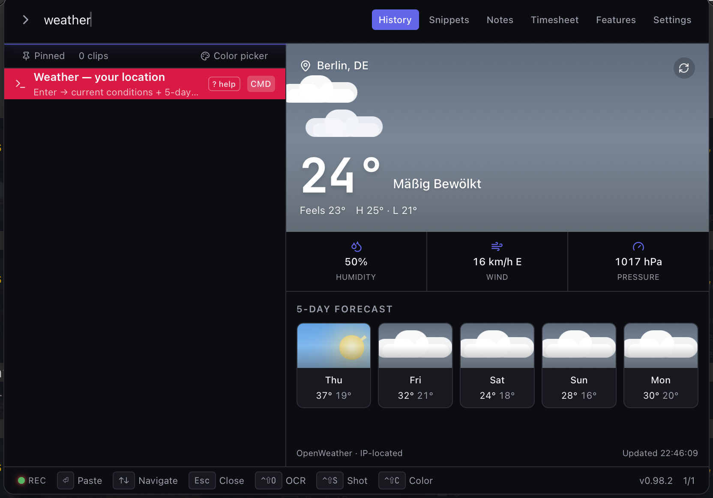 | 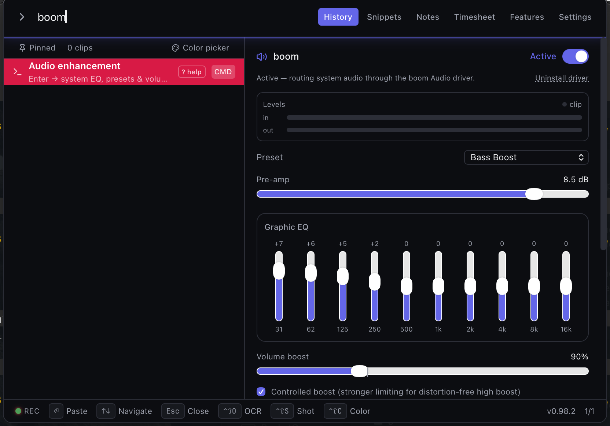 |
| **`weather`** — aktuelles Wetter, nächste 12 h + animierte 5-Tage-Vorschau | **`boom`** — systemweiter 10-Band-EQ + Presets + Volume-Boost |
| 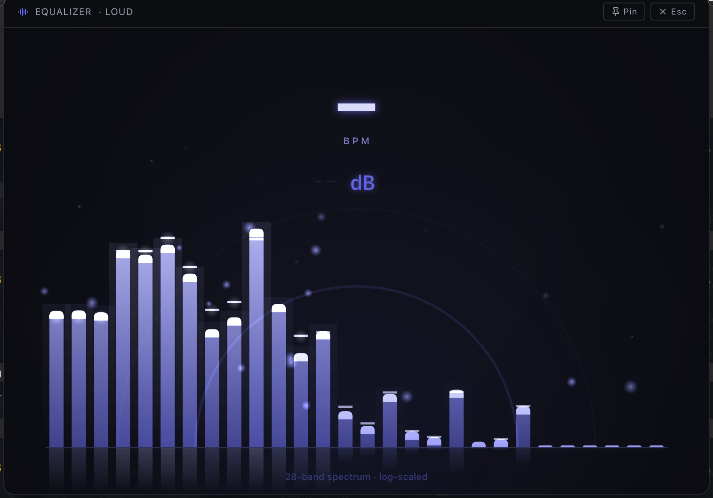 | 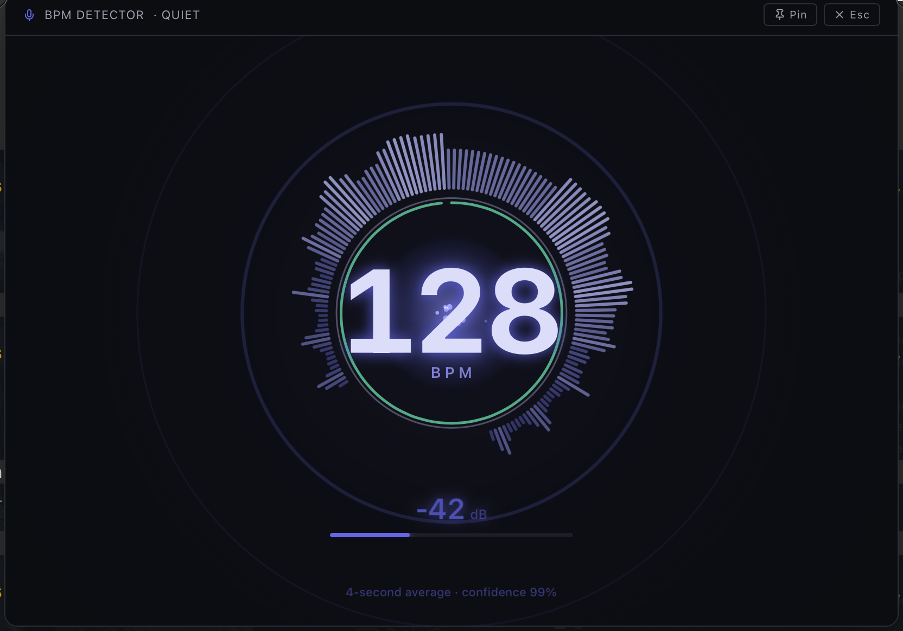 |
| **`equalizer`** — Live-28-Band-Mikro-Spektrum + Beat-Reaktion | **`bpm`** — Live-Mikro-Tempo-Detektor (128 BPM · 99 % Konfidenz) |
| 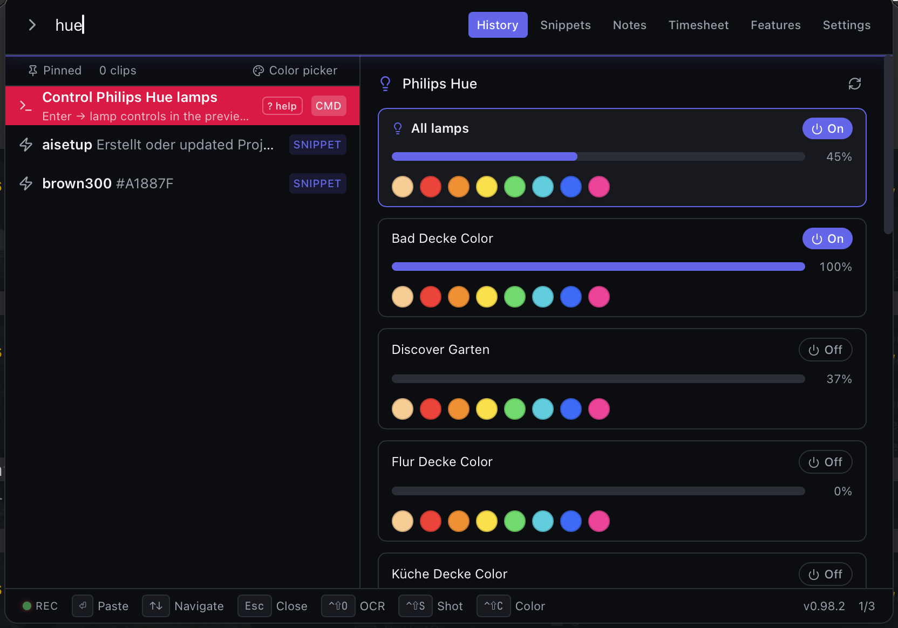 | 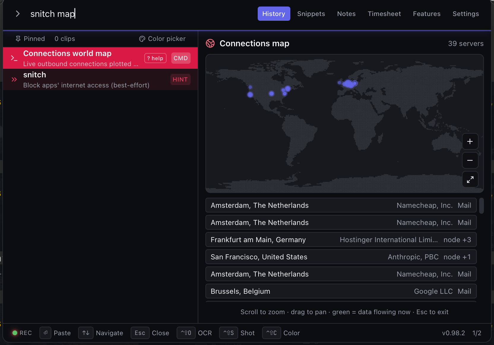 |
| **`hue`** — Philips Hue: Farbe + Helligkeit pro Lampe | **`snitch map`** — laufende Outbound-Verbindungen auf einer Weltkarte |
| 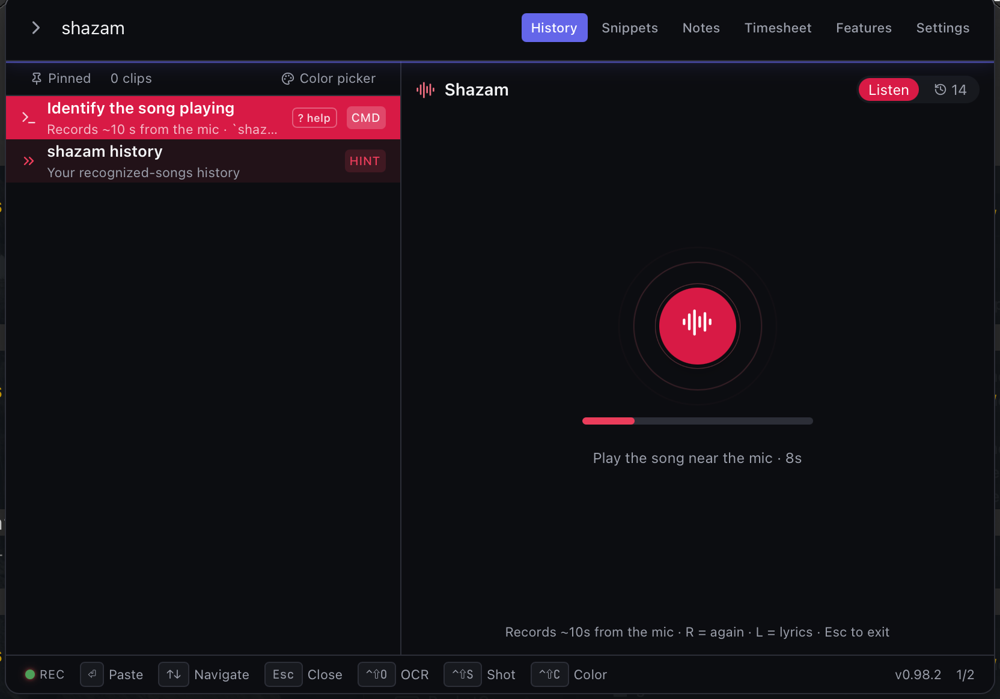 | 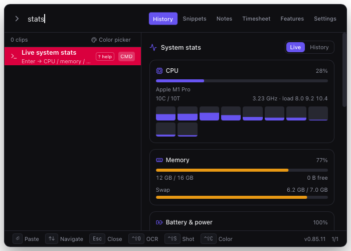 |
| **`shazam`** — den laufenden Song über das Mikro erkennen | **`stats`** — Live-Dashboard für CPU / RAM / Akku / Netzwerk |
| 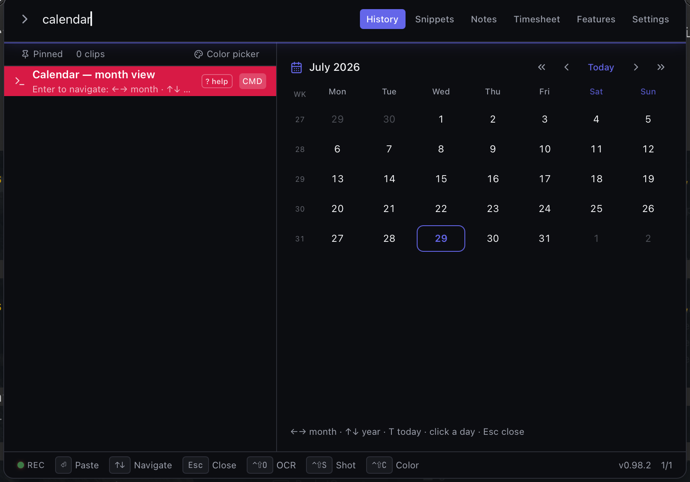 | 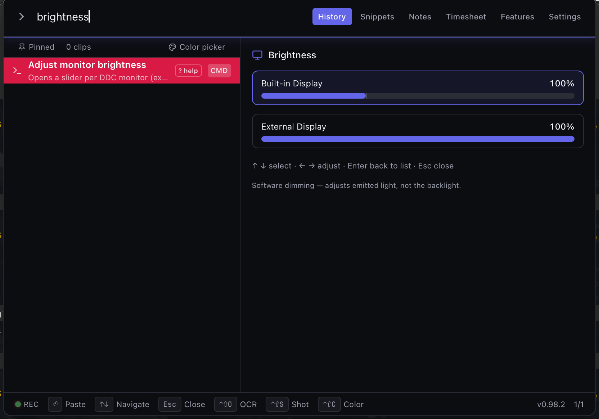 |
| **`calendar`** — Monatsansicht + Wochentag-Recherche | **`brightness`** — Slider pro Monitor (+ EDR/XDR-Boost) |
| 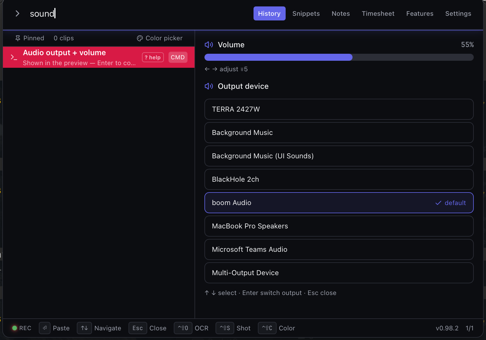 | 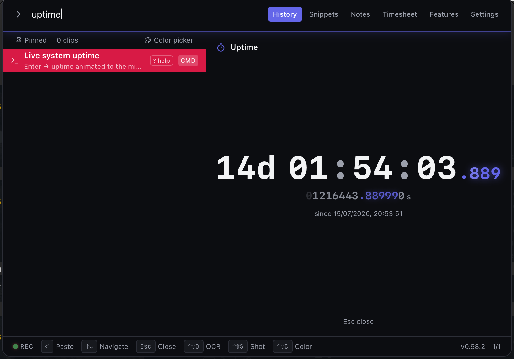 |
| **`sound`** — Audio-Ausgabe-Wähler + Lautstärke-Slider | **`uptime`** — Live-animierte Uptime-Anzeige |
| 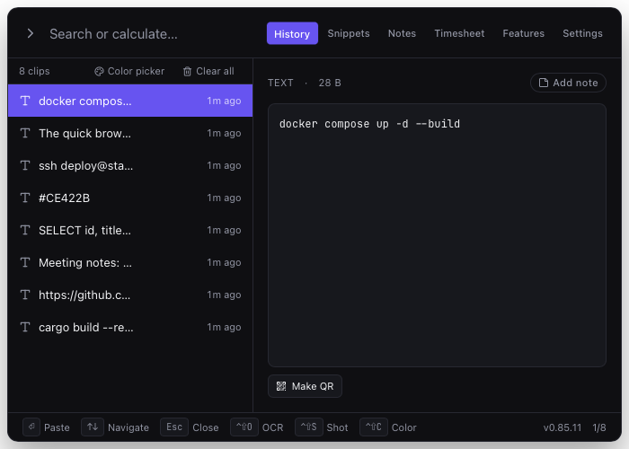 | 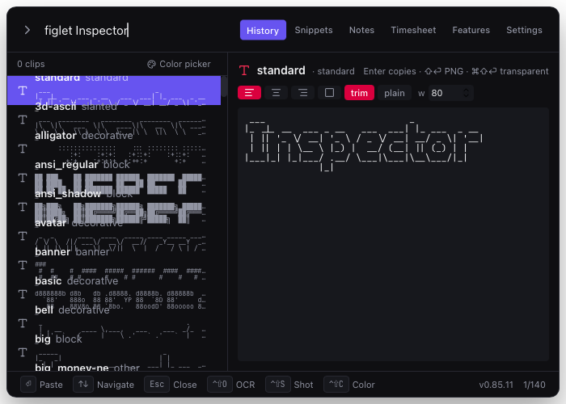 |
| **Clipboard-History** — Suche beim Tippen, Live-Vorschau, Notizen + QR | **`figlet`** — ASCII-Banner-Galerie; jede Zeile rendert *deinen* Text |
| 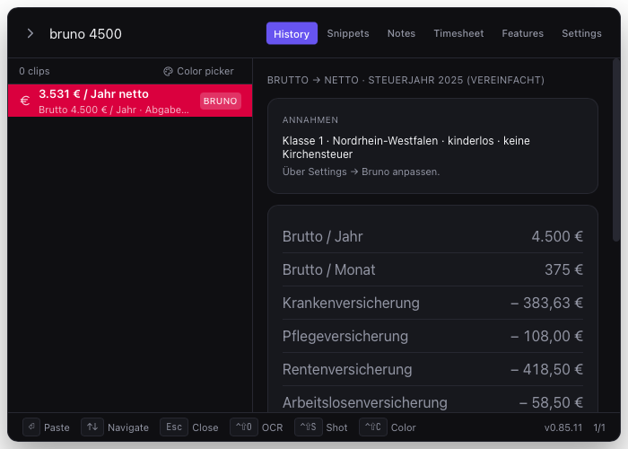 | 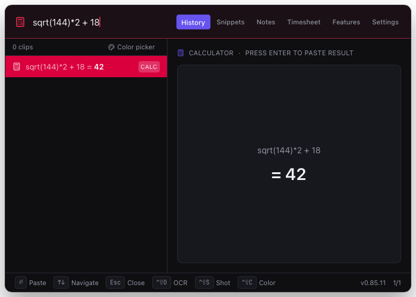 |
| **`bruno`** — deutsche Brutto→Netto-Aufstellung | **Inline-Rechner** — Ausdruck tippen, Enter fügt das Ergebnis ein |
| 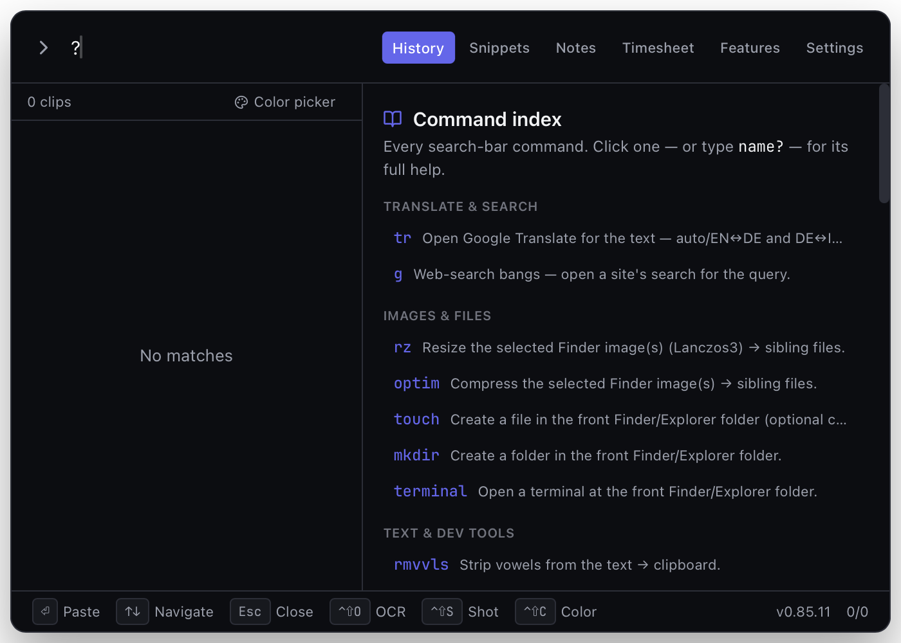 | |
| **`?`** — eingebauter Befehls-Index & Inline-Hilfe | |

## Download

**Aktueller Release:** [](https://github.com/pepperonas/inspector-rust/releases/latest) — siehe [CHANGELOG](./CHANGELOG.md) für die Neuerungen.

| Plattform | Datei | Hinweise |
|-----------|-------|----------|
| **Windows 11 / 10** | [`InspectorRust_<ver>_x64_en-US.msi`](https://github.com/pepperonas/inspector-rust/releases/latest) | MSI-Installer — fügt Startmenü-Eintrag & Uninstaller hinzu |
| **Windows 11 / 10** | [`inspector-rust.exe`](https://github.com/pepperonas/inspector-rust/releases/latest) | Standalone-Exe — keine Installation nötig |
| **macOS 10.15+ (Apple Silicon)** | [`InspectorRust_<ver>_aarch64.dmg`](https://github.com/pepperonas/inspector-rust/releases/latest) | DMG für arm64-Macs |
| **macOS Intel** | — | Nicht baubar: die ONNX-Runtime-Abhängigkeit liefert kein Intel-macOS-Binary — [Details](./macos/README.md#apple-silicon-only-x86_64-does-not-build) |
| **Linux (Ubuntu/Debian)** | Aus Source bauen — siehe [`linux/README.md`](./linux/README.md) | `.deb` + AppImage via `pnpm build:linux` |

> **macOS-Gatekeeper-Hinweis.** Releases sind ad-hoc-signiert, **nicht von Apple notarisiert**. Ein von GitHub geladenes DMG wird vom Browser unter Quarantäne gestellt; macOS behauptet dann, die App sei **"beschädigt und kann nicht geöffnet werden"** — ist sie nicht, und Rechtsklick → **Öffnen** hilft gegen genau diese Meldung *nicht*. App in den Programme-Ordner ziehen, dann das Attribut einmalig entfernen:
>
> ```bash
> xattr -dr com.apple.quarantine /Applications/InspectorRust.app
> ```
>
> (Bei einem lokal gebauten Build wird das Attribut nie gesetzt — nur für Downloads nötig.) Danach die TCC-Berechtigungen erteilen:
>
> | Berechtigung | Benötigt für |
> |--------------|-------------|
> | **Bedienungshilfen** | Paste (`enigo` synthetisiert `Cmd+V`), system-weiter Text-Expander, `freeze`-Eingabesperre |
> | **Bildschirmaufnahme** | OCR (`Ctrl+Shift+O`) und Screenshot-Region (`Ctrl+Shift+S`) |
> | **Automation → Finder** | Finder-Selektion (`Ctrl+Shift+F`) und Markdown→PDF (`Ctrl+Shift+M`) |
> | Mikrofon *(optional)* | BPM-Detektor (Befehl `bpm`) |
>
> Der Settings-Tab zeigt fehlende Grants als zusammenklappbare amber Banner mit Ein-Klick-Sprung zum richtigen Privacy-Pane. `scripts/install-macos.sh` signiert jeden Build mit einem **stabilen selbstsignierten Zertifikat**, sodass alle Grants künftige Rebuilds überleben — jede Berechtigung wird nur einmal erteilt. `scripts/grant-permissions-macos.sh` führt durch das einmalige Setup in einem geführten Durchlauf.
>
> Vollständige Details in [`macos/README.md`](./macos/README.md#macos-permissions).

---

## Plattform-Support

| Plattform  | Status              | Verzeichnis           |
|------------|---------------------|-----------------------|
| Windows 11 | ✅ implementiert     | [`win/`](./win)         |
| macOS      | ✅ implementiert     | [`macos/`](./macos)     |
| Linux      | ✅ implementiert     | [`linux/`](./linux)     |

Die gesamte App-Logik lebt in [`core/`](./core) — ein einzelnes Frontend (`core/frontend`) und eine einzelne Rust-Library (`core/rust-lib`), die plattformübergreifend geteilt werden. Jedes OS hat seine eigene dünne Bundle-Shell mit plattformspezifischen Details (Installer-Config, Icons, Capabilities). Um eine neue Plattform hinzuzufügen, siehe [`CONTRIBUTING.md`](./CONTRIBUTING.md#adding-a-new-platform-shell-linux-etc).

## Workflow

Inspector Rust ist für *einen* Workflow gebaut: **`Ctrl+Space` → tippen → Enter**. Der Hotkey öffnet ein rahmenloses Popup über dem aktiven Monitor; was du tippst, wird fuzzy durchsucht über Clipboard-History, Snippets, Calc-Ergebnisse und Farbwerte; Enter fügt den Top-Match in die zuvor fokussierte App ein. Keine Maus, keine Menü-Bäume, keine Per-App-Integrationen.

Drei weitere globale Shortcuts feuern von überall — Inspector Rusts Fenster muss nicht offen oder fokussiert sein:

- **`Ctrl+Shift+O`** — Bildschirm-Region-**OCR**. Marquee ziehen, Apple Vision erkennt den Text in der Region, der Text landet auf deiner Zwischenablage + oben in der History.
- **`Ctrl+Shift+S`** *(v0.15.0+)* — Bildschirm-Region-**Screenshot**. Gleiche Marquee, kein OCR-Schritt: das aufgenommene PNG geht direkt auf die Zwischenablage und in die History. Ideal für Diagramme, Buttons, Fotos oder Regionen ohne erkennbaren Text. **Als Datei speichern:** Während das Overlay offen ist **`S`** drücken — der Auswahlrahmen wird grün und nach dem Zeichnen erscheint ein nativer Speichern-Dialog statt des Clipboard-Schreibens *(v0.19.2+)*.
- **`Ctrl+Shift+C`** *(v0.17.0+)* — **Eyedropper**. Cursor wird zur NSColorSampler-Lupe (macOS) / GDI-Overlay (Windows); ein Klick auf ein Pixel und der Hex-Code (`#RRGGBB`) landet auf der Zwischenablage + History. Kein Popup, kein Modal — fire-and-forget.

Literal Control auf jedem OS — dieselbe Taste auf Windows und macOS. OCR + Screenshot benötigen auf macOS das **Bildschirmaufnahme**-TCC-Grant; auf Windows sind keine extra Berechtigungen nötig.

Alles andere (Snippets-Verwaltung, Notes, Settings, Image-Tools) lebt im selben Popup hinter Tabs oben rechts — es gibt kein separates Fenster zum Alt-Tabben. **Settings → Keyboard shortcuts** trägt das komplette Cheat-Sheet.

## Konfiguration

Alles wird im **Settings-Tab** des Popups konfiguriert (`Ctrl+Space` → Settings) — keine Config-Dateien. Das Wichtigste:

| Bereich | Einstellbar |
|---|---|
| **Popup-Hotkeys** | Haupt-Hotkey (Standard `Ctrl+Space`) + zweiter Clipboard-History-Hotkey (Standard `Ctrl+Shift+V`, abschaltbar) |
| **Globale Shortcuts** | Jeder Aktions-Hotkey (OCR, Screenshot, Eyedropper, Finder-Auswahl, Markdown→PDF, Recording, Audio-Swap, Timesheet, …) ist umbelegbar, mit Live-Kollisionsprüfung |
| **Text-Expander** | Abkürzungs-Hotkey, Direkt-Hotkey→Snippet-Slots, passive Auto-Expansion (aText-Stil), Trigger-/Case-Optionen |
| **Appearance** | Dark / Light / System-Theme + Popup-Größe (S / M / L) |
| **Clipboard-Privacy** | App-Ausschlussliste (z. B. Passwortmanager) + Auto-Clear-Timer |
| **Cleaning** | Safe / Standard / Aggressive, Mindestalter, Kategorie-Schalter, Dev-Projekt-Ordner |
| **Timesheet** | Idle-Schwelle, Aufbewahrung, Claude-Code-Erkennung, Privacy-Denylist |
| **Sounds** | Master-Schalter für alle Feedback-Sounds |
| **Command-Defaults** | Bruno (Steuerparameter), Faker, Figlet, Security-Builder, Meme-Bibliotheks-Ordner |
| **Startup** | Start bei Login + „Always keep running“-Auto-Relaunch |
| **Backup** | Voll-Export/-Import, optional passwortverschlüsselt (Argon2id + AES-256-GCM) |

Alle Daten liegen in einer SQLite-Datei — `~/Library/Application Support/InspectorRust/history.db` (macOS), `%APPDATA%\InspectorRust\history.db` (Windows), `~/.local/share/InspectorRust/history.db` (Linux) — sensible Spalten AES-256-GCM-verschlüsselt ([Details](./docs/encryption.md)).

## Features & Shortcuts auf einen Blick

### 🔥🔥🔥 Globale Hotkeys — fire and forget, von überall 🔥🔥🔥

| Shortcut | Aktion | Benötigt (macOS) |
|----------|--------|------------------|
| `Ctrl+Space` | Popup auf dem aktiven Monitor öffnen | — |
| `Ctrl+Shift+V` *(v0.83.0+, konfigurierbar)* | Zweiter **Clipboard-History**-Hotkey — öffnet ebenfalls das Popup | — |
| `Ctrl+Shift+O` | Bildschirm-Region-**OCR** → Text auf Clipboard + History | Bildschirmaufnahme |
| `Ctrl+Shift+S` *(v0.15.0+)* | Bildschirm-Region-**Screenshot** → PNG auf Clipboard + History (kein OCR); **`S`** während Overlay → als Datei speichern (grüner Rahmen) *(v0.19.2+)* | Bildschirmaufnahme *(macOS)* |
| `Ctrl+Shift+Alt+S` *(v0.81.0+)* | **Bildschirmaufnahme** → Bereich → Audio (System / Mic / beides) → 3-2-1 → MP4 nach Downloads. Schwebende Stop-Leiste mit Pause/Resume. Multi-Monitor; ffmpeg | Bildschirmaufnahme *(macOS)* |
| `Ctrl+Shift+C` *(v0.17.0+)* | **Eyedropper** → Hex (`#RRGGBB`) auf Clipboard + History | — |
| `Ctrl+Shift+F` *(v0.30.0+)* | **Finder-Selektion** → Popup mit gerade selektierten Dateien + Actions (Resize, Optim, Cut-Out, …) | Automation → Finder |
| `Ctrl+Shift+M` *(v0.46.0+, macOS)* | **Markdown → PDF** — im Finder gewählte `.md`-Dateien in-process zu PDF konvertieren | Automation → Finder |
| `Ctrl+Shift+Alt+M` *(v0.84.22+, macOS)* | **Audio ersetzen / überlagern** — Video im Finder wählen → Overlay zum Ersetzen oder Mischen einer lokalen Audiodatei oder eines yt-dlp-YouTube-Tracks an gewählter Position | Automation → Finder |
| `Ctrl+Shift+T` *(v0.84.85+, macOS)* | **Timesheet** — Zeiterfassungs-Übersicht öffnen (der Timesheet-Tab) | keine |
| `Ctrl+Shift+Alt+T` *(v0.84.204+, macOS)* | **Zeiterfassung umschalten** — Session von überall starten/stoppen (Status-Toast bestätigt) | keine |
| `Alt+1` *(Default, konfigurierbar, opt-in)* | Snippet-Abbreviation in-place expandieren | Bedienungshilfen |
| *(user-konfigurierbar)* | **Direct hotkey → snippet** — bestimmten Snippet-Body pasten | Bedienungshilfen |

Literal Control auf jedem OS. Dieselbe Taste auf Windows und macOS. Der Expander-Hotkey ist opt-in (aus, bis du ihn in Settings → Text expander konfigurierst).

### Popup-Shortcuts — wenn das Popup offen ist

| Shortcut | Aktion |
|----------|--------|
| `↑` `↓` | In der Liste navigieren |
| `Shift+↑` `Shift+↓` *(v0.22.0+)* | System-Lautstärke erhöhen / senken (±5 % pro Druck, rastet aufs 5-%-Raster) |
| `Enter` | Ausgewählten Eintrag pasten (respektiert das Plain-Text-Setting) |
| `Shift+Enter` | Mit Originalformatierung pasten (überschreibt das Plain-Text-Setting einmalig) |
| `Esc` | Popup schließen |
| `⌘B` / `Ctrl+B` | **Hintergrund freistellen** beim ausgewählten Image-Eintrag (ML — U²-Net) |
| `⌘S` / `Ctrl+S` | **Bild in Downloads speichern** (PNG unverändert) |

### Suchleisten-Befehle

Alle Power-Commands, generiert aus der kanonischen `CommandDoc`-Registry
(`core/frontend/src/lib/commandDocs.ts`). Tippe einen Befehl gefolgt von **`?`**
in die Suchleiste für die vollständige Inline-Hilfe (Argumente, Beispiele,
Tipps); **`?`** allein zeigt den Gesamtindex. (Die Hilfetexte selbst sind auf
Englisch.)

<!-- COMMANDS:START -->
<!-- Generated by scripts/gen-docs.mjs from core/frontend/src/lib/commandDocs.ts — do not edit by hand. -->

| Befehl | Seit | Was er tut |
|--------|------|------------|
| `rmvvls` | v0.18.0 | Vokale aus dem Text entfernen → Clipboard. |
| `tr` <sub>(alias: `tren`, `trde`, `trde2it`, `trit2de`, `trde2sp`, `trsp2de`, `trde2pl`, `trpl2de`)</sub> | v0.18.0 | Live-Übersetzung in der Preview — Enter kopiert, ⇧Enter öffnet Google Translate. |
| `kill` | v0.19.0 | Live-Prozess-Picker — nach Name/PID filtern, bestätigen, beenden. |
| `lock` | v0.19.0 | Bildschirm sofort sperren. |
| `mute` | v0.19.0 | System-Ausgabe stumm schalten (Toggle). |
| `reboot` | v0.19.0 | Rechner neu starten (mit Bestätigung). |
| `shutdown` | v0.19.0 | Rechner herunterfahren (mit Bestätigung). |
| `bruno` | v0.33.0 | Netto-Rechner Deutschland — Angestellte UND Selbständige (Steuerjahr 2025). |
| `freeze` | v0.35.0 | Eingabesperre — Tastatur + Maus bis zum Entsperr-Chord blockieren. |
| `pwgen` | v0.40.0 | Passwort-Generator — CSPRNG, 4 Modi. |
| `alarm` | v0.42.0 | Alarm zu einer Uhrzeit (nächstes Auftreten). |
| `timer` | v0.42.0 | Countdown-Timer — löst bei Ablauf einen Alarm aus. |
| `md2pdf` | v0.46.0 | Markdown → PDF (GitHub-CSS), Nachbardatei. |
| `wakelock` <sub>(alias: `caffeine`)</sub> | v0.52.0 | Mac wachhalten — wakelock on / off (Alias caffeine). |
| `mkdir` | v0.53.0 | Ordner im vordersten Finder/Explorer-Ordner anlegen. |
| `terminal` | v0.53.0 | Terminal im vordersten Finder/Explorer-Ordner öffnen. |
| `touch` | v0.53.0 | Datei im vordersten Finder/Explorer-Ordner anlegen (opt. Inhalt). |
| `shot` <sub>(alias: `shotfull`, `shotwin`, `shotlast`)</sub> | v0.57.0 | Screenshot — Region / Vollbild / Fenster / Wiederholen, mit Selbstauslöser. |
| `clean` <sub>(alias: `cleanup`)</sub> | v0.60.0 | Speicher freimachen — Cache/Log/Temp + Dev-Müll, Ordner-Picker. |
| `brightness` <sub>(alias: `bri`)</sub> | v0.62.0 | Helligkeits-Slider pro Monitor im Preview. |
| `rnd` <sub>(alias: `random`)</sub> | v0.68.0 | Zufallszahl würfeln — in einem Status-Toast angezeigt. |
| `meme` | v0.70.0 | Meme-Ordner durchsuchen, gewähltes GIF/Bild kopieren. |
| `g` <sub>(alias: `ddg`, `gh`, `yt`, `npm`, `crates`, `so`, `mdn`, `wiki`)</sub> | v0.76.0 | Web-Such-Bangs — die Suche einer Seite für die Anfrage öffnen. |
| `hash` | v0.76.0 | Text als SHA-256 hashen → Clipboard (Hex). |
| `json` | v0.76.0 | Clipboard-JSON formatieren → Clipboard. |
| `jwt` | v0.76.0 | Clipboard-JWT dekodieren (Header + Payload) → Clipboard. |
| `qr` | v0.76.0 | QR-Code erzeugen — Live-Vorschau, Enter kopiert das PNG. |
| `slug` | v0.76.0 | Text sluggen (URL-sicher, klein, Bindestriche) → Clipboard. |
| `uuid` | v0.76.0 | Zufällige v4-UUID(s) erzeugen → Clipboard. |
| `sound` <sub>(alias: `audio`)</sub> | v0.80.0 | Audio-Ausgabe-Wähler + System-Lautstärke-Slider. |
| `trim` | v0.84.28 | Video/Audio-Datei trimmen — verlustfrei-schnell oder frame-genau. |
| `hue` | v0.84.40 | Philips-Hue-Lampensteuerung (lokal, nur LAN). |
| `disco` | v0.84.43 | Hue-Lampen zum Mikro beat-syncen — läuft nach dem Schließen weiter. |
| `stats` | v0.84.59 | Live-System-Dashboard — CPU/RAM/Akku/Sensoren/Disks/Netz + Verlauf. |
| `uptime` | v0.84.64 | Live-animierte Uptime-Anzeige. |
| `optim` <sub>(alias: `optimize`)</sub> | v0.84.71 | Ausgewählte Finder-Bild(er) komprimieren → Nachbardateien. |
| `rz` <sub>(alias: `resize`)</sub> | v0.84.72 | Ausgewählte Finder-Bild(er) skalieren (Lanczos3) → Nachbardateien. |
| `track` | v0.84.77 | Zeiterfassung — Start/Stopp, opt-in, verschlüsselt (macOS). |
| `boom` | v0.84.143 | Systemweiter Audio-EQ + Presets + Lautstärke-Boost. |
| `calendar` <sub>(alias: `cal`)</sub> | v0.84.234 | Monatskalender im Preview — welcher Wochentag war das Datum? |
| `snitch` | v0.84.246 | Netzwerk-Monitor + Best-Effort-Per-App-Blocker + Weltkarte (macOS). |
| `shazam` | v0.84.250 | Den laufenden Song über das Mikro erkennen. |
| `faker` <sub>(alias: `fake`)</sub> | v0.84.270 | Realistische Fake-Testdaten — 70+ Generatoren, 14 Locales, viele Formate. |
| `sec` <sub>(alias: `nmap`, `sqlmap`, `feroxbuster`, `ferox`, `john`)</sub> | v0.84.271 | Geführte Pentest-Command-Builder — nmap · sqlmap · ferox · John. |
| `figlet` <sub>(alias: `banner`, `ascii`)</sub> | v0.85.0 | ASCII-Art-Banner — Live-Vorschau, Hunderte Fonts durchblättern, Enter kopiert. |
| `settings` <sub>(alias: `config`)</sub> | v0.87.1 | Öffnet den Settings-Tab — optional direkt zu einer Sektion springen. |
| `weather` <sub>(alias: `wetter`)</sub> | v0.97.0 | Wetter für deinen Standort — aktuell, nächste 12 h + 5-Tage-Vorschau, animiert. |
| `tokens` <sub>(alias: `usage`)</sub> | v0.101.0 | Claude-Code-Tokenverbrauch — Kosten, Projekte, Sessions & Modelle. |
| `iris` | v0.102.0 | Rotes Glimmen an den Bildschirmrändern, sobald das Mikrofon zu laut wird. |

<!-- COMMANDS:END -->

### Komplette Feature-Matrix

| Feature | Wo triggern | Doku |
|---------|-------------|------|
| Clipboard-History (Text/RTF/HTML/PNG/Files, 1 000 Einträge, dedupliziert) | `Ctrl+Space` → suchen | core |
| **Rich-Copy-Treue** — kopiertes Markdown bleibt Markdown | Automatisch beim Erfassen | [clipboard-shapes.md](./docs/clipboard-shapes.md) |
| **Kopier-Formate + Lineage-Rails** — eine umgewandelte Kopie wird ein neuer Eintrag, per Commit-Graph-Pfad mit dem Original verbunden | Vorschau → `⌘`/`Ctrl` halten für die Transform-Chips | [clipboard-shapes.md](./docs/clipboard-shapes.md) |
| **Live-Übersetzung** — `tr*`-Commands übersetzen beim Tippen in der Vorschau | `tren <text>` tippen | [translation.md](./docs/translation.md) |
| Substring-Suche (Clipboard) + Fuzzy-Match (Commands / Apps) | Im Suchfeld tippen | core |
| **Inline-Taschenrechner** | Ausdruck im Suchfeld tippen (`2+2`, `sqrt(9)`, `sin(pi/2)`, `0xff << 4`, …) | core |
| **Farb-Konverter** | `#RRGGBB` / `rgb(…)` / `hsl(…)` im Suchfeld tippen → Swatch + alle Formate | [colors.md](./docs/colors.md) |
| **HSV-Color-Picker-Modal** | History-Tab → *Color Picker*-Button → Hue-Slider + Swatch + Hex/RGB/HSL-Tabs | [colors.md](./docs/colors.md) |
| **Screen-Eyedropper** (Modal) | *Color Picker*-Modal → *Pick from screen* (macOS `NSColorSampler`-Lupe / Windows GDI-Overlay) | [colors.md](./docs/colors.md) |
| **Eyedropper — globaler Hotkey** *(v0.17.0+)* | `Ctrl+Shift+C` oder Tray *Pick Color* → Hex direkt aufs Clipboard, kein Popup | [colors.md](./docs/colors.md) |
| Snippet-Search-as-you-type | Snippet-Abbreviation im Popup-Suchfeld tippen | [text-expander.md](./docs/text-expander.md) |
| Abbreviation-Expander (system-weit) | Abbreviation in irgendein Textfeld tippen → `Alt+1` (Default) | [text-expander.md](./docs/text-expander.md) |
| Direct hotkey → snippet *(v0.13.0+)* | User-bound globaler Hotkey | [text-expander.md](./docs/text-expander.md) |
| 27 gebündelte AI-Prompt-Snippets (`ai*`) | Snippets-Tab; Search / Abbreviation / Direct-Slot | [ai-prompts.md](./docs/ai-prompts.md) |
| Snippets CRUD + JSON-Import | Snippets-Tab → Formular / Import-Button | [snippets-import.md](./docs/snippets-import.md) |
| Notes — kategorisierte persistente Bookmarks | Notes-Tab (Tray: *Manage Notes*) | [notes.md](./docs/notes.md) |
| Clip als Note speichern | Hover über History-Zeile → Bookmark-Icon | [notes.md](./docs/notes.md) |
| **Bildschirm-Region-OCR** *(v0.9.0+; Windows seit v0.19.2)* | `Ctrl+Shift+O` oder Tray *OCR Region* | core |
| **Bildschirm-Region-Screenshot** *(v0.15.0+; Windows seit v0.19.2)* | `Ctrl+Shift+S` oder Tray *Screenshot Region* | core |
| **Screenshot → als Datei speichern** *(v0.19.2+)* | `Ctrl+Shift+S` → **`S`** während Overlay drücken (grüner Rahmen) → nativer Speichern-Dialog | core |
| **Bild-Recolor** (Logo-Tinten, Chromaticity-gated) | Preview-Pane bei Image-Eintrag → Swatch / Hex | core |
| **ML-Hintergrund-Cutout** (U²-Net-ONNX, ~4,5 MB embedded) | Preview-Pane → *Cut out background* oder `⌘B` | core |
| Bild in Downloads speichern | Preview-Pane oder `⌘S` (PNG unverändert) | core |
| Backup — komplette App als eine Datei (History + Snippets + Notes + 2FA + Settings, Timesheet optional), optional passwort-verschlüsselt | Settings → Backup & restore | [backup.md](./docs/backup.md) |
| Plain-Text-only Paste *(Default an, v0.4.0+)* | Settings → Paste (Shift+Enter überschreibt einmal) | core |
| Autostart bei Login *(v0.14.0+)* | Settings → Startup *oder* Tray-Checkmark | core |
| Clipboard-Capture pausieren | Tray → *Pause Capture* | core |
| History löschen (mit Bestätigung) | Tray → *Clear History…* | core |
| **AES-256-GCM at-rest** (alle Bodies) *(v0.6.0+)* | Automatisch; Key im OS-Keychain | [encryption.md](./docs/encryption.md) |
| Per-Monitor-Popup-Placement | Automatisch (öffnet auf Monitor mit Cursor) | core |
| Multi-Tab-UI | Popup oben-rechts Tabs: History · Snippets · Notes · Features · Settings | core |
| Permissions-UX (TCC-Banner + 1-s-Polling + `tccutil reset`-Recovery) | Settings → Permissions-Sektion *(macOS)* | core |
| Keyboard-Shortcuts-Cheat-Sheet | Settings → *Keyboard shortcuts* (OS-adaptive Glyphen) | core |
| About-Dialog | Settings → About | core |
| **Theme — Hell / Dunkel / System** *(v0.20.0+)* | Settings → Appearance | Drei-Wege-Toggle; Hell/Dunkel überschreiben das OS, System folgt ihm |
| **Finder-Selection-Actions** *(v0.30.0+, macOS)* | `Ctrl+Shift+F` | Popup listet die im Finder selektierten Dateien; `rz 1200x800` tippen skaliert alle Bilder (schreibt `<name>-1200x800.<ext>` neben Quelle), `optim` läuft oxipng auf jedes PNG. Enter auf einer Zeile öffnet die Datei |
| **Resize-Preset-Autocomplete** *(v0.31.0+)* | `rz` oder `rz <partial>` tippen | Beschriftete Preset-Zeilen (Full HD, HD, XGA, SVGA, …); Enter führt aus, Tab / → füllt ins Suchfeld vor dem Ausführen |
| **Screenshot-Vorschau-HUD** *(v0.32.0+)* | Nach `Ctrl+Shift+S` | CleanShot-X-Style schwebende Karte mit X / Pin / Copy / Save / Edit / Cloud Buttons über dem PNG. Pin behält die Vorschau über den nächsten Screenshot |
| **Annotations-Editor** *(v0.32.0+)* | Vorschau-HUD → Stift-Button | Neues Fenster mit 9 Tools: Pfeil / Linie / Text / Rect / Ellipse / Highlight / Blur (Mosaik-Pixelung) / Redact (deckender Block) / nummerierte Step-Badge. 4 Farb-Presets, 2–16 px Stroke, ⌘Z/⌘⇧Z undo/redo, ⌘S speichern, Esc abbrechen. Save backt zu `<App>-<ts>-edited.png` |
| **App-Name in Screenshot-Dateinamen** *(v0.32.0+)* | Automatisch | `osascript`-gefangener Frontmost-App-Name im gespeicherten Dateinamen: `Safari-20260524-153012.png`. Bearbeitete Varianten bekommen `-edited`-Suffix |
| Power-Command-Autocomplete (Fuzzy-Command-Matching) | Teil-Keyword tippen (`tre`, `rm`, `reb`, `bru`, `tim`, `pw`, …) → Vorschlag als `hint`-Zeile | core |
| **Markdown → PDF** *(v0.46.0+, macOS)* | `Ctrl+Shift+M` mit im Finder ausgewählten `.md`-Dateien | Automation → Finder |
| **2FA / TOTP-Manager** *(v0.47.0+)* | `2fa` oder `otp` tippen → Enter öffnet den TOTP-Tresor: Live-Codes + Countdown, **Hinzufügen / Bearbeiten (inkl. Secret) / Löschen, Drag-Umsortieren (⠿-Griff), Duplikate entfernen / Alle löschen**. **`2fa add [issuer]`** *(v0.104.0)* springt direkt ins Anlege-Formular (Issuer · Login · Base32-Secret), das Argument befüllt den Issuer vor — auch über einen dezenten ＋-Button in der Preview erreichbar. Import per Einfügen **oder Datei-Drag&Drop** (Google-Auth-Migration · Aegis · 2FAS · OTPManager · otpauth), dedupliziert beim Import. **Tippen filtert die Liste** — Fuzzy-Match über Issuer/Account, Top-Treffer umrandet, Enter kopiert dessen Code + schließt das Popup, Esc leert erst den Filter. `otp <issuer>` / `2fa <issuer>` vervollständigen einen Code inline. Secrets AES-verschlüsselt, überqueren nie IPC | core |
| **OTP-Autocomplete** *(v0.47.0+)* | `otp <Aussteller>` oder `2fa <Aussteller>` tippen (z. B. `2fa hosti` → Hostinger) → lebendiger 30-Sekunden-Countdown + Enter kopiert den aktuellen Code | core |
| **BPM-Detektor** | `bpm` tippen → Enter startet Live-Takterkennung via Mikrofon; **nochmal Enter pinnt** (Klick außerhalb schließt nicht mehr; Visualizer wird rot) | Mikrofon *(macOS)* |
| **Features-Tab** | History · Snippets · Notes · **Features** · Settings Tabs; Features-Tab listet alle Shortcuts und Fähigkeiten mit Live-Hotkey-Anzeige | core |
| **Overlay-Größen-Einstellung** | Settings → Appearance → Popup-Größe: Small / Medium / Large | core |
| **Status-Toast** *(v0.51.0+)* | Zentrierter Bildschirm-Toast bestätigt wakelock an/aus (und andere Zustandsänderungen) mit animiertem Ring | core |
| **Bildschirmaufnahme** *(v0.81.0+, macOS)* | `Ctrl+Shift+Alt+S` → Bereich → Audio (System / Mic / beides, Mic +10 dB) → 3-2-1 → MP4 (H.264) nach Downloads. Schwebende Stop-Leiste mit **Pause/Resume**. Multi-Monitor; System-Audio routet automatisch über ein BlackHole-Multi-Output und stellt danach zurück; `adeclick` + 256 k AAC für sauberen Ton. ffmpeg nötig | core |
| **Audio ersetzen / überlagern** *(v0.84.22+, macOS)* | `Ctrl+Shift+Alt+M` — Video im Finder wählen → Overlay zum **Ersetzen** oder **Mischen** einer lokalen Audiodatei oder eines **yt-dlp-YouTube-Tracks** an gewählter Startposition + Trim. Schreibt `-audioswap.mp4` daneben. ffmpeg (+ yt-dlp) nötig | core |
| **Social-Media-Download** *(v0.84.28+)* | **YouTube / Instagram / TikTok / Facebook**-URL einfügen/kopieren → in Suchleiste oder Clip auto-erkannt → Preview bietet **Video laden** (alle) + **Audio laden** (YouTube) → Downloads. Bevorzugt **H.264** (in QuickTime spielbar); bei YouTubes Bot-Schutz erneuter Versuch mit deinen Browser-Cookies (Chrome/Firefox/…). yt-dlp nötig | core |
| **Inline-Konverter** *(v0.76.0+)* | `5 km in mi` · `72 f to c` · `0xff in dec` · `1717000000 as date` — Einheiten / Zahlenbasis / Epoch→ISO | core |
| **Smart-Preview-Actions** *(v0.76.0+)* | Text-Clip erkennt URLs / E-Mails / Telefonnummern / `lat,lng` → One-Tap Link öffnen · E-Mail · Anrufen · Karte · QR | core |
| **Zweiter Clipboard-Hotkey** *(v0.83.0+)* | Zweiter konfigurierbarer Popup-Hotkey (Default `Ctrl+Shift+V`) | core |
| **Verschlüsselte Backups** *(v0.79.0+)* | Settings → Backup → optionales Passwort (Argon2id + AES-256-GCM) | [backup.md](./docs/backup.md) |
| **Material-3-Expressive-Motion** *(v0.84.18+)* | Feder-Popup-Entrance, Tab-/Command-/Calc-Übergänge, taktiles Button-Press, Modal-/Toast-Federn — respektiert `prefers-reduced-motion` | core |
| **Calculator Slot-Machine-Reveal** *(v0.84.20+)* | Das Calc-Ergebnis lässt die Ziffern rollen und rastet links→rechts ein; Eingabe + Ergebnis-Zeile rot hervorgehoben wie ein Command | core |

## Features

### Clipboard-Core
- **Globaler Hotkey** `Ctrl+Space` öffnet das Popup zentriert auf dem Monitor mit dem Cursor.
- **Erfasst** Text, RTF, HTML, Bilder (PNG, ≤ 5 MB), und Datei-Listen via OS-nativen Clipboard-Events (kein Polling). Image-vor-Files-Priorität auf macOS, sodass Finder-Image-Copies als Bitmaps landen, nicht als Pfade.
- **Suche** rankt Matches während du tippst: Clipboard-History per **Substring**, Power-Commands + App-Launcher per **Fuzzy** (first-char-anchored Subsequence). Virtualisierte Liste, per-Content-Type Preview-Panel.
- **Auto-Paste** — Enter pasted via `enigo`-simuliertem `Ctrl+V` / `Cmd+V` in die zuvor fokussierte App. Shift+Enter überschreibt das Plain-Text-Setting und pasted mit Originalformatierung.
- **SQLite-Store** unter `%APPDATA%\InspectorRust\history.db` / `~/Library/Application Support/InspectorRust/history.db`. SHA-256-dedupliziert, Cap bei 1 000 Einträgen.
- **AES-256-GCM at-rest** seit v0.6.0 — Text-/HTML-/RTF-/Image-Bodies, Snippet-Bodies, Note-Bodies. Schlüssel im OS-Keychain (Keychain / Credential Manager / Secret Service), 0600-Keyfile-Fallback. Volle Referenz: [`docs/encryption.md`](./docs/encryption.md).
- **Time-Chip** (v0.10.3) — der relative Time-Hint auf jeder Zeile (`just now`, `1h ago`) wird zu einem winzigen klickbaren Button: Hover zeigt sowohl `Captured` als auch `Last used` als absolute Timestamps in einem Tooltip; Klick schaltet den Chip selbst zwischen relativer und absoluter Anzeige um.

### Text-Expander (Snippets, v0.2 — system-weit v0.2.7, Hotkey-Überholung v0.12.0, Direct Slots v0.13.0)
- **Expansion im Popup** — tippe eine Abbreviation ins Suchfeld; matching Snippets erscheinen über Clipboard-Einträgen; Enter pasted den Body.
- **Abbreviation-Expander** — tippe die Abbreviation in *irgendein* Textfeld, drücke den konfigurierten Hotkey (Default `Alt+1`, opt-in via Settings; Ein-Klick-Presets `Alt+1` / `Alt+2` / `Alt+3`, oder beliebige Kombination aufnehmen), Inspector Rust ersetzt sie in-place. Drei Pfade: AX/UIA in-place-Ersatz (native Apps — keine Clipboard-Berührung, kein Flicker, verifiziert durch erneutes Lesen des Werts); AX-select-then-paste-over-selection für Electron / Chromium / Mac-Catalyst-Apps, die `AXValue` read-only freigeben (WhatsApp, Slack, Discord, VS Code — v0.12.0); und ein Clipboard+Keystroke-Fallback für alles andere. Der Diagnose-Button in Settings sagt, welcher Pfad benutzt wurde.
  - *Warum `Alt+1` und nicht `Alt+Backquote`?* Der alte Default war auf deutschen ISO-MacBooks unerreichbar (die physische `^`-Taste meldet sich als `IntlBackslash`). Ziffernreihe-Tasten sind layout-stabil überall. Ein un-customised alter Install wird einmal beim Upgrade auf `Alt+1` migriert (überschreibt keinen Wert, den du absichtlich neu gewählt hast).
- **Direct hotkey → snippet slots (v0.13.0)** — binde einen Hotkey direkt an ein Snippet (Settings → *Direct hotkey → snippet*); Drücken pasted den Body am Cursor mit **keiner getippten Abbreviation**. Liest nichts vom fokussierten Feld — schreibt nur den Body auf die Zwischenablage, synthetisiert Paste, stellt die Zwischenablage wieder her — funktioniert daher in **jeder** App, **inklusive Terminals** (iTerm2, Terminal.app, …), wo der Abbreviation-Expander die Input-Zeile nicht sehen kann. Kollisionen mit Popup-/OCR-/Abbreviation-Hotkeys werden abgelehnt.
- **Laut bei Permission-Fail (macOS, v0.12.0)** — wenn Accessibility nicht erteilt ist, no-opt der Hotkey nicht länger still: Inspector Rust öffnet sein Popup, wechselt auf Settings und zeigt ein amber Banner mit `Force re-grant` → `Restart now`. (Selbes Pattern wie OCR-/Paste-Banner. Direct Slots nutzen dasselbe Gate + Banner.)
- **Snippets-Tab** zum Erstellen/Editieren/Löschen mit zweispaltigem Formular. **JSON-Import** via Snippets → Import (`docs/snippets-import.md`, thematische Samples in `docs/examples/snippets/`).
- **Funktioniert überall, inkl. Terminals (v0.64.0)** — ist der Hotkey aktiv, merkt sich ein passiver Tastatur-Tracker die gerade getippte Abkürzung, sodass `Alt+1` sie aus diesem Puffer expandiert (Blind-Backspace + Paste), **ohne** das fokussierte Feld zu lesen. Die AX/UIA-In-Place-Pfade bleiben als Fallback. Image-/Files-Snippets werden nicht expandiert (nur Text).
- Volle Referenz: [`docs/text-expander.md`](./docs/text-expander.md).

### 27 gebündelte AI-Prompt-Snippets (v0.5.0, überarbeitet v0.12.0)
First-Launch seedet deine Snippet-Tabelle mit `ai*`-prefixed Prompts über Programmierung, Web, IT-Security, Business, Daten und API-Design (`aiplan`, `aireview`, `airefactor`, `airegex`, `aisql`, `aitest`, `aimigration`, `aithumb`, `aithreat`, `aipentest`, `aibrief`, `aiml`, `aiapi`, …). Jeder Prompt ist die **strukturierte Anweisungs-Hälfte only** — keine `[REQUIREMENT]`-artigen Fill-in-Slots (entfernt in v0.12.0). Du hängst ihn an deinen eigenen Prompt / Code / Kontext an und das LLM nimmt das Thema von dort auf. Idempotent (gelöschte Prompts bleiben gelöscht), wiederherstellbar von der Snippets-Sidebar — existierende Installs klicken *Restore defaults*, um den v0.12.0-Stil aufzugreifen. Komplette Liste: [`docs/ai-prompts.md`](./docs/ai-prompts.md).

### Inline-Taschenrechner (v0.2.5)
Tippe einen Mathe-Ausdruck ins Suchfeld, das Ergebnis erscheint als oberster Listen-Eintrag — Alfred-Style. Enter zum Pasten.

- Operatoren `+ - * / % ^`, unär `+/-`, Klammern. Zahlen: int/dezimal/wissenschaftlich/`1_000`-gruppiert. Konstanten: `pi`/`π`, `tau`, `e`. Funktionen: `sqrt`, `cbrt`, `abs`, `sign`, `floor`/`ceil`/`round`, `ln`/`log`/`log2`, `exp`, Trig + Hyperbolisch + Invers, `min`/`max`/`pow`/`mod`.
- Aktiviert nur bei Ausdrücken mit mindestens einem Operator/Function/Konstante — pure Zahlen und Text triggern nicht. Force-Evaluation einer Literale mit `=`-Prefix (`=pi`).
- Sicherer Recursive-Descent-Parser in [`calc.ts`](./core/frontend/src/lib/calc.ts), kein `eval`. 43 Tests.

### Farb-Tools (v0.4.0 → v0.5.2)
- **Inline-Hex-Preview** — tippe `#3366FF` (auch `3366ff`, `#abc`, `#abcdef12`) → Swatch + Hex + RGB-Zeile oben → Enter pasted Großbuchstaben `#RRGGBB`.
- **HSV-Picker-Modal** — Hue-Slider, großes Swatch, Output-Tabs für Hex / RGB / HSL, Zwei-Klick-Auswahl (kein stiller Default), Copy via Tauri-Clipboard-Plugin (umgeht WKWebView-Restriktionen).
- **Pixel vom Bildschirm picken** — sample irgendein Pixel auf dem Desktop. macOS: Apples `NSColorSampler`-Lupe. Windows: Fullscreen-Overlay + `GetPixel`. Modul: [`screen_picker.rs`](./core/rust-lib/src/screen_picker.rs).
- Frontend in [`colors.ts`](./core/frontend/src/lib/colors.ts) + [`ColorPickerModal.tsx`](./core/frontend/src/components/ColorPickerModal.tsx). 37 Tests. Referenz: [`docs/colors.md`](./docs/colors.md).

### Bildschirm-Region-OCR (v0.9.0, macOS)
Drück `Ctrl+Shift+O` (oder nutze den Tray-Eintrag **OCR Region**) → Marquee über jeden Text auf dem Bildschirm ziehen → Inspector Rust läuft Apple Vision über die Auswahl und schreibt den erkannten Text direkt auf deine Zwischenablage. Der Text landet oben in der History; das Source-PNG wird als separater Image-Eintrag direkt darunter aufbewahrt, sodass du eine andere Region nochmal OCR'en kannst ohne den Screenshot neu zu machen, und Enter auf dem auto-selected Top-Eintrag pasted den **Text**, nicht den Screenshot (Ordering gefixt in v0.14.2). Der Hotkey ist **literal Control** auch auf macOS (v0.14.1+ — frühere Builds nutzten `⌘⇧O`, was mit IDE-Bindings kollidierte).

- **Region-Picker** — nutzt `screencapture -i` (dasselbe Binary wie Cmd+Shift+4), sodass die Marquee-UX die polierte ist, die User schon kennen. Esc cancelt sauber.
- **Engine** — Visions `VNRecognizeTextRequest` mit accuracy=Accurate + Sprach-Korrektur; selbe Engine, die Apple Live Text antreibt. Kein Model-Bundling, kein Netzwerk.
- **Sprachen** — was auch immer dein macOS-Vision-Install unterstützt (Latein + CJK + Arabisch + Kyrillisch auf macOS 13+).
- **Windows** *(v0.19.2+)* — implementiert via WinRT `Windows.Media.Ocr` + `Windows.Graphics.Imaging`. Nutzt die bereits auf deinem Windows-System installierten Sprachpakete (Einstellungen → Zeit & Sprache → Sprache) — keine Extras nötig.
- Module: [`region_picker.rs`](./core/rust-lib/src/region_picker.rs), [`ocr.rs`](./core/rust-lib/src/ocr.rs).

### Image-Tools — Recolor + ML-Cutout + Save (v0.7.0 → v0.10.x)
Auf ausgewählten Image-Einträgen zeigt das Preview-Panel drei Aktionen:

- **Recolor** (v0.7.0) — für überwiegend graustufige PNGs (Logos / Icons / Silhouetten), 9 Preset-Swatches + Custom-Hex färben das Bild. RGB-Lerp von Target → Weiß pro Pixel-Luminanz, Alpha bleibt erhalten. Gesättigte Fotos werden automatisch aus der Toolbar versteckt (Chromaticity-Gate). Fügt die getintete Version als neuen History-Eintrag hinzu; das Original bleibt.
- **Cut out background** (v0.10.0) — lässt das **U²-Net (U2Netp) ONNX-Model** (~4,5 MB embedded) über das Bild laufen, um das Foreground-Subject zu detektieren; Output ist ein transparentes PNG, gespeichert nach `~/Downloads/<name>-cutout-<ts>.png`. Shortcut `Cmd/Ctrl+B`. Funktioniert mit echten Fotos (Flugzeug am Himmel, Person vor unruhigem Hintergrund, …) — selbe Architektur wie Pythons `rembg`, nur ohne Python. Inference läuft via `ort` (ONNX Runtime, statisch ins Binary gelinkt).
- **Save to Downloads** (v0.10.1) — drop den ausgewählten Image-Eintrag auf die Platte als `~/Downloads/inspector-rust-image-<ts>.png` unverändert. Shortcut `Cmd/Ctrl+S`. Companion zum Recolor: wähle den frisch-getinteten History-Eintrag, drück `Cmd+S`, deine Datei liegt in Downloads.
- **Inputs:** PNG, JPEG, WebP, GIF, BMP — für Clipboard-Image-Einträge *und* Single-File-Files-Einträge (eine aus Finder kopierte JPG funktioniert also auch). Output ist immer RGBA-PNG.
- Module: [`recolor.rs`](./core/rust-lib/src/recolor.rs), [`cutout_ml.rs`](./core/rust-lib/src/cutout_ml.rs). Der Legacy-Chroma-Key-Cutout in [`cutout.rs`](./core/rust-lib/src/cutout.rs) wird als Fast-Path-Option behalten, aber per Default nicht benutzt. 16-MP-Cap auf Inputs. Gebündeltes Model: [`core/rust-lib/models/u2netp.onnx`](./core/rust-lib/models/u2netp.onnx) (Apache-2.0).

### Notes (v0.2.6)
Persistente, kategorisierte Clipboard-Items in einer separaten SQLite-Tabelle — **nicht** unterworfen dem 1 000-Einträge-Pruning.

- **Bookmark aus History** — Hover über jede Zeile → Bookmark-Icon → Eintrag landet in Notes/`Uncategorized`. Entkoppelt vom Source-Clip; überlebt Pruning.
- **Notes-Tab** — drei Panes: Kategorien-Sidebar (mit Counts; virtuelle `All` / `Uncategorized`), Liste, Detail/Edit. Frei-formige Kategorien (`<datalist>`-Autocomplete). Editierbare Bodies für Text/HTML/RTF; Image-/Files-Notes sind read-only. Per-Row-Delete + Clear All mit Bestätigung.
- **+ New Note** für from-Scratch-Einträge. Tray-Shortcut: **Manage Notes** öffnet das Popup direkt hier.
- Referenz: [`docs/notes.md`](./docs/notes.md).

### Backup — Single-File-JSON-Export/Import (v0.2.6+)
Settings-Tab → *Backup & restore* → Export schreibt die komplette App (History, Snippets, Notes, 2FA-Konten, alle Settings — Timesheet optional) in eine Datei, optional passwort-verschlüsselt (AES-256-GCM + Argon2id). Import erkennt verschlüsselte Dateien, fragt das Passwort inline ab und merged zurück: Snippets upsert nach Abbreviation, History upsert nach SHA-256, 2FA/Timesheet dedupliziert, Settings überschreiben, Notes appended. Versioniertes Schema — neuere Backups werden abgelehnt statt still zu kappen. Referenz: [`docs/backup.md`](./docs/backup.md).

### Plain-Text-Paste (Default an, v0.4.0)
HTML- / RTF-Clipboard-Einträge werden zur Paste-Zeit auf ihren Text-Preview gestrippt, sodass Copy-aus-Word / -Browser / -Mail nicht länger Styling in andere Apps leakt. Toggle in Settings → Paste. Shift+Enter im Popup überschreibt für einen Paste.

### Permissions-UX (v0.11.0)
Inspector Rust nutzt **vier** unabhängige macOS-TCC-Surfaces. Der Settings-Tab zeigt jede als zusammenklappbares amber Banner:

| Berechtigung | Aktiviert | Banner erscheint wenn fehlend |
|--------------|----------|------------------------------|
| **Bedienungshilfen** | Paste, Text-Expander, `freeze` | Bei jedem Paste-Versuch + Expander-Hotkey |
| **Bildschirmaufnahme** | OCR (`Ctrl+Shift+O`), Screenshot (`Ctrl+Shift+S`) | Wenn OCR oder Screenshot versucht wird |
| **Automation → Finder** | Finder-Selektion (`Ctrl+Shift+F`), Markdown→PDF (`Ctrl+Shift+M`) | Wenn Hotkey ohne Grant gedrückt wird |
| **Mikrofon** | BPM-Detektor (`bpm`) | Wenn BPM-Modus aktiviert wird |

Jedes Banner:
- Bleibt laut (Border + Warn-Icon + primärer `Open System Settings`-Button), wenn fehlend, kollabiert aber per Default zu einer einzelnen Zeile.
- Pre-checked, bevor der relevante native Call invoked wird. OCR returnt eine `screen.permission_denied`-Sentinel statt still zu failen; ein Tauri-Event öffnet das Popup und zeigt das Banner.
- Pollt das Grant einmal pro Sekunde, sodass das Badge ~1 Sekunde nach dem System-Settings-Toggle auf grün flippt — kein Reload nötig.
- Hat einen `tccutil reset`-Recovery-Button für den "Toggle ist an, aber der laufende Prozess sieht immer noch denied"-Stale-cdhash-State.

`scripts/install-macos.sh` signiert jeden Build mit einem stabilen selbstsignierten Zertifikat, sodass Grants Rebuilds überleben. `scripts/grant-permissions-macos.sh` bietet ein geführtes Einmal-Setup für alle vier Berechtigungen. Vollständige Details: [`macos/README.md`](./macos/README.md#macos-permissions).

### Discoverability (v0.10.7)
- **Footer-Hints** — `⌃⇧O OCR` + `⌃⇧S Shot` + `⌃⇧C Color` neben dem `⏎ Paste · ↑↓ Navigate · Esc Close`-Strip gerendert, sodass User alle globalen Shortcuts jedes Mal sehen, wenn sie das Popup öffnen.
- **Settings → Keyboard shortcuts** — Drei-Gruppen-Cheat-Sheet (Global / Popup-Nav / Image-Actions), das jeden Shortcut der App abdeckt. Modifier-Glyphs (`⌘` vs `Ctrl`, `⇧` vs `Shift`, `⌥` vs `Alt`) passen sich ans laufende OS an via dem `IS_MAC`-Helper in [`core/frontend/src/lib/platform.ts`](./core/frontend/src/lib/platform.ts).
- **About-Dialog** — Settings → About öffnet ein Modal mit Version, License, Jahr, Zielgruppe und einer tabellarischen Tech-Stack-Übersicht.

### Screenshot-Vorschau-HUD + Editor (v0.32.0)
- **CleanShot-X-Style-HUD** — nach `Ctrl+Shift+S` schwebt der PNG als Hintergrund einer kleinen dunklen Karte mit sechs Controls darüber: **X** (oben-links, verwerfen), **Pin** (oben-rechts, Vorschau über nächsten Screenshot halten), **Copy** + **Save** (mittlere Pillen), **Stift** (Editor öffnen), **Cloud** (Placeholder — kommt noch).
- **App-Name im Dateinamen** — `osascript` liest die Frontmost-App *bevor* der Region-Picker startet; gespeicherte Datei wird `Safari-20260524-153012.png`. Alphabetische Sortierung im Finder gruppiert nach App. Bearbeitete Varianten bekommen `-edited` Suffix.
- **Annotations-Editor** — Stift öffnet ein separates Tauri-Fenster mit fünf Tools: **Pfeil / Text / Rect / Highlight / Blur** (Mosaik-Pixelung, sampled aus der Quelle, also Undo non-destruktiv). 4 Farb-Presets, 2–16 px Stroke. Hotkeys: `⌘Z`/`⌘⇧Z` undo/redo, `⌘S` speichern, `Esc` abbrechen, Tool-Switches per Einzel-Taste (`A`/`T`/`R`/`H`/`B`). Canvas ist in nativer Pixel-Auflösung des Screenshots, das gespeicherte PNG also full-resolution.
- **Pin-Verhalten** — solange gepinnt, schreibt der nächste Screenshot zwar weiterhin in Clipboard + History, ersetzt aber nicht die sichtbare Vorschau. Nützlich für Batch-Capture-and-Annotate-Workflows.

### Media-Tools — aufnehmen · downloaden · trimmen · tauschen (v0.81.0 → v0.84.x, ffmpeg)
- **Bildschirmaufnahme** (`Ctrl+Shift+Alt+S`, macOS) — Bereich wählen → Audio (System / Mic / beides, Mic +10 dB) → 3-2-1 → MP4 (H.264) nach Downloads, mit schwebender Stop-Leiste die **pausieren/fortsetzen** kann (Segmente + verlustfreies Concat). Multi-Monitor (nimmt den Bildschirm unter dem Cursor auf). System-Audio routet automatisch über ein BlackHole-Multi-Output und stellt deinen Default danach wieder her; der Ton wird ent-klickt (`adeclick`), zeitkorrigiert (`atempo`) und mit 256 k AAC / 48 kHz kodiert. Arg-Builder + Audio-Sync-Mathematik sind pure + unit-getestet.
- **Audio ersetzen / überlagern** (`Ctrl+Shift+Alt+M`, macOS) — Video im Finder wählen → Overlay zum **Ersetzen** der Tonspur oder **Mischen** einer neuen darüber, an gewählter Startposition mit optionalem Trim + Lautstärke pro Spur. Die neue Audio ist eine lokale Datei oder ein **yt-dlp-YouTube-Track**. Video wird stream-kopiert (schnell/verlustfrei), Ausgabe ist ein `-audioswap.mp4` daneben.
- **Social-Media-Download** — **YouTube / Instagram / TikTok / Facebook**-URL einfügen/kopieren; auto-erkannt (in Clip oder Suchleiste), die Preview bietet **Video laden** (alle) + **Audio laden** (YouTube). H.264 wird bevorzugt, damit die Datei in QuickTime spielt; bei YouTubes „confirm you're not a bot"-Sperre wird transparent mit deinen Browser-Cookies (Chrome / Firefox / Brave / Edge) erneut versucht. Dateien landen in `~/Downloads` mit dem **Download-Zeitstempel** (sortieren also neueste-zuerst). Per yt-dlp.
- **Trimmen** (`trim`-Command) — lokale Audio-/Videodatei wählen, Start/Ende auf einer Timeline setzen, und schneiden — **verlustfrei & schnell** (`-c copy`, snapt auf Keyframes) oder **frame-genau** (re-encode). Speichert eine `-trim`-Kopie.

### Meme-Bibliothek (v0.70.0) — `meme [query]` tippen

`meme [query]` durchsucht fuzzy einen Ordner mit GIFs/Bildern, zeigt eine animierte Vorschau und kopiert das gewählte Meme bei Enter ins Clipboard (auf macOS als Datei-URL, damit die Animation beim Einfügen in einen Chat erhalten bleibt). Der Ordner ist **nicht in die App eingebaut** — zeig auf deine eigene Sammlung oder schnapp dir das kuratierte Starter-Pack unten.

**📦 Starter-Pack herunterladen:** **[`inspector-rust-memes.zip`](https://github.com/pepperonas/inspector-rust/releases/latest/download/inspector-rust-memes.zip)** (~126 MB, 351 Reaction-GIFs in 14 Kategorien) — auch im Repo unter [`memes/`](./memes) durchsuchbar.

**Installation (3 Schritte):**
1. **Lade** `inspector-rust-memes.zip` vom [neuesten Release](https://github.com/pepperonas/inspector-rust/releases/latest) (oder kopiere den [`memes/`](./memes)-Ordner aus einem Repo-Clone).
2. **Entpacke** es — es entsteht ein `memes/`-Ordner mit Kategorie-Unterordnern (`feels/`, `deal-with-it/`, …).
3. **Leg es dorthin, wo die App sucht**, entweder:
   - **Standard-Pfad** *(empfohlen — aktiviert die animierte Vorschau)*: verschiebe den Inhalt hierhin:
     - macOS / Linux: `~/My Drive/media/memes`
     - Windows: `%USERPROFILE%\My Drive\media\memes` (oder `G:\My Drive\media\memes`, falls Google Drive im Streaming-Modus läuft)
   - **Beliebiger Pfad**: leg den Ordner irgendwohin und trage ihn unter **Settings → Meme library** ein (oder lass das Feld leer, um auf den Standard zurückzusetzen). Ein eigener Ordner listet + kopiert problemlos; die *animierte* In-App-Vorschau rendert nur innerhalb des Standard-Pfads (Asset-Protocol-Scope).

Dann das Popup öffnen und `meme` tippen (optional `meme katze` zum Filtern). Unterordner-Namen werden zu Kategorien; der Dateiname (ohne Endung) ist das durchsuchbare Label. Unterstützt: `gif · png · jpg · jpeg · webp · bmp · apng`. Das ganze Feature lässt sich mit `pnpm build:{macos,win,linux}:nomeme` herauskompilieren.

### Finder-Selection-Actions (v0.30.0, macOS)
- **`Ctrl+Shift+F`** — `osascript` liest die Finder-Selection (mit TCC-Automation→Finder-Grant, beim ersten Mal angefragt). Popup öffnet sich mit den selektierten Dateien an der Spitze, jede mit `finder`-Chip.
- **Multi-File-`rz`** — `rz 1200x800` im Finder-Mode skaliert jedes selektierte Bild, schreibt `<name>-1200x800.<ext>` neben Quelle (Format bleibt). Originale unangetastet.
- **Multi-File-`optim`** — gleiche Form: oxipng auf jedes selektierte PNG, schreibt `<stem>-optim.png` neben Quelle. Non-PNG-Selektionen werden übersprungen (oxipng-only).
- **Permission via Settings** — die macOS-Permission-Karte hat drei Zeilen (Bedienungshilfen · Bildschirmaufnahme · Automation → Finder); "Set up permissions" cyclet alle drei mit einem Klick via `tccutil reset` + Re-Prompt.

### Bruno — Brutto/Netto-Rechner (v0.33.0 · Selbständigen-Modus v0.86.0)
- **Befehl** — `bruno 60000` (jährlich) oder `bruno 5000m` (monatlich) im Suchfeld. Ergebnis-Zeile zeigt Netto/Monat + Netto/Jahr inline; Preview-Panel zeigt volle Aufteilung (KV / PV / RV / AV + ESt / Soli / Kirche + Abgabenquote + Grenzsteuersatz).
- **Freelancer / Selbständige (`f`-Suffix, v0.86.0)** — `bruno 80000f` rechnet das Netto aus dem Jahres**gewinn**; `bruno 7000mf` aus dem Monatsgewinn; `bruno 90000-15000f` aus Einnahmen − Betriebsausgaben. Modell: **freiwillige GKV** (14,0 % ermäßigt / 14,6 % mit Krankengeldanspruch + Zusatzbeitrag, auf den Gewinn zwischen Mindestbemessungsgrundlage und Beitragsbemessungsgrenze) **oder PKV-Fixbeitrag**; volle Pflegeversicherung; **keine RV-/AV-Pflicht**; Grund- oder **Splittingtarif**; **Gewerbesteuer** für Gewerbebetriebe (Freibetrag 24.500 €, Messzahl 3,5 % × Gemeinde-Hebesatz) inkl. **§ 35-EStG-Anrechnung** — Freiberufler bleiben befreit. USt ist durchlaufender Posten (nur § 19-Hinweis). Rechtsform, Hebesatz, GKV/PKV & Splitting unter **Settings → Bruno → Selbständig**.
- **Smart Defaults** — Steuerklasse I, NRW, 0 Kinder, kein Kirchen-Mitglied, TK-Niveau 2,45 % KV-Zusatz. Persönliche Werte via **Settings → Bruno** (in SQLite-Settings persistiert; `bruno-defaults-changed`-Event aktualisiert das Popup ohne Restart).
- **Steuerjahr 2025** — §32a EStG (vereinfacht), Grundfreibetrag 12.096 €, Beitragsbemessungsgrenzen KV 66.150 € / RV 96.600 €. Portiert aus der [Steuerschleuder](https://steuerschleuder.celox.io/)-Web-App des Maintainers.
- **Pure-TS-Compute** — kein IPC-Roundtrip pro Tastendruck. Zahlenformat-toleranter Parser (`bruno 60.000` = `bruno 60,000` = `bruno 60000`). 82 Unit-Tests pinnen Compute + Parser (beide Modi). ⚠️ Vereinfacht — kein Faktorverfahren, keine individuellen Freibeträge. Keine Steuerberatung.

### `freeze` (v0.28.0)
- Natives macOS-`CGEventTap` (raw FFI auf `ApplicationServices` + `CoreFoundation`) blockt alle Tastatur- + Maus-Eingaben bis der konfigurierte Unlock-Chord (Default `i + r`) gedrückt wird. Installiert auf dem Main-Run-Loop via `CFRunLoopGetMain()` — Worker-Thread-Varianten haben Events auf Sonoma+ stillschweigend nicht gedroppt.

### `wakelock` / `caffeine` (v0.29.0 · `on`/`off`-Syntax v0.52.0)
- **`wakelock on`** hält den Mac wach, **`wakelock off`** stoppt. **`caffeine on`/`off`** ist ein Alias. (Die alte `wakelock=1`/`=0`-Syntax wurde in v0.52.0 entfernt.) Wachhalten pausiert Sleep + Bildschirmsperre, trickst Teams- / Slack- / Discord-"Abwesend"-Detection und Bildschirmschoner-/Lock-Idle-Timer aus. Mechanismus pro Plattform: macOS `caffeinate -disu` (echte IOPM-Assertions); Windows `SetThreadExecutionState` **plus** unsichtbarer `F15`-Tastendruck alle 30 s (setzt den Screensaver-/Lock-Idle-Timer zurück, nicht nur Power-Sleep); Linux X11 Cursor-Jiggle (Wayland: no-op). Beim Umschalten schließt sich das Popup und ein zentrierter **Status-Toast** bestätigt den neuen Zustand.

### `touch` / `mkdir` / `terminal` (v0.53.0, macOS)
- Mit offenem Finder-Fenster legt **`touch <name>`** eine leere Datei, **`mkdir <name>`** einen Ordner an, oder **`terminal`** öffnet ein Terminal — jeweils **im aktuellen Ordner dieses Fensters** (oder Desktop, wenn kein Fenster offen ist — Finders `insertion location`). `touch`/`mkdir` selektieren das neue Element im Finder; Namen werden bereinigt (kein `/`, `.`, `..`). `terminal` bevorzugt **iTerm2**, sonst Terminal.app. Alle brauchen den Automation→Finder-TCC-Grant (wie Finder-Selection).

### System-Tray + Multi-Monitor
- **Tray-Menü:** Open · Manage Snippets · Manage Notes · **OCR Region (Ctrl+Shift+O)** · **Screenshot Region (Ctrl+Shift+S)** *(v0.15.0+)* · **Pick Color (Ctrl+Shift+C)** *(v0.17.0+)* · Pause Capture · ☑/☐ Start with Windows / Start at Login (Checkmark spiegelt State seit v0.14.0) · Clear History · Quit.
- **Autostart bei Login** (v0.14.0) — Toggle in Settings → Startup oder vom Tray-Menü. macOS schreibt `~/Library/LaunchAgents/InspectorRust.plist`; Windows nutzt den Run-Key-Registry-Eintrag. App startet hidden im Tray, sodass sie bereit ist, wenn der Popup-Hotkey trifft.
- **Multi-Monitor-Placement:** Popup öffnet auf dem Monitor mit dem Cursor, horizontal zentriert, ~⅓ von oben, geclamped auf die Bounds des aktiven Monitors (wichtig bei Mixed-DPI-Setups).

## Repository-Layout

```
inspector-rust/
├── core/
│   ├── frontend/                      # React 19 · TS 5 · Tailwind v4 · Vite 7 — eine UI für alle 3 OSes
│   │   └── src/
│   │       ├── App.tsx                # Popup-Shell: kombinierte Liste, dispatchCommand, alle Inline-Panel-Verdrahtungen
│   │       ├── components/            # 57 Komponenten — SearchBar, HistoryList/Item, PreviewPanel, die Inline-Panels
│   │       │                          #   (Weather · Stats · Hue · Boom · Calendar · Shazam · Snitch · BPM · Equalizer …),
│   │       │                          #   die versteckten Games, der Screenshot-Editor, Settings/Features-Tabs
│   │       ├── hooks/                 # 8 Hooks — useClipboardHistory · useFuzzySearch · useSnippets · useKeyboardNav …
│   │       └── lib/                   # ~60 reine, unit-getestete Module — ipc.ts · commands.ts · commandDocs.ts · calc.ts
│   │                                  #   · convert.ts · bpm.ts · disco-engine.ts · weather.ts · figlet.ts · qr.ts …
│   └── rust-lib/                      # inspector-rust-core — GESAMTE Logik (66 Module + 10 Subsystem-Ordner)
│       ├── build.rs                   # linkt macOS Vision (OCR) + Metal (EDR-Helligkeit)
│       ├── models/u2netp.onnx         # U²-Net-Cutout-Model (~4,5 MB, Apache-2.0)
│       ├── assets/                    # eingebettete WAV-Cues + Alarm + ~550 gzip-Figlet-Fonts
│       └── src/
│           ├── lib.rs · commands.rs                 # Tauri-Builder + Tray + invoke_handler · ~290 #[tauri::command]s
│           ├── db.rs · models.rs · crypto.rs · settings.rs · ui_state.rs · backup.rs · sync.rs · logging.rs
│           │                                        #   SQLite (5 Tabellen) · Hash-Dedup + Prune · AES-256-GCM · Cloud-Sync (cue)
│           ├── clipboard_watcher.rs · snippets.rs · snippet_template.rs · notes.rs · seed.rs
│           │                                        #   Capture · Snippets + Templates + Notizen · First-Launch-Seed
│           ├── expander.rs · auto_expand.rs · paste.rs · hotkey.rs · input_lock.rs · esc_watch.rs · keepalive.rs
│           │                                        #   Text-Expander (4 Modi) · globale Hotkeys · Eingabesperre · Esc/Enter-Watcher
│           ├── text_field/                          # FieldAccess-Trait + macOS-AX + Windows-UIA In-Place-Replace
│           ├── region_picker.rs · ocr.rs · screen_record.rs · screenshot_preview.rs · screenshot_editor.rs
│           │                                        #   OCR · Screenshots (Region/Vollbild/Fenster) · Aufnahme · Preview-HUD · Annotate
│           ├── screen_picker.rs · color_loupe.rs    # Eyedropper + Live-Hex-Lupe
│           ├── social_dl.rs · media_trim.rs · audio_swap.rs · md_to_pdf.rs      # Medien: Download · Trim · Audio-Swap · md→PDF
│           ├── recolor.rs · cutout.rs · cutout_ml.rs · image_ops.rs             # Bild: Tint · Cutout (U²-Net) · Resize · Optim
│           ├── system_commands.rs · system_stats.rs · stats_history.rs · brightness.rs · edr.rs
│           │                                        #   kill/reboot/lock/mute · Live-Stats + Verlauf · Helligkeit + EDR/XDR
│           ├── audio.rs · sound.rs · mic_capture.rs · wakelock.rs              # Audio-Gerät · natives cpal-Mikro · Wachhalten
│           ├── boom/                                # systemweiter EQ — mod.rs (DSP) · macos.rs (Treiber-Bridge) · windows.rs (EqAPO)
│           ├── hue.rs · weather.rs · shazam.rs · snitch.rs · bruno.rs · timer.rs · alarm.rs · status_toast.rs
│           │                                        #   Inline-Panels & Integrationen (Hue · Wetter · Song-ID · Netz-Monitor …)
│           ├── gestures/ · window_snap/ · window_palette/    # Touchpad-Gesten + Fenster-Snapping/Palette (Per-OS)
│           ├── tracking/                            # Timesheet — os/ (aktives Fenster) · db · claude · bridge · slots · export
│           ├── faker/ · figlet/ · sec/              # Generatoren: Fake-Daten · ASCII-Banner · Pentest-Command-Builder
│           ├── totp_store.rs · totp_import.rs       # 2FA / TOTP-Tresor + Importer (GAuth · Aegis · 2FAS · OTPManager)
│           ├── translate.rs · cleaner.rs · meme.rs · app_launcher.rs           # Übersetzen · Disk-Cleaner · Meme-Picker · Launcher
│           ├── finder_selection.rs · frontmost_app.rs · osascript_util.rs      # Finder-Auswahl · touch/mkdir/terminal
│           └── cli_dispatch.rs · desktop_shortcuts.rs        # Linux-CLI-Flag-Dispatch + gsettings-Shortcut-Install
├── win/   ·   macos/   ·   linux/       # Per-OS-Bundle-Shells — 2-Zeilen-main.rs + tauri.conf.json + capabilities/ + icons/
│                                        #   (macos zusätzlich: entitlements.plist · linux: .desktop + Install-Docs)
├── boom-driver/                         # gevendorter BlackHole → „boom Audio"-Virtual-Driver (build.sh, ad-hoc-signiert)
├── extension/                           # MV3-Browser-Extension fürs Timesheet (meldet den aktiven Tab über einen Loopback-Socket)
├── memes/                               # Starter-Meme-Pack (Reaction-GIFs; auch die inspector-rust-memes.zip des Releases)
├── .github/workflows/                   # ci.yml (Rust- + Frontend-Tests) · release.yml (Bundles + GitHub-Release bei v*-Tags)
├── docs/                                # 19 Deep-Dive-Docs (Encryption · Timesheet · Figlet · Faker · Translation …)
│   ├── screenshots/                     #   die README-Screenshot-Galerie
│   └── *.png                            #   Brand-Artwork — ir.png · rust-juggernaut.png
├── scripts/                             # check.sh · install-{macos,linux}.sh · gen-docs.mjs · update-badges.mjs · gen-figlet-fonts.mjs …
├── Cargo.toml                           # Rust-Workspace — Members: core/rust-lib + {win,macos,linux}/src-tauri
├── pnpm-workspace.yaml                  # pnpm-Workspace (core/frontend + win/macos/linux)
└── package.json                         # Root-Scripts: dev/build:{win,macos,linux} · test · check · lint · typecheck · update-badges
```

## Quick Start

### Prerequisites

| Tool | Version | Hinweise |
|------|---------|----------|
| [Rust](https://rustup.rs/) | stable | MSVC-Toolchain auf Windows; `rustup component add clippy` ausführen |
| [Node.js](https://nodejs.org/) | 20+ | |
| [pnpm](https://pnpm.io/) | 10+ | `npm install -g pnpm` |

Plattformspezifische Prerequisites:
- **Windows** → [`win/README.md`](./win/README.md) (WiX, MSVC-Build-Tools, WebView2)
- **macOS** → [`macos/README.md`](./macos/README.md) (Xcode CLT, Gatekeeper, Accessibility-Permission)

### Install & run

```bash
pnpm install          # installiert den ganzen Workspace (CI nutzt --frozen-lockfile)

# Windows
pnpm dev:win          # tauri dev — Live-Reload
pnpm build:win        # → target/release/bundle/msi/InspectorRust_x.x.x_x64_en-US.msi

# macOS
pnpm dev:macos                      # tauri dev — Live-Reload
pnpm build:macos                    # → target/release/bundle/{macos/InspectorRust.app, dmg/InspectorRust_x.x.x_<arch>.dmg}
bash scripts/install-macos.sh             # build + re-sign (stabiles Zertifikat) + install + launch
bash scripts/install-macos.sh --reset    # …auch tccutil-reset stale TCC-Grants
bash scripts/grant-permissions-macos.sh  # geführtes Einmal-Setup für alle vier TCC-Berechtigungen
```

> Warum der `install-macos.sh`-Helper? Ohne Apple-Developer-ID ist jedes frische `pnpm build:macos` ad-hoc-signiert mit einem neuen cdhash, der alle vorherigen TCC-Grants invalidiert. Das Script erstellt einmalig ein stabiles selbstsigniertes Zertifikat und signiert jeden Build damit — TCC koppelt das Grant an die Designated Requirement (Bundle-ID + Zertifikat-Hash), nicht den cdhash, sodass **alle vier Berechtigungs-Grants jeden künftigen Rebuild überleben**. Voller Hintergrund: [`macos/README.md` — macOS-Berechtigungen](./macos/README.md#macos-permissions).

> Jede Plattform muss auf ihrem nativen Host gebaut werden (Windows für MSI, macOS für DMG/`.app`). Cross-Compilation wird nicht unterstützt.

### Snippet-Import

In Inspector Rust: Popup öffnen (`Ctrl+Space`) → **Snippets**-Tab → **Import** → eine `.json`-Datei auswählen. Der native File-Picker öffnet (NSOpenPanel auf macOS, OpenFileDialog auf Windows); existierende Abbreviations werden in-place upsert, sodass Re-Import derselben Datei idempotent ist.

**Ready-to-import-Samples** in [`docs/examples/snippets/`](./docs/examples/snippets/):

| Datei | Snippets | Thema |
|-------|----------|-------|
| [`getting-started.json`](./docs/examples/snippets/getting-started.json) | 3 | Adresse, E-Mail, deutsche Signatur — First-Import-Test |
| [`signatures.json`](./docs/examples/snippets/signatures.json) | 4 | E-Mail-Signaturen (DE/EN, kurz, OOO-Template) |
| [`dev.json`](./docs/examples/snippets/dev.json) | 8 | Shebang, MIT-Header, fn-Skeletons, gitignore, Commit-Msg |
| [`markdown.json`](./docs/examples/snippets/markdown.json) | 5 | Headings, Table, `<details>`, PR-Body |
| [`wrapped-form.json`](./docs/examples/snippets/wrapped-form.json) | 2 | Demonstriert `{ "snippets": [...] }`-Shape |

Siehe [`docs/snippets-import.md`](./docs/snippets-import.md) für das volle Schema, die Field-Semantik, das sqlite3+jq-Export-Rezept und Tips/Anti-Patterns.

### Notes & Backup

Notes haben ihren eigenen Tab; die Kategorien-Sidebar hat **+ New Note** und **Clear All**. Backup lebt jetzt im **Settings**-Tab.

- **Clipboard-Eintrag als Note speichern:** Hover über jede History-Zeile → Bookmark-Icon klicken → Eintrag landet im `Uncategorized`-Bucket des Notes-Tabs. Verschiebe ihn durch Editieren der Note in eine Kategorie.
- **Full-Backup exportieren:** Settings-Tab → **Backup & restore** → was exportieren ankreuzen (Clipboard-History / Snippets / Notes — alle Default an) → **Export…** → Pfad wählen. Inspector Rust schreibt eine einzelne JSON-Datei (Default-Name `inspector-rust-backup-<timestamp>.json`); ungeticked Sektionen werden als leere Arrays geschrieben, sodass du Snippets teilen kannst ohne deine Zwischenablage zu leaken.
- **Backup importieren:** Settings-Tab → **Backup & restore** → **Import…** → die JSON-Datei wählen. Snippets und History mergen nach ihren natürlichen Keys (Abbreviation / SHA-256-Hash); Notes werden appended. Notes- / Snippets- / History-Tabs aktualisieren sich automatisch.

Volle Feature-Referenz: [`docs/notes.md`](./docs/notes.md). Backup-Datei-Schema und Merge-Semantik: [`docs/backup.md`](./docs/backup.md).

### Tests & Coverage

Inspector Rust hält seine **pure Logik** — Parser, Mathematik, State-Machines, Arg-Builder, Formatierer — als freie Funktionen und testet sie erschöpfend (Verhalten, Edge-Cases, Fehlerpfade), während die unreine OS/FFI-Kante (CoreAudio/Vision/CGEvent-FFI, Tauri-Fenster, `ffmpeg`/`yt-dlp`/`osascript`-Spawns, Web Audio) manuell/per Integration getestet wird — sie braucht ein Live-System. Der deterministisch testbare Code ist daher gut abgedeckt — **Frontend `src/lib` ≈ 83 % stmt / 95 % Branch** (gemessen 2026-07-19) und die puren Rust-Kerne neben ihren 0 %-FFI-Shells (z. B. `window_snap/mod.rs` 93 %, `boom/mod.rs` 93 %) — auch wenn der Workspace-Schnitt bescheiden aussieht.

```bash
pnpm test               # Frontend-Unit-Tests (vitest + happy-dom) — 2140 Tests
cargo test --workspace  # Rust-Unit-Tests — 1307 Tests
```

Ein einzelnes Modul während der Iteration:

```bash
cargo test -p inspector-rust-core --lib snitch                              # ein Rust-Modul
pnpm --filter inspector-rust-frontend exec vitest run src/lib/worldmask.test.ts   # eine Frontend-Datei
```

Coverage-Reports (Tooling: `cargo-llvm-cov` + `@vitest/coverage-v8`):

```bash
cargo llvm-cov --lib -p inspector-rust-core --summary-only
cd core/frontend && npx vitest run --coverage --coverage.provider=v8 --coverage.include='src/lib/**'
```

Die Test-Commands laufen in [GitHub-Actions-CI](./.github/workflows/ci.yml) bei jedem Push und PR. Die **LOC- + Test-Count-Badges werden automatisch** aus den echten Quellen/Runnern berechnet — nie von Hand — via `pnpm update-badges` (`scripts/update-badges.mjs`, läuft auch als `posttest`-Hook; bricht ab, wenn eine Suite rot ist).

### Statische Analyse

```bash
pnpm check            # cargo clippy (Workspace) + tsc --noEmit + eslint
```

## Bekannte Einschränkungen

| Einschränkung | Detail |
|---------------|--------|
| **Scope der At-Rest-Encryption** | Sensitive Inhalte (Clipboard-Text/-HTML/-RTF/-Bilder, Snippet-Bodies, Note-Bodies) sind AES-256-GCM-verschlüsselt at-rest mit einem per-Install zufälligen 256-Bit-Key (v0.6.0+). Key lebt im OS-Keychain; fällt zurück auf eine 0600-Keyfile im Data-Dir, wenn der Keychain nicht verfügbar ist. **Nicht verschlüsselt:** Timestamps, Content-Type-Tags, Dedup-Hashes, Snippet-Abbreviations, Note-Titles/-Kategorien — keines davon verrät Clipboard-Inhalt. Volle Referenz: [`docs/encryption.md`](./docs/encryption.md). |
| **Keine Sensitive-App-Detection** | Inspector Rust erfasst alles ohne Filterung. |
| **Kein Cloud-Sync** | Kein automatischer Sync oder Multi-Device-Support — aber der [Backup](./docs/backup.md)-Export/Import gibt dir eine portable JSON-Datei, die du manuell zwischen Maschinen bewegen kannst. |
| **File-Paste-Fallback** | Das Setzen von File-List-Clipboard-Payloads aus Rust wird nicht universell unterstützt; Inspector Rust fällt zurück darauf, die Newline-joined Liste der Pfade als Text zu pasten. |
| **Expander in Terminals (v0.64.0)** | Der *Abbreviation*-Hotkey (`Alt+1`) funktioniert seit v0.64.0 **auch in Terminals** (Terminal.app, iTerm2, kitty, …): ein passiver Tastatur-Tracker merkt sich die getippte Abkürzung und `Alt+1` expandiert sie aus dem Puffer (Blind-Backspace + Paste), ohne das Feld zu lesen. Alternativ weiterhin ein **Direct hotkey → snippet**-Slot oder das Popup. Electron-/Chromium-/Mac-Catalyst-Apps (WhatsApp, Slack, VS Code, …) werden zusätzlich via AX-select-then-paste unterstützt. |
| **macOS Bedienungshilfen** | Paste-Simulation (`enigo`), der system-weite Text-Expander und `freeze` brauchen Accessibility-Zugriff. Einmal in Systemeinstellungen → Datenschutz & Sicherheit → Bedienungshilfen erteilen; danach Inspector Rust einmal neu starten (der Settings-Tab bietet einen Ein-Klick-Neustart). Bei fehlendem Grant erscheint ein amber Banner beim nächsten Paste-Versuch oder Expander-Hotkey-Druck. |
| **macOS Bildschirmaufnahme** | OCR (`Ctrl+Shift+O`) und Screenshot-Region (`Ctrl+Shift+S`, v0.15.0+) brauchen beide Bildschirmaufnahme-Zugriff — `screencapture -i` wird Inspector Rust zugeordnet und macOS verweigert es ohne das Grant. Pre-checked via `CGPreflightScreenCaptureAccess`; fehlende Permission öffnet das Popup + zeigt ein amber Banner (v0.11.0). Der Eyedropper (`Ctrl+Shift+C`) braucht **keine** Bildschirmaufnahme. |
| **macOS Automation → Finder** | Finder-Selektion (`Ctrl+Shift+F`) und Markdown→PDF (`Ctrl+Shift+M`) senden Apple Events an Finder. Die erste Nutzung löst den Automation-Prompt aus; Allow klicken. |
| **macOS "App ist beschädigt"** | Release-DMGs sind ad-hoc-signiert und **nicht notarisiert** (Notarisierung braucht eine kostenpflichtige Apple Developer ID). macOS setzt bei jedem Download ein Quarantäne-Attribut und meldet die App dann als **"beschädigt und kann nicht geöffnet werden"** — der Download ist in Ordnung; `codesign --verify --deep --strict` besteht auf dem ausgelieferten Bundle. **Rechtsklick → Öffnen hilft hier *nicht*.** Der Fix ist, das Quarantäne-Attribut einmalig zu entfernen, nachdem die App in den Programme-Ordner verschoben wurde: `xattr -dr com.apple.quarantine /Applications/InspectorRust.app` (oder **Fix Gatekeeper.command** auf dem DMG — das aus demselben Grund selbst blockiert sein kann, daher die Terminal-Zeile). Betrifft **jedes** Release, nicht nur alte. |
| **macOS Rebuild ⇒ Re-Grant (abgemildert)** | Plain Ad-hoc-Builds ändern den `cdhash` bei jedem Rebuild und würden TCC-Grants invalidieren. `scripts/install-macos.sh` signiert mit einem stabilen selbstsignierten Zertifikat — TCC-Grants überleben jeden künftigen Rebuild. Ein Re-Grant ist nur nötig, wenn erstmalig von einem Plain-Build auf das Install-Script umgestellt wird. Vollständige Details: [`macos/README.md`](./macos/README.md#why-grants-survive-every-rebuild--the-stable-self-signed-certificate). |
| **Windows-OCR-Sprachpakete** | Die Windows-OCR-Engine (`Windows.Media.Ocr`) nutzt die in Einstellungen → Zeit & Sprache → Sprache installierten Sprachpakete. Ist für den auf dem Bildschirm dargestellten Text kein Paket installiert, schlägt die Engine mit einer beschreibenden Fehlermeldung fehl. Das fehlende Paket in den Windows-Einstellungen hinzufügen und erneut versuchen. |
| **Linux: Wayland-Shortcuts & Tools** | Globale Tauri-Shortcuts erhalten unter GNOME/Wayland oft keine Tastenevents — Inspector Rust registriert beim ersten Start automatisch GNOME/Cinnamon-`gsettings`-Custom-Keybindings (CLI-Flags `--toggle-popup` / `--ocr` / `--screenshot` / `--pick-color`). Region-Capture braucht `grim`+`slurp` (Wayland) bzw. `scrot` (X11), OCR braucht `tesseract` + Sprachpakete. Eyedropper und der In-Place-AX-Expander sind unter Linux noch nicht verfügbar (Clipboard-Paste-Fallback). Details: [`linux/README.md`](./linux/README.md). |

## Beiträge

Beiträge sind willkommen — siehe [`CONTRIBUTING.md`](./CONTRIBUTING.md) für den Dev-Workflow, Code-Style und wie man IPC-Commands oder neue Plattform-Shells hinzufügt.

## Releasing

Push ein `v*`-Tag, um den [Release-Workflow](https://github.com/pepperonas/inspector-rust/actions/workflows/release.yml) zu triggern, der die Windows-, macOS- und Linux-Bundles baut und an einen GitHub-Release attached. Volle Procedure (Version-Bumps, Pre-Flight-Checks, Troubleshooting) in [`docs/RELEASING.md`](./docs/RELEASING.md).

## Changelog

Siehe [`CHANGELOG.md`](./CHANGELOG.md) — jeder Release ist dokumentiert mit dem, was hinzugefügt, gefixt wurde, und etwaige bekannte Issues zu der Zeit.

## Entwickler

- **Martin Pfeffer** — Autor & Maintainer
- Kudos 2 Daniel

## License

[MIT](./LICENSE) — © 2026 Martin Pfeffer | [celox.io](https://celox.io)

A private open-source side project — built on weekends and evenings, made with ❤️.

Brewed and shipped from Berlin 🍻

---

## 🦾 Vom braven Detektiv zum Rust Juggernaut

Angefangen hat alles harmlos. Ein Hotkey, ein Clipboard-Manager und ein höflicher kleiner Detektiv mit Fedora, der dir einfach nur beim Einfügen helfen wollte.

Dann gaben wir ihm einen Text-Expander. Dann OCR. Dann Bildschirmaufnahme, einen systemweiten EQ, 2FA, eine Wettervorhersage, eine Netzwerk-Weltkarte, ASCII-Banner, eine Songerkennung, fünf versteckte Games und ungefähr neunzig weitere Befehle.

Er hat einfach weitertrainiert. Irgendwo zwischen dem U²-Net-Freisteller und dem EDR-Helligkeits-Overlay hörte er auf, Detektiv zu sein, und wurde eine *Kampfmaschine*. Der Hut blieb. Der Rest ist jetzt Hydraulik, vernietete Panzerung, ein festungstauglicher Security-Schild und eine unvernünftige Menge Ausrüstung.

Meine Damen und Herren — **Der Rust Juggernaut · Ultimate Armored Edition™.**
Immer noch ein Hotkey. Ungefähr 400 % mehr Panzerung. Immer noch unter 50 MB. 🕵️‍♂️ → 🦾

<div align="center">
  
</div>
