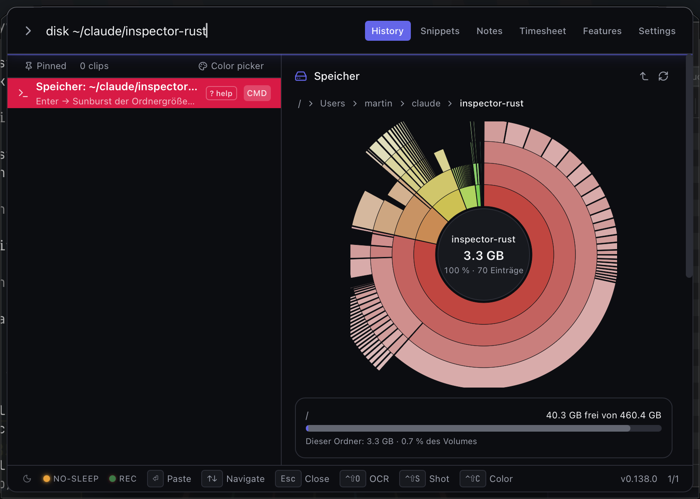
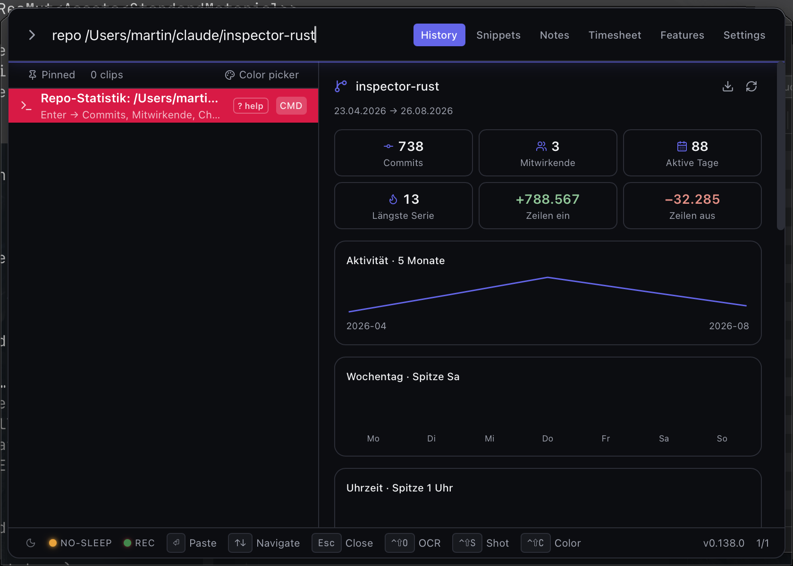
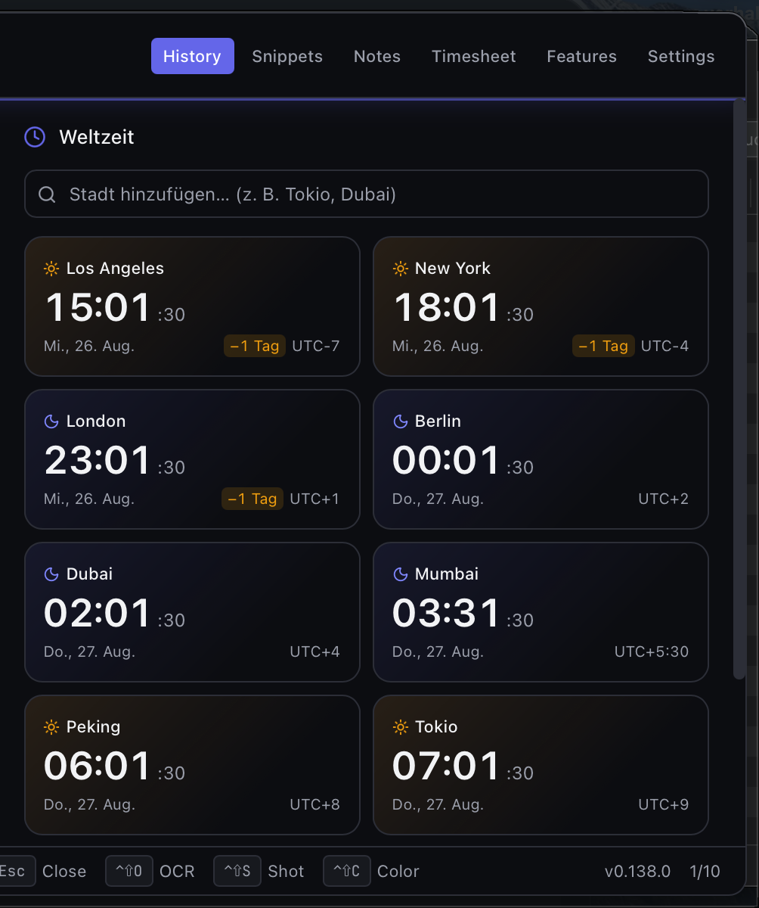
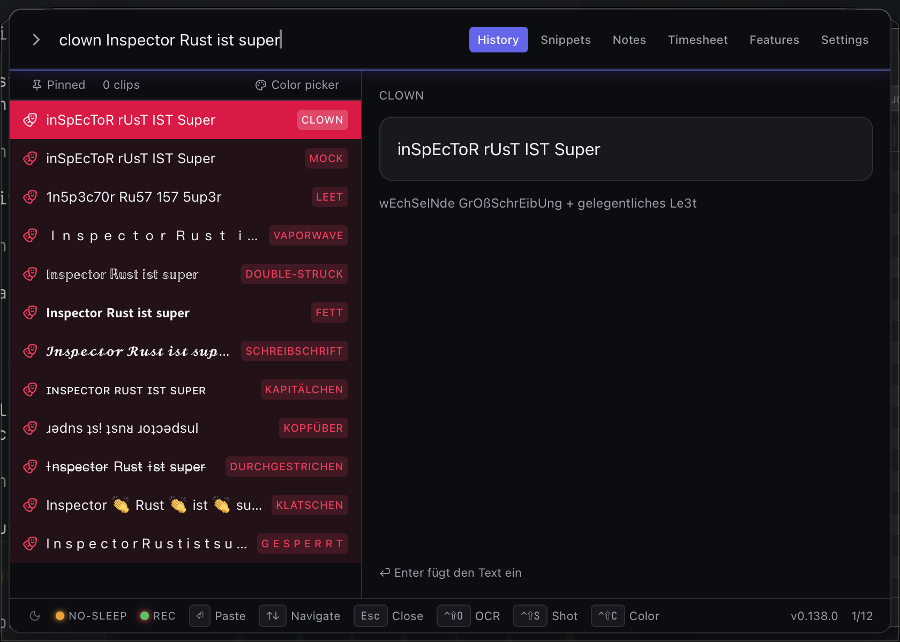
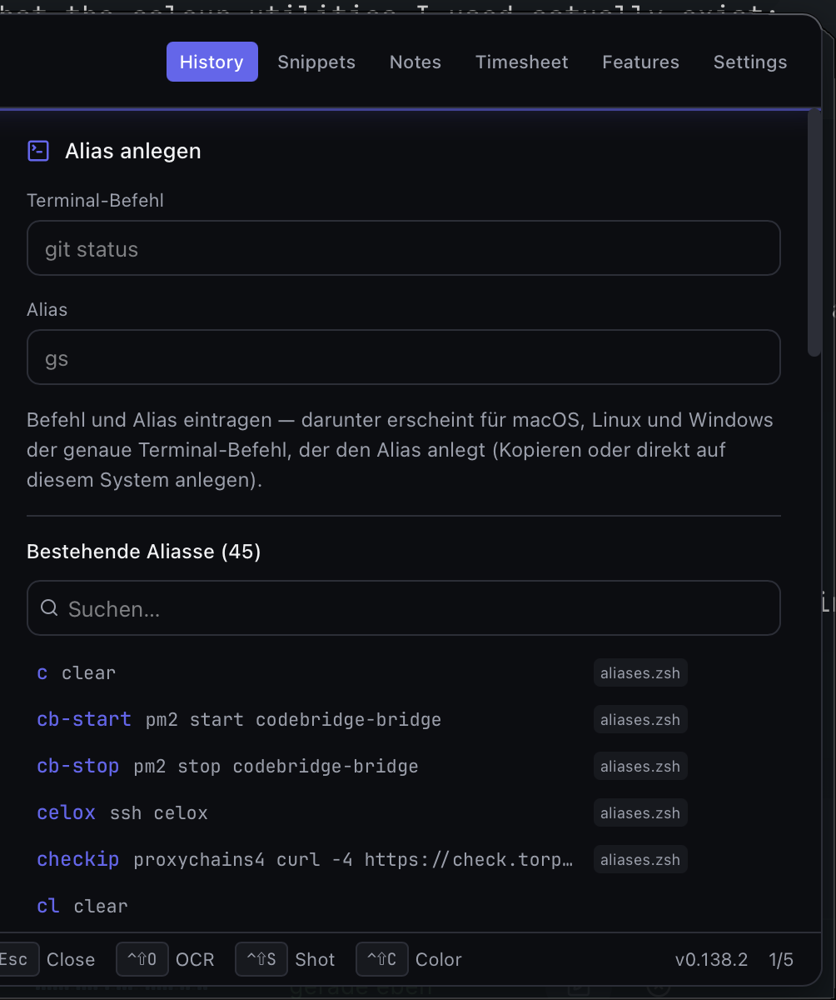

<div align="right">

**🇬🇧 English** · [🇩🇪 Deutsch](./README.de.md)

</div>

<div align="center">
  

  # Inspector Rust 🕵️‍♂️

  > **One hotkey, your whole toolbox: clipboard history, text expander, launcher, screenshots & OCR, screen recording, a system-wide EQ and 70+ power commands — in a single native popup for macOS, Windows 11 and Linux. No Electron, no cloud, no telemetry.**

  Press **`Ctrl+Space`** anywhere → frameless popup over the active monitor → search 1 000 deduped clipboard entries → Enter pastes back into the previously focused app. Whole loop under 200 ms, under 50 MB RAM, AES-256-GCM-encrypted at rest with keys in the OS keychain. **Built for the kind of person who already has muscle memory for three clipboard managers and is tired of every one of them.**

  <p>
    <a href="https://www.paypal.com/donate/?business=martin.pfeffer@celox.io&item_name=Inspector+Rust&currency_code=EUR">
      
    </a>
  </p>

  <em>Free, open-source, zero-telemetry — one person, a lot of late nights, and an unreasonable amount of espresso. If Inspector Rust just saved you a few hundred keystrokes, <a href="https://www.paypal.com/donate/?business=martin.pfeffer@celox.io&item_name=Inspector+Rust&currency_code=EUR">toss a coffee in the jar</a> ☕ — every cup quite literally turns into the next command.</em>

  ### ✨ What it does (in short)

  *Roughly sorted by everyday usefulness × how much engineering sits behind it — flagship features first, easter eggs last.*

  - 📋 **Clipboard history** — text, RTF, HTML, PNG, file lists; 1 000 entries deduped via SHA-256; substring search-as-you-type; pin + attach a note to any clip.
  - 🎯 **Text expander — 4 modes**: passive **auto-expansion** (aText-style — expands as you type, no hotkey) · in-popup search · system-wide hotkey (AX/UIA in-place replace + Electron fallback) · direct hotkey → snippet slots (works even in terminals). **Dynamic placeholders** at paste time: `{date}` / `{date:%d.%m.%Y}`, `{time}`, `{datetime}`, `{clipboard}`, `{cursor}`, `{{`/`}}`.
  - 🧮 **Inline calculator** (`2+2`, `sqrt(144)`, hex/bit-ops; slot-machine reveal), **unit / base / time converter** (`5 km in mi`, `0xff in dec`, `1700000000 as date`) and **colour converter** (`#hex` / `rgb()` / `hsl()` in any direction).
  - 🎚️ **System-wide audio EQ — `boom`** (macOS · Windows via [Equalizer APO](https://sourceforge.net/projects/equalizerapo/)) — a **10-band graphic equaliser + volume boost + 20 presets** applied to *all* system audio, plus **5 enhancement effects** (Bass · Clarity · Fidelity · Ambience stereo-widen · Night compressor for low-volume listening), with live input/output level meters and a **perceptual system-volume taper** (the stock virtual-driver curve made everything below 40 % near-inaudible; boom now applies a proper power taper, so the volume slider feels like real hardware). Installs a small virtual audio driver from the panel (one click), matches your device's sample rate, and **follows your output device live** (incl. Bluetooth). **Battery-aware:** after 60 s of silence the audio bridge suspends itself so your Mac can sleep normally, and resumes within milliseconds when anything starts playing.
  - 🪟 **Window management** (macOS, opt-in) — drag a window to a screen edge to **snap** it (left/right halves · top to maximize, Magnet-style), or hover its green zoom button for a **Moom-style palette**: preset layouts (⌥ for quarters) + a drag-over **honeycomb grid** (16×10 default, up to 24 — rounded hexagons with magnetic hover, gradient-lit selection, and a live size readout) to drop the window into any region of the screen, with a live on-screen outline preview.
  - 📸 **Screenshots — CleanShot-X-style**: region (`Ctrl+Shift+S`) · full-screen · active-window · self-timer · repeat-last; floating preview HUD; **annotation editor** (arrow / line / text / rect / ellipse / highlight / blur / redact / numbered step badges); **pin to screen**. Filenames include the source app.
  - 🎥 **Screen recording** (`Ctrl+Shift+Alt+S`) — drag a region → pick audio (system / mic / both) → 3-2-1 → **MP4 (H.264)** to Downloads; floating bar with **pause/resume**; multi-monitor; system audio auto-routes through a loopback. Needs ffmpeg.
  - 🔍 **Screen-region OCR** (`Ctrl+Shift+O`) — Apple Vision (macOS) / WinRT (Windows) / Tesseract (Linux). PDF-grade text recognition into the clipboard.
  - 🎬 **Media tools** — **download** YouTube / Instagram / TikTok / Facebook (video or audio — just paste a URL; Tab toggles on YouTube), with an optional **trim-and-download section** under the buttons: QuickTime-style yellow handles, scrub the range by ear on a small audio proxy, and the download fetches **only the cut** (frame-accurate — 20 s out of an 83-minute set arrive as ~1.2 MiB instead of hundreds of MB); **audio swap** (`Ctrl+Shift+Alt+M`) to replace or mix a video's audio with a local file or a YouTube track; **trim** local audio/video (`trim`) lossless-fast or frame-accurate. Need ffmpeg / yt-dlp.
  - ⏱️ **Time tracking / Timesheet** (`track on/off`; `track` or **`Ctrl+Shift+T`**; macOS) — opt-in, event-based app-usage tracking by window focus with retroactive idle auto-pause; an editable **Timesheet tab** with day/week views, inline-SVG charts (timeline · app donut · categories · projects), **manual Pause/Resume**, CSV + self-contained HTML export following the visible scope (day or Mon–Sun week), **week-wide cleanup**, and a global **toggle-tracking hotkey** (`Ctrl+Shift+Alt+T`, rebindable); detects **Claude Code** usage per project (time + tokens); an optional **browser extension** (loopback socket only). Window titles + URLs encrypted at rest.
  - 📊 **System stats** (`stats`) — live inline dashboard: CPU (overall + per-core), memory + swap, **battery & power draw in watts**, temperatures + **fan RPM** (SMC / hwmon), disks, live network throughput, uptime. **Live ↔ History** toggle with per-metric line charts (1 h / 6 h / 24 h / 7 d).
  - ☀️ **Monitor brightness** (`brightness` / `bri`) — sliders inline in the preview for built-in *and* external displays (**↑↓** pick a monitor, **←→** adjust). Software (gamma) dimming on macOS + Windows, hardware DDC/CI on Linux. On **EDR-capable Macs** (14"/16" MBP XDR, Pro Display XDR) the *same* slider runs **past 100 %** to push the display into its **extra-brightness (EDR/XDR) range** — Vivid-style, up to ~7× — via a multiply-blend Metal overlay; macOS thermal-throttles it automatically (same path as HDR video, within spec).
  - 💡 **Philips Hue** (`hue`) — control your lamps inline: all-lamps on/off + brightness, per-lamp brightness, and 8 colour-preset swatches on colour bulbs. Plus a **Beat-sync** disco that pulses the lamps to music from the mic. Local LAN pairing (discover or enter IP + link button); no cloud.
  - 🖐️ **Touchpad gestures** (opt-in) — **3-finger swipe** up/down for volume (consistent 5 % grid steps), **3-finger tap** to mute, and **tip-tap tab switching** (macOS): rest **two** fingers, tap a third to their right/left → next/previous tab, sending **each app's own shortcut** automatically (Ctrl+Tab for browsers/terminals/Finder, ⌘⌥→/← for VS Code/Cursor, ⇧⌘]/[ for JetBrains/Xcode — resolved for your keyboard layout, e.g. ⌥6 on German). Per-app map ships as a data file + a user-override JSON (`tab-shortcuts.json` in the app data dir) — add any app with one entry, no rebuild. **Palm rejection** (macOS): a hand heel resting on the pad never counts as a gesture finger (size + rest + per-finger-movement guards, libinput/Karabiner-style) — no more accidental volume swipes while scrolling. **Reliable tap recognition**: light multi-finger taps that the trackpad reports as sequential single touches are coalesced into one clean tap (settle-based recognition) — a 3-finger tap toggles mute exactly once, and one drifting finger can't turn a tap into a volume swipe. macOS via the private MultitouchSupport API (consumes the swipe so the app underneath doesn't scroll); Windows Precision Touchpad; Linux libinput.
  - 🔐 **2FA / TOTP manager** — type `2fa` *or* `otp` for the TOTP vault — **just type to filter it** (fuzzy, Enter copies the top match's code); `otp <issuer>` / `2fa <issuer>` for instant OTP autocomplete with a live 30-second countdown, Enter copies the token; **`2fa add [issuer]`** jumps straight to the add form (issuer pre-filled). **Add / edit / delete, drag-reorder, and dedupe-on-import**; imports Google Authenticator / Aegis / 2FAS / **OTPManager (macOS)** / `otpauth` — paste *or* drag the export file onto the overlay. Secrets encrypted, never cross the IPC boundary.
  - 🔊 **Audio output** (`sound` / `audio`) — inline picker to switch the system default output device (macOS · Windows · Linux).
  - 🎵 **Song recognition — `shazam`** — type `shazam`, and it records ~10 s from the mic, generates a Shazam audio-fingerprint (natively, in Rust — no file, no ffmpeg) and identifies the track: cover, title, artist, album, genre, year + a link to open it in Shazam. `shazam history` opens your recognized-songs list. Verified bit-for-bit against the reference and end-to-end against the real service.
  - 🕵️ **Network monitor — `snitch`** (macOS) — lists every app with a live connection and lets you toggle its internet access off (**best-effort**: a background watcher feeds a blocked app's server IPs into the pf firewall — one admin prompt, not a hard firewall; a real per-app filter needs an Apple system-extension entitlement a self-signed app can't have). **`snitch map`** plots your live outbound connections on an offline dotted world map — connections **actively transferring right now glow green with packets flowing** along an arc from your location — each server located by country/city/ISP (public IPs only — LAN addresses never leave the machine). Typing `snitch` shows both the blocker and the map as selectable rows.
  - 🧹 **Cleaning** (`clean`) — free disk space by deleting cache/log/temp files inside known-safe folders. At **Standard** this sweeps the whole user cache dir (`~/Library/Caches` — often many GB); opt-in **Aggressive** adds dev-tool caches (npm/pnpm/Gradle/Cargo incl. sources), Xcode build caches and old Trash items. Enter opens an **interactive category picker** (sizes, file counts, largest files — choose exactly what goes) — including **duplicate files in Downloads** (content-hashed, the oldest copy always survives), **old installers** (dmg/pkg/iso), **editor caches** (VS Code / Cursor), **Xcode DerivedData + iOS DeviceSupport** and the **Docker build cache** (via `docker builder prune`) — risky categories are pre-deselected, user files are never a default; strict allowlist, symlinks never followed; Safe / Standard / Aggressive levels.
  - 🎨 **Color picker / eyedropper** (`Ctrl+Shift+C`) — a custom screen loupe with the **live hex shown under the magnifier** (macOS) / GDI overlay (Windows); hex straight to the clipboard.
  - 🖼️ **Image tools** — Recolor (logo tint), ML **cut-out** (U²-Net ONNX, 4.5 MB embedded), Lanczos3 **resize** (`rz`) + **optimise** (`optim`, oxipng) on the Finder selection or the clipboard image.
  - 📁 **Finder selection actions** (`Ctrl+Shift+F`, macOS) — batch resize / optim / cut-out / open on whatever you have selected in Finder.
  - 📄 **Markdown → PDF** (`Ctrl+Shift+M` / `md2pdf`, macOS) — converts the `.md` files currently selected in Finder to PDF in-process; no CLI tools required.
  - 🚀 **App launcher** (Spotlight-like, macOS) — fuzzy-match an app name, real icon in the row, Enter launches. Activates an already-running instance instead of spawning a duplicate.
  - 🔳 **QR code** (`qr <text>`) — live preview in the panel; Enter copies the PNG to the clipboard.
  - 🛠️ **Dev quick-tools** — `uuid [n]` · `slug` · `hash` (SHA-256) · `json` (pretty-print clipboard) · `jwt` (decode clipboard) → clipboard.
  - 🎲 **Fake test data — `faker`** *(v0.84.270+)* — 70+ generators (names, emails, addresses, phones, companies, finance, lorem, dates, numbers, UUID/…, plus composite **person / user / address / order** records) in 14 locales. Bare `faker` lists them with live samples; `faker person 50 --csv @de` → 50 German records as CSV in the clipboard, one Enter. `--json` / `--sql` / `--ts`, `faker int 1..100`, `--seed=` reproducible, ⌘/Ctrl+R rerolls, `faker tpl "{name} <{email}>"`. Honest locale fallback (unsupported → EN, shown). Also `{faker:first_name}` in snippets. See [docs/faker.md](./docs/faker.md).
  - 🛡️ **Security command builders — `sec`** *(v0.84.271+)* — guided command builders for **nmap · sqlmap · feroxbuster · John**. Pick a preset, fill the target; Inspector Rust assembles the correct (sh/bash-quoted) command line with a plain-English flag cheat-sheet — `nmap service 10.0.0.5` → `nmap -sV -sC 10.0.0.5`. **Enter copies it; ⌘/Ctrl+Enter opens your terminal** with it inserted (macOS, opt-in, un-submitted by default). It **never scans itself** — no subprocess, no network. Authorized targets only. See [docs/security-builder.md](./docs/security-builder.md).
  - 🌐 **Web-search bangs** — `g` · `ddg` · `gh` · `yt` · `npm` · `crates` · `so` · `mdn` · `wiki` `<query>` open a site's search.
  - 🥁 **BPM detector** (`bpm`) — live microphone beat detection with an animated AAA visualizer. Captured natively (in Rust) so starting it never interrupts other apps' playback. Its little sibling **`dezibel` / `db`** shows the live room loudness in dBFS with the same glow-and-meter animation.
  - 🏁 **CPU benchmark** (`benchmark` / `performance`) — seven Geekbench-style workloads, single- and multi-core, scored against a measured reference. Typing shows a preview first; nothing runs until you confirm. Runs persist as JSON — import a run from **another machine or OS** and compare side by side with deltas (sub-noise differences are marked as noise, not findings). Exports as HTML/PDF.
  - 📑 **Signed reports** — every exported report (LoC, PageSpeed, repo stats, benchmark, Bruno, timesheet; HTML and PDF) carries a **signature and a vector seal** in the shared print-ready design — one look across all of them.
  - 💸 **Bruno (Brutto/Netto)** — German net-pay calculator 2025 as a search-bar command, for **employees AND freelancers**: `bruno 60000` (salary) or `bruno 80000f` / `bruno 90000-15000f` (self-employed profit, income − expenses) with voluntary GKV or fixed PKV premium, Gewerbesteuer incl. §35 credit, Grund-/Splittingtarif. **Tab flips employee ↔ self-employed** on the row; Shift+Enter copies the full breakdown, and the preview **exports it as HTML or PDF** in the shared report design. Smart defaults + per-user override in Settings.
  - ⚙️ **Power commands** — the search bar parses dozens of shell-style commands: translate (`tr` / `tren` / `trde` / `trde2it` / …), system (`kill` / `lock` / `reboot` / `shutdown` / `mute` / `freeze`), `rnd` / `random` (dice), `timer` / `alarm <HH:MM>`, `touch` / `mkdir` / `terminal` (in the open Finder folder), `rmvvls`, `pwgen`, `meme [query]`, `calendar [month year]` (month-view calendar — which weekday was that date?) — plus every command listed above. Fuzzy-matched, always outranking clips, rendered with a red accent. Append **`?`** to any command (or type `?` alone) for full **inline help** — arguments, examples, tips — right in the preview.
  - 📓 **Snippets** (27 bundled AI prompts + 255 Material colours, **organised into groups** — filter, assign, create/rename/reorder/delete) · **Notes** (persistent bookmarks) · **Backup** (single-file JSON, optionally password-encrypted; carries snippet groups).
  - 🟢 **Keep-alive & wakelock** — `wakelock on/off` (alias `caffeine`) keeps the machine awake (pulsing footer LED + on-screen toast); **“Always keep running”** (Settings → Startup) relaunches the app natively if it's ever quit or killed.
  - 🔒 **Local-first** — zero network calls, zero account; data only at `~/Library/Application Support/InspectorRust/history.db`, AES-256-GCM-encrypted with keys in the OS keychain.
  - 🎮 **Hidden games** — five Easter-egg trigger words. You'll find them.

  ### 🧰 Tech stack

  Tauri 2 (WebView2 / WKWebView) · Rust workspace (`core/rust-lib` shared, 2-line per-OS bundle shells) · React 19 + TypeScript 5 + Tailwind v4 + Vite 7 · brightness via CoreGraphics/GDI gamma + DDC/CI (`ddc-hi`). **4088 unit tests (1531 Rust + 2557 frontend).** MIT-licensed.

  <!-- ── Headline metrics — XXL hero badges ────────────────────── -->
  <p>
    <a href="https://github.com/pepperonas/inspector-rust" title="Lines of code (Rust + TypeScript source)">
      
    </a>
    &nbsp;
    <a href="https://github.com/pepperonas/inspector-rust/actions/workflows/ci.yml" title="Unit tests — 1531 Rust + 2557 frontend, all passing">
      
    </a>
  </p>

  <!-- ── Highlights — prominent (for-the-badge) badges ─────────── -->
  <p>
    <a href="./LICENSE"></a>
    <a href="https://github.com/pepperonas/inspector-rust/releases/latest"></a>
    <a href="#"></a>
    <a href="https://tauri.app"></a>
    <a href="https://rustup.rs"></a>
    <a href="#"></a>
    <a href="./scripts/check.sh"></a>
  </p>

  <!-- ── Status / release ─────────────────────────────────────── -->
  [](https://github.com/pepperonas/inspector-rust/actions/workflows/ci.yml)
  [](https://github.com/pepperonas/inspector-rust/actions/workflows/release.yml)
  [](https://github.com/pepperonas/inspector-rust/commits/main)
  [](https://github.com/pepperonas/inspector-rust/issues)
  [](https://github.com/pepperonas/inspector-rust/stargazers)
  [](https://github.com/pepperonas/inspector-rust/commits/main)
  [-success?style=flat-square)](https://github.com/pepperonas/inspector-rust/actions/workflows/ci.yml)
  [](./CONTRIBUTING.md)
  [](./scripts/check.sh)
  [](#commands)
  [](./docs)
  [](./core/rust-lib/src)
  [](./Cargo.lock)
  [](./LICENSE)
  [](https://tauri.app)
  [](#privacy)
  [](#privacy)
  [](https://github.com/pepperonas/inspector-rust/releases)
  [](#)
  [](https://github.com/pepperonas/inspector-rust/commits/main)
  [](https://github.com/pepperonas/inspector-rust/commits/main)
  [](#)
  [](#)
  [](https://github.com/pepperonas/inspector-rust/releases/latest)
  [](https://www.conventionalcommits.org)
  [](https://semver.org)

  <!-- ── Platforms ────────────────────────────────────────────── -->
  [](./win)
  [](./macos)
  [](./macos)
  [](#)
  [](./linux/README.md)
  [](#)
  [](https://developer.microsoft.com/microsoft-edge/webview2/)
  [](#)

  <!-- ── Stack ────────────────────────────────────────────────── -->
  [](https://react.dev)
  [](https://www.typescriptlang.org)
  [](https://vitejs.dev)
  [](https://tailwindcss.com)
  [](https://pnpm.io)
  [](https://nodejs.org)
  [](https://sqlite.org)
  [](https://onnxruntime.ai)
  [](#)
  [](https://github.com/xuebinqin/U-2-Net)
  [](https://github.com/rusqlite/rusqlite)
  [](https://github.com/madsmtm/objc2)
  [](https://github.com/microsoft/windows-rs)
  [](#)
  [](https://ffmpeg.org)
  [](https://github.com/yt-dlp/yt-dlp)
  [](https://github.com/shssoichiro/oxipng)
  [](https://github.com/ExistentialAudio/BlackHole)
  [](#)
  [](#)
  [](#)
  [](#)
  [](#)
  [](https://doc.rust-lang.org/edition-guide/)
  [](https://github.com/GuillaumeGomez/sysinfo)
  [](https://github.com/starship/rust-battery)
  [](https://github.com/chronotope/chrono)
  [](https://github.com/algesten/ureq)
  [](https://github.com/image-rs/image)
  [](https://github.com/Amanieu/parking_lot)
  [](https://github.com/RustCrypto/password-hashes)

  <!-- ── Security & ergonomics ───────────────────────────────── -->
  [](./docs/encryption.md)
  [](./docs/encryption.md)
  [](#)
  [](#)
  [](#)
  [](#)
  [](#)

  <!-- ── Quality ─────────────────────────────────────────────── -->
  [](https://eslint.org)
  [](https://vitest.dev)
  [](#)
  [](#)
  [](#)
  [](#)
  [](https://prettier.io)

  <!-- ── Features ────────────────────────────────────────────── -->
  [](#)
  [](#)
  [](#)
  [](#)
  [](#)
  [](#)
  [](#)
  [](#)
  [](#)
  [](#)
  [](#)
  [](https://m3.material.io)
  [](#)
  [](#)
  [](#)
  [](#)
  [](#)
  [](#)
  [](#)
  [](#)
  [](#)
  [](#)
  [](#)
  [](#)
  [](#)
  [](#)
  [](#)
  [](#)
  [](#)
  [](#)
  [](#)
  [](./docs/figlet.md)
  [](#)
  [](#)
  [](#)
  [](./docs/faker.md)
  [](./docs/security-builder.md)
  [](./docs/inline-help.md)
  [](./docs/clipboard-shapes.md)
  [](./docs/translation.md)
  [](#)
  [](#)
  [](#)
  [](#)
  [](#)
  [](#)
  [](#)
  [](#)
  [](./docs/colors.md)
  [](#)
  [](#)
  [](#)
  [](#)
  [](./docs/snippets-import.md)
  [](./docs/text-expander.md)
  [](./docs/notes.md)
  [](./docs/backup.md)
  [](#)
  [](#)
  [](#)
  [](#)
  [](#)
  [](#)
  [](#)
  [](#)
  [](#)
  [](#)
  [](#)
  [](#)
  [](#)
  [](#)

  <!-- ── Community ───────────────────────────────────────────── -->
  [](https://github.com/pepperonas/inspector-rust/issues)
  [](https://github.com/pepperonas/inspector-rust/issues?q=is%3Aissue+is%3Aclosed)
  [](https://github.com/pepperonas/inspector-rust/pulls)
  [](https://github.com/pepperonas/inspector-rust/stargazers)
  [](https://github.com/pepperonas/inspector-rust/network/members)
  [](https://github.com/pepperonas/inspector-rust/watchers)
  [](https://github.com/pepperonas/inspector-rust/graphs/contributors)
  [](https://github.com/pepperonas/inspector-rust/commits/main)
  [](https://github.com/pepperonas/inspector-rust/commits/main)
  [](https://github.com/pepperonas/inspector-rust)
  [](https://github.com/pepperonas/inspector-rust)
  [](https://github.com/pepperonas/inspector-rust)
  [](https://github.com/pepperonas/inspector-rust)
  [](#)

  <!-- ── Architecture & build ────────────────────────────────── -->
  [](./pnpm-workspace.yaml)
  [](./Cargo.toml)
  [](#)
  [](#)
  [](#)
  [](#)
  [](#)
  [](#)
  [](#)

  <!-- ── Features (numerical) ────────────────────────────────── -->
  [](#)
  [](./core/rust-lib/src/commands.rs)
  [](./core/rust-lib/src/commands.rs)
  [](#)
  [](./core/rust-lib/src)
  [](./docs/ai-prompts.md)
  [](#)
  [](#)
  [](#)
  [](./docs/encryption.md)
  [](#)
  [](./docs/text-expander.md)
  [](#)
  [](./docs/timesheet.md)
  [](./docs/encryption.md)
  [](./core/rust-lib/src)
  [](./core/frontend/src)
  [](./features.txt)
  [](#)
  [](#)
  [](#)
  [](#)
  [](#)
  [](#)
  [](#)

  <!-- ── Standards / conventions ─────────────────────────────── -->
  [](https://semver.org)
  [](https://keepachangelog.com)
  [](https://www.conventionalcommits.org)
  [](#)
  [](./CHANGELOG.md)

  <!-- ── Permissions / OS surfaces ───────────────────────────── -->
  [](./macos/README.md#macos-permissions)
  [](./macos/README.md#macos-permissions)
  [](./macos/README.md#macos-permissions)
  [-000000?style=flat-square&logo=apple&logoColor=white)](./macos/README.md#macos-permissions)
  [](./CHANGELOG.md)
  [](#)

  <!-- ── Tech (extended) ─────────────────────────────────────── -->
  [](https://crates.io/crates/rusqlite)
  [](https://crates.io/crates/enigo)
  [](https://crates.io/crates/clipboard-rs)
  [](https://crates.io/crates/ort)
  [](https://crates.io/crates/ring)
  [](https://crates.io/crates/objc2)
  [](https://lucide.dev)
  [](https://tanstack.com/virtual)

  <!-- ── Vibes ───────────────────────────────────────────────── -->
  [](#)
  [](#)
  [](#)
  [](./LICENSE)
  [](#)

  <!-- ── Recently added ──────────────────────────────────────── -->
  [](#)
  [](#)
  [](#)
  [](#)
  [-1f6feb?style=flat-square)](#)
  [-1DB954?style=flat-square)](https://lrclib.net)
  [](#)
  [](#)
  [](#)
  [](#)
  [](./docs/snippets-import.md)

  <!-- ── Tech (even more) ────────────────────────────────────── -->
  [](https://openweathermap.org)
  [](https://ip-api.com)
  [](https://crates.io/crates/rustfft)
  [](https://crates.io/crates/cpal)
  [](#)
  [](./docs/translation.md)
  [](./docs/translation.md)
  [](https://lrclib.net)
  [](https://crates.io/crates/figlet-rs)
  [](https://crates.io/crates/pulldown-cmark)
  [](https://simpleicons.org)
  [](#)
  [](#)
  [](https://sourceforge.net/projects/equalizerapo/)

  <!-- ── Testing (extended) ──────────────────────────────────── -->
  [](https://github.com/capricorn86/happy-dom)
  [](#)
  [](#)
  [](./.github/workflows/ci.yml)
  [](#)
  [](#)

  <!-- ── More vibes ──────────────────────────────────────────── -->
  [](https://www.paypal.com/donate/?business=martin.pfeffer@celox.io&item_name=Inspector+Rust&currency_code=EUR)
  [](https://celox.io)
  [](#)
  [](#)
  [](#)
  [](#)
  [](./features.txt)
  [](#)
  [](https://www.linkedin.com/)

  Press `Ctrl+Space` → search → paste. Inspired by Alfred's clipboard viewer on macOS, scoped to one tool you can keep on every machine.
</div>

---

## Screenshots

*Dark theme on macOS, with a demo clipboard history — dummy data, no real clips.*

| | |
|---|---|
|  |  |
| **`weather`** — current conditions, next 12 h + animated 5-day forecast | **`boom`** — system-wide 10-band EQ + presets + volume boost |
|  |  |
| **`equalizer`** — live 28-band mic spectrum + beat reaction | **`bpm`** — live mic tempo detector (128 BPM · 99 % confidence) |
|  |  |
| **`hue`** — Philips Hue: per-lamp colour + brightness | **`snitch map`** — live outbound connections on a world map |
|  |  |
| **`shazam`** — identify the playing song from the mic | **`stats`** — live CPU / RAM / battery / network dashboard |
|  |  |
| **`calendar`** — month view + weekday lookup | **`brightness`** — per-monitor sliders (+ EDR/XDR boost) |
|  |  |
| **`sound`** — audio output picker + volume slider | **`uptime`** — live, animated uptime readout |
|  |  |
| **Clipboard history** — search-as-you-type, live preview, notes + QR | **`figlet`** — ASCII-banner gallery; every row renders *your* text |
|  |  |
| **`bruno`** — German gross→net breakdown | **Inline calculator** — type an expression, Enter pastes the result |
|  |  |
| **`?`** — built-in command index & inline help | **`disk`** — usage sunburst; the path bar browses the whole disk |
|  |  |
| **`repo`** — git history at a glance, exportable as one HTML file | **`clock`** — world clock; any IANA zone, DST handled by the OS |
|  |  |
| **`clown`** — twelve text styles; pick the one you can see | **`alias`** — build a shell alias, and manage the ones you have |

## Download

**Latest release:** [](https://github.com/pepperonas/inspector-rust/releases/latest) — see the [CHANGELOG](./CHANGELOG.md) for what's new.

| Platform | File | Notes |
|----------|------|-------|
| **Windows 11 / 10** | [`InspectorRust_<ver>_x64_en-US.msi`](https://github.com/pepperonas/inspector-rust/releases/latest) | MSI installer — adds Start-menu entry & uninstaller |
| **Windows 11 / 10** | [`inspector-rust.exe`](https://github.com/pepperonas/inspector-rust/releases/latest) | Standalone exe — no install needed |
| **macOS 10.15+ (Apple Silicon)** | [`InspectorRust_<ver>_aarch64.dmg`](https://github.com/pepperonas/inspector-rust/releases/latest) | DMG for arm64 Macs |
| **macOS Intel** | — | Not buildable: the ONNX Runtime dependency ships no Intel-macOS binary — [details](./macos/README.md#apple-silicon-only-x86_64-does-not-build) |
| **Linux (Ubuntu/Debian)** | Build from source — see [`linux/README.md`](./linux/README.md) | `.deb` + AppImage via `pnpm build:linux` |

> **macOS Gatekeeper note.** Releases are ad-hoc-signed, **not Apple-notarized**. A DMG downloaded from GitHub is quarantined by the browser, and macOS then claims the app is **"damaged and can't be opened"** — it isn't; right-click → **Open** does *not* help against that particular wording. Move the app to Applications, then clear the marker once:
>
> ```bash
> xattr -dr com.apple.quarantine /Applications/InspectorRust.app
> ```
>
> (For a locally built app the marker is never set, so this is only needed for downloads.) Then grant the required TCC permissions:
>
> | Permission | Required for |
> |------------|-------------|
> | **Accessibility** | Paste (`enigo` synthesizes `Cmd+V`), system-wide text expander, `freeze` input lock |
> | **Screen Recording** | OCR (`Ctrl+Shift+O`) and screenshot region (`Ctrl+Shift+S`) |
> | **Automation → Finder** | Finder selection (`Ctrl+Shift+F`) and Markdown→PDF (`Ctrl+Shift+M`) |
> | Microphone *(optional)* | BPM detector (`bpm` command) |
>
> The Settings tab surfaces missing grants as collapsible amber banners with one-click jumps to the right Privacy pane. `scripts/install-macos.sh` signs every build with a **stable self-signed certificate** so all grants survive future rebuilds — you grant each permission once. `scripts/grant-permissions-macos.sh` walks through the full one-time setup in a single guided pass.
>
> Full details in [`macos/README.md`](./macos/README.md#macos-permissions).

---

## Platform support

| Platform   | Status         | Location                |
|------------|----------------|-------------------------|
| Windows 11 | ✅ implemented | [`win/`](./win)         |
| macOS      | ✅ implemented | [`macos/`](./macos)     |
| Linux      | ✅ implemented | [`linux/`](./linux)     |

All app logic lives in [`core/`](./core) — a single frontend (`core/frontend`) and a single Rust lib (`core/rust-lib`) shared across platforms. Each OS has its own thin bundle shell that owns platform-specific details (installer config, icons, capabilities). To add a new platform, see [`CONTRIBUTING.md`](./CONTRIBUTING.md#adding-a-new-platform-shell-linux-etc).

Linux port contributor credit: [`CONTRIBUTORS.md`](./CONTRIBUTORS.md).

## Workflow

Inspector Rust is built for one workflow: **`Ctrl+Space` → type → Enter**. The hotkey opens a frameless popup over the active monitor; whatever you type is fuzzy-searched across clipboard history, snippets, calc results, and color values; Enter pastes the top match into the previously focused app. No mouse, no menu trees, no per-app integrations.

Three more global shortcuts fire from anywhere — Inspector Rust's window doesn't need to be open or focused:

- **`Ctrl+Shift+O`** — screen-region **OCR**. Drag a marquee, Apple Vision recognises the text in the region, the text lands on your clipboard + at the top of History.
- **`Ctrl+Shift+S`** *(v0.15.0+)* — screen-region **screenshot**. Same marquee, no OCR step: the captured PNG goes straight to the clipboard and into History. Use this for charts, buttons, photos, or any region without recognisable text. **Save to file:** while the overlay is open, press **`S`** — the selection border turns green and after drawing the region a native save dialog appears instead of writing to the clipboard *(v0.19.2+)*.
- **`Ctrl+Shift+C`** *(v0.17.0+)* — **eyedropper**. Cursor turns into the NSColorSampler loupe (macOS) / GDI overlay (Windows); click a pixel, the hex code (`#RRGGBB`) lands on your clipboard + History. No popup, no modal — fire-and-forget.

Literal Control on every OS — same key on Windows and macOS. OCR + screenshot require the macOS **Screen Recording** TCC grant on macOS; on Windows no extra permissions are needed.

Everything else (snippets management, notes, settings, image tools) lives in the same popup behind tabs in the top-right — there's no separate window to alt-tab to. **Settings → Keyboard shortcuts** carries the full cheat sheet.

## Configuration

Everything is configured in the popup's **Settings tab** (`Ctrl+Space` → Settings) — no config files. The essentials:

| Area | What you can set |
|---|---|
| **Popup hotkeys** | Main hotkey (default `Ctrl+Space`) + a second clipboard-history hotkey (default `Ctrl+Shift+V`, can be disabled) |
| **Global shortcuts** | Every action hotkey (OCR, screenshot, eyedropper, Finder selection, Markdown→PDF, recording, audio swap, timesheet, …) is rebindable, with live collision checks |
| **Text expander** | Abbreviation hotkey, direct hotkey→snippet slots, passive auto-expansion (aText-style), trigger/case options |
| **Appearance** | Dark / Light / System theme + popup size (S / M / L) |
| **Clipboard privacy** | App exclusion list (e.g. password managers) + auto-clear timer |
| **Cleaning** | Safe / Standard / Aggressive level, minimum file age, per-category toggles, dev-project roots |
| **Timesheet** | Idle threshold, retention, Claude-Code detection, privacy denylist |
| **Sounds** | Master toggle for all feedback cues |
| **Command defaults** | Bruno (tax parameters), Faker, Figlet, Security builder, meme library folder |
| **Startup** | Start at login + “always keep running” auto-relaunch |
| **Backup** | Full-app export/import, optionally password-encrypted (Argon2id + AES-256-GCM) |

All data lives in one SQLite file — `~/Library/Application Support/InspectorRust/history.db` (macOS), `%APPDATA%\InspectorRust\history.db` (Windows), `~/.local/share/InspectorRust/history.db` (Linux) — with sensitive columns AES-256-GCM-encrypted ([details](./docs/encryption.md)).

## Features & shortcuts at a glance

### 🔥🔥🔥 Global hotkeys — fire and forget, from anywhere 🔥🔥🔥

| Shortcut | Action | Requires (macOS) |
|----------|--------|------------------|
| `Ctrl+Space` | Open popup over the active monitor | — |
| `Ctrl+Shift+V` *(v0.83.0+, configurable)* | Second **clipboard-history** hotkey — also opens the popup | — |
| `Ctrl+Shift+O` | Screen-region **OCR** → text on clipboard + History | Screen Recording |
| `Ctrl+Shift+S` *(v0.15.0+)* | Screen-region **screenshot** → PNG on clipboard + History (no OCR); press **`S`** during overlay to save to file instead (green border) *(v0.19.2+)* | Screen Recording *(macOS)* |
| `Ctrl+Shift+Alt+S` *(v0.81.0+)* | **Screen recording** → region select → audio (system / mic / both) → 3-2-1 → MP4 to Downloads. Floating stop bar with pause/resume. Multi-monitor; ffmpeg | Screen Recording *(macOS)* |
| `Ctrl+Shift+C` *(v0.17.0+)* | **Eyedropper** → hex (`#RRGGBB`) on clipboard + History | — |
| `Ctrl+Shift+F` *(v0.30.0+)* | **Finder selection** → popup with the currently-selected files + actions (Resize, Optim, Cut-out, …) | Automation → Finder |
| `Ctrl+Shift+M` *(v0.46.0+, macOS)* | **Markdown → PDF** — convert the `.md` files selected in Finder to PDF in-process | Automation → Finder |
| `Ctrl+Shift+Alt+M` *(v0.84.22+, macOS)* | **Replace / overlay audio** — select a video in Finder → overlay to swap or mix in a local audio file or a yt-dlp'd YouTube track at a chosen position | Automation → Finder |
| `Ctrl+Shift+T` *(v0.84.85+, macOS)* | **Timesheet** — open the time-tracking overview (the Timesheet tab) | none |
| `Ctrl+Shift+Alt+T` *(v0.84.204+, macOS)* | **Toggle time tracking** — start/stop a timesheet session from anywhere (status toast confirms) | none |
| `Alt+1` *(default, configurable, opt-in)* | Expand snippet abbreviation in place | Accessibility |
| *(user-configurable)* | **Direct hotkey → snippet** — paste a specific snippet body | Accessibility |

Literal Control on every OS. Same key on Windows and macOS. The expander hotkey is opt-in (off until you configure it in Settings → Text expander).

### Popup shortcuts — when the popup is open

| Shortcut | Action |
|----------|--------|
| `↑` `↓` | Navigate the list |
| `Shift+↑` `Shift+↓` *(v0.22.0+)* | Raise / lower the system volume (±5 % per press, snapped to the 5 % grid) |
| `Enter` | Paste selected entry (respects the plain-text setting) |
| `Shift+Enter` | Paste with original formatting (overrides plain-text setting once) |
| `Esc` | Close popup |
| `⌘B` / `Ctrl+B` | **Cut out background** on the selected image entry (ML — U²-Net) |
| `⌘S` / `Ctrl+S` | **Save image to Downloads** (unchanged PNG) |

### Search-bar commands

Every power command, generated from the canonical `CommandDoc` registry
(`core/frontend/src/lib/commandDocs.ts`). Type any command followed by **`?`**
in the search bar for full inline help (arguments, examples, tips); type **`?`**
alone for the whole index.

<!-- COMMANDS:START -->
<!-- Generated by scripts/gen-docs.mjs from core/frontend/src/lib/commandDocs.ts — do not edit by hand. -->

| Command | Since | What it does |
|---------|-------|--------------|
| `rmvvls` | v0.18.0 | Strip vowels from the text → clipboard. |
| `tr` <sub>(alias: `tren`, `trde`, `trde2it`, `trit2de`, `trde2sp`, `trsp2de`, `trde2pl`, `trpl2de`)</sub> | v0.18.0 | Live translate in the preview — Enter copies, ⇧Enter opens Google Translate. |
| `kill` | v0.19.0 | Live process picker — filter by name/PID, confirm, terminate. |
| `lock` | v0.19.0 | Lock the screen immediately. |
| `mute` | v0.19.0 | Toggle system output mute. |
| `reboot` | v0.19.0 | Reboot the machine (with confirmation). |
| `shutdown` | v0.19.0 | Shut the machine down (with confirmation). |
| `bruno` | v0.33.0 | German net-pay calculator — employees AND freelancers (tax year 2025). |
| `freeze` | v0.35.0 | Input lock — block keyboard + mouse until an unlock chord. |
| `pwgen` | v0.40.0 | Password generator — CSPRNG, 4 modes. |
| `alarm` | v0.42.0 | Alarm at a clock time (next occurrence). |
| `timer` <sub>(alias: `countdown`)</sub> | v0.42.0 | Countdown timer — fires an alarm on expiry. |
| `md2pdf` | v0.46.0 | Markdown → PDF (GitHub CSS), sibling file. |
| `wakelock` <sub>(alias: `caffeine`)</sub> | v0.52.0 | Keep the Mac awake — full (screen on) or dark (screen may sleep). |
| `mkdir` | v0.53.0 | Create a folder in the front Finder/Explorer folder. |
| `terminal` | v0.53.0 | Open a terminal at the front Finder/Explorer folder. |
| `touch` | v0.53.0 | Create a file in the front Finder/Explorer folder (optional content). |
| `shot` <sub>(alias: `shotfull`, `shotwin`, `shotlast`)</sub> | v0.57.0 | Screenshot — region / full-screen / window / repeat, with a self-timer. |
| `clean` <sub>(alias: `cleanup`)</sub> | v0.60.0 | Reclaim disk space — cache/log/temp + developer junk, folder picker. |
| `brightness` <sub>(alias: `bri`)</sub> | v0.62.0 | Per-monitor brightness sliders in the preview. |
| `rnd` <sub>(alias: `random`)</sub> | v0.68.0 | Roll a random number — shown in a status toast. |
| `meme` | v0.70.0 | Browse your meme folder, copy the picked GIF/image. |
| `g` <sub>(alias: `ddg`, `gh`, `yt`, `npm`, `crates`, `so`, `mdn`, `wiki`)</sub> | v0.76.0 | Web-search bangs — open a site's search for the query. |
| `hash` | v0.76.0 | SHA-256 the text → clipboard (hex). |
| `json` | v0.76.0 | Pretty-print the clipboard JSON → clipboard. |
| `jwt` | v0.76.0 | Decode the clipboard JWT (header + payload) → clipboard. |
| `qr` | v0.76.0 | Generate a QR code — preview live, Enter copies the PNG. |
| `slug` | v0.76.0 | Slugify text (URL-safe, lowercase, hyphenated) → clipboard. |
| `uuid` | v0.76.0 | Generate random v4 UUID(s) → clipboard. |
| `sound` <sub>(alias: `audio`)</sub> | v0.80.0 | Audio output picker + a system volume slider. |
| `trim` | v0.84.28 | Trim a video/audio file — lossless-fast or frame-accurate. |
| `hue` | v0.84.40 | Philips Hue lamp controller (local, LAN-only). |
| `disco` | v0.84.43 | Beat-sync Hue lamps to the mic — keeps running after close. |
| `stats` | v0.84.59 | Live system dashboard — CPU/mem/battery/sensors/disks/net + history. |
| `uptime` | v0.84.64 | Live, animated uptime readout. |
| `optim` <sub>(alias: `optimize`)</sub> | v0.84.71 | Compress the selected Finder image(s) → sibling files. |
| `rz` <sub>(alias: `resize`)</sub> | v0.84.72 | Resize the selected Finder image(s) (Lanczos3) → sibling files. |
| `track` | v0.84.77 | Time tracking — start/stop, opt-in, encrypted at rest (macOS). |
| `boom` | v0.84.143 | System-wide audio EQ + presets + volume boost. |
| `calendar` <sub>(alias: `cal`)</sub> | v0.84.234 | Month-view calendar in the preview — which weekday was that date? |
| `snitch` | v0.84.246 | Network monitor + best-effort per-app blocker + world map (macOS). |
| `shazam` | v0.84.250 | Recognise the song playing from the mic. |
| `faker` <sub>(alias: `fake`)</sub> | v0.84.270 | Realistic fake test data — 70+ generators, 14 locales, many formats. |
| `sec` <sub>(alias: `nmap`, `sqlmap`, `feroxbuster`, `ferox`, `john`)</sub> | v0.84.271 | Guided pentest-command builders — nmap · sqlmap · ferox · John. |
| `figlet` <sub>(alias: `banner`, `ascii`)</sub> | v0.85.0 | ASCII-art banners — live preview, browse hundreds of fonts, Enter copies. |
| `settings` <sub>(alias: `config`)</sub> | v0.87.1 | Open the Settings tab — optionally jump straight to a section. |
| `weather` <sub>(alias: `wetter`)</sub> | v0.97.0 | Weather for your location — current, next 12 h + 5-day forecast, animated. |
| `tokens` <sub>(alias: `usage`)</sub> | v0.101.0 | Claude Code token usage — cost, projects, sessions & models. |
| `iris` | v0.102.0 | Red screen-edge glow whenever the microphone gets too loud. |
| `loc` | v0.117.0 | Lines-of-code statistics for the Finder selection — per language, with charts. |
| `adb` | v0.119.0 | Control your Android phone — dashboard, remote, screenshot, apps, WiFi-ADB. |
| `disk` <sub>(alias: `daisy`)</sub> | v0.120.0 | DaisyDisk-style disk usage — a sunburst of what's eating your space. |
| `clock` | v0.121.0 | World clock — live times for the world's major cities. |
| `rickroll` | v0.122.0 | You know the rules — and so do I. |
| `repo` <sub>(alias: `export`)</sub> | v0.123.0 | Git repository activity stats — commits, contributors, hotspots. |
| `nosleep` | v0.124.0 | Keep the Mac awake on AC — persistently (pmset profile). |
| `alias` | v0.127.0 | Guided shell-alias builder — per-OS one-liners + direct create. |
| `clown` | v0.132.0 | tExT sO sChReIbEn — a gallery of silly text styles. |
| `pagespeed` | v0.142.0 | Google PageSpeed Insights for a URL — desktop and mobile, side by side. |
| `benchmark` <sub>(alias: `performance`)</sub> | v0.150.0 | CPU benchmark — preview, confirm, then single- and multi-core scores. |
| `dezibel` <sub>(alias: `db`)</sub> | v0.154.0 | Live microphone loudness in dBFS, animated in the preview. |

<!-- COMMANDS:END -->

### Full feature matrix

| Feature | Where to trigger | Doc |
|---------|------------------|-----|
| Clipboard history (text/RTF/HTML/PNG/files, 1 000 entries, deduped) | `Ctrl+Space` → search | core |
| **Rich-copy fidelity** — copied Markdown stays Markdown | Automatic on capture | [clipboard-shapes.md](./docs/clipboard-shapes.md) |
| **Copy shapes + lineage rails** — a converted copy becomes a new entry, tied to its original by a commit-graph rail | Preview → hold `⌘`/`Ctrl` for the transform chips | [clipboard-shapes.md](./docs/clipboard-shapes.md) |
| **Live translation** — `tr*` commands translate in the preview as you type | Type `tren <text>` | [translation.md](./docs/translation.md) |
| Substring search (clipboard) + fuzzy match (commands / apps) | Type in the search bar | core |
| **Inline calculator** | Type an expression in the search bar (`2+2`, `sqrt(9)`, `sin(pi/2)`, `0xff << 4`, …) | core |
| **Color converter** | Type `#RRGGBB` / `rgb(…)` / `hsl(…)` in the search bar → swatch + all formats | [colors.md](./docs/colors.md) |
| **HSV color picker modal** | History tab → *Color Picker* button → hue slider + swatch + hex/rgb/hsl tabs | [colors.md](./docs/colors.md) |
| **Screen eyedropper** (modal) | *Color Picker* modal → *Pick from screen* (macOS `NSColorSampler` loupe / Windows GDI overlay) | [colors.md](./docs/colors.md) |
| **Eyedropper — global hotkey** *(v0.17.0+)* | `Ctrl+Shift+C` or tray *Pick Color* → hex direct to clipboard, no popup | [colors.md](./docs/colors.md) |
| Snippet search-as-you-type | Type a snippet abbreviation in the popup search | [text-expander.md](./docs/text-expander.md) |
| Abbreviation expander (system-wide) | Type the abbreviation in any text field → `Alt+1` (default) | [text-expander.md](./docs/text-expander.md) |
| Direct hotkey → snippet *(v0.13.0+)* | User-bound global hotkey | [text-expander.md](./docs/text-expander.md) |
| 27 bundled AI prompt snippets (`ai*`) | Snippets tab; search / abbreviation / direct-slot | [ai-prompts.md](./docs/ai-prompts.md) |
| Snippets CRUD + JSON import | Snippets tab → form / Import button | [snippets-import.md](./docs/snippets-import.md) |
| Notes — categorized persistent bookmarks | Notes tab (tray: *Manage Notes*) | [notes.md](./docs/notes.md) |
| Save clip as note | Hover any History row → bookmark icon | [notes.md](./docs/notes.md) |
| **Screen-region OCR** *(v0.9.0+; Windows since v0.19.2)* | `Ctrl+Shift+O` or tray *OCR Region* | core |
| **Screen-region screenshot** *(v0.15.0+; Windows since v0.19.2)* | `Ctrl+Shift+S` or tray *Screenshot Region* | core |
| **Screenshot → save to file** *(v0.19.2+)* | `Ctrl+Shift+S` → press **`S`** during overlay (border turns green) → native save dialog | core |
| **Image recolor** (logo tint, chromaticity-gated) | Preview pane on image entry → swatch / hex | core |
| **ML background cutout** (U²-Net ONNX, ~4.5 MB embedded) | Preview pane → *Cut out background* or `⌘B` | core |
| Save image to Downloads | Preview pane or `⌘S` (unchanged PNG) | core |
| Backup — export/import the whole app as a single file (history + snippets + notes + 2FA + settings, timesheet opt-in), optionally password-encrypted | Settings → Backup & restore | [backup.md](./docs/backup.md) |
| Plain-text-only paste *(default on, v0.4.0+)* | Settings → Paste (Shift+Enter overrides for one paste) | core |
| Autostart on login *(v0.14.0+)* | Settings → Startup *or* tray checkmark | core |
| Pause clipboard capture | Tray → *Pause Capture* | core |
| Clear history (with confirm) | Tray → *Clear History…* | core |
| **AES-256-GCM at rest** (all bodies) *(v0.6.0+)* | Automatic; key in OS keychain | [encryption.md](./docs/encryption.md) |
| Per-monitor popup placement | Automatic (opens on monitor with cursor) | core |
| Multi-tab UI | Popup top-right tabs: History · Snippets · Notes · Features · Settings | core |
| Permissions UX (TCC banners + 1 s polling + `tccutil reset` recovery) | Settings → permissions section *(macOS)* | core |
| Keyboard shortcuts cheat sheet | Settings → *Keyboard shortcuts* (OS-adaptive glyphs) | core |
| About dialog | Settings → About | core |
| **Theme — Light / Dark / System** *(v0.20.0+)* | Settings → Appearance | Three-way toggle; Light/Dark override the OS, System follows it |
| **Finder selection actions** *(v0.30.0+, macOS)* | `Ctrl+Shift+F` | Popup lists the currently-selected Finder files; type `rz 1200x800` to resize all selected images (writes `<name>-1200x800.<ext>` next to source) or `optim` to oxipng each PNG. Enter on a row opens the file |
| **Resize-preset autocomplete** *(v0.31.0+)* | Type `rz` or `rz <partial>` | Labelled preset rows (Full HD, HD, XGA, SVGA, …); Enter runs, Tab / → fills into the search bar before running |
| **Screenshot preview HUD** *(v0.32.0+)* | After `Ctrl+Shift+S` | CleanShot-X-style floating card with X / Pin / Copy / Save / Edit / Cloud buttons over the captured PNG. Pin keeps the preview across the next screenshot |
| **Annotation editor** *(v0.32.0+)* | Preview HUD → Pencil button | New window with 9 tools: Arrow / Line / Text / Rect / Ellipse / Highlight / Blur (mosaic pixelation) / Redact (opaque block) / numbered Step badge. 4 colour presets, 2–16 px stroke, ⌘Z/⌘⇧Z undo/redo, ⌘S save, Esc cancel. Save bakes to `<App>-<ts>-edited.png` |
| **App-name in screenshot filenames** *(v0.32.0+)* | Automatic | `osascript`-captured frontmost-app name baked into the saved filename: `Safari-20260524-153012.png`. Edited variants get `-edited` suffix |
| Power-command autocomplete (fuzzy command matching) | Type a partial keyword (`tre`, `rm`, `reb`, `bru`, `tim`, `pw`, …) → suggestion row | core |
| **Markdown → PDF** *(v0.46.0+, macOS)* | `Ctrl+Shift+M` with `.md` files selected in Finder | Automation → Finder |
| **2FA / TOTP manager** *(v0.47.0+)* | Type `2fa` or `otp` → Enter opens the TOTP vault: live codes + countdown, **add / edit (incl. secret) / delete, drag-reorder (⠿ handle), remove-duplicates / clear-all**. **`2fa add [issuer]`** *(v0.104.0)* jumps straight to the add form (Issuer · Login · Base32 secret), the argument pre-filling the issuer — also reachable via a subtle ＋ button in the preview. Import by paste **or drag-and-drop a file** (Google Authenticator migration · Aegis · 2FAS · OTPManager · otpauth), deduped on import. **Type-to-filter the list** — fuzzy issuer/account match, top hit ringed, Enter copies its code + hides the popup, Esc clears the filter first. `otp <issuer>` / `2fa <issuer>` autocomplete a code inline. Secrets AES-encrypted, never cross IPC | core |
| **OTP autocomplete** *(v0.47.0+)* | Type `otp <issuer>` or `2fa <issuer>` (e.g. `2fa hosti` → Hostinger) → live 30-second countdown + Enter copies the current code | core |
| **BPM detector** | Type `bpm` → Enter starts live beat detection via microphone; **Enter again pins it** (click-outside won't close; visualizer turns red) | Microphone *(macOS)* |
| **Features tab** | History · Snippets · Notes · **Features** · Settings tabs; Features tab lists all shortcuts and capabilities with live hotkey display | core |
| **Overlay size setting** | Settings → Appearance → popup size: Small / Medium / Large | core |
| **Status toast** *(v0.51.0+)* | Centred on-screen toast confirms wakelock on/off (and other state changes) with animated ring | core |
| **Screen recording** *(v0.81.0+, macOS)* | `Ctrl+Shift+Alt+S` → region select → audio (system / mic / both, mic +10 dB) → 3-2-1 → MP4 (H.264) to Downloads. Floating stop bar with **pause/resume**. Multi-monitor; system-audio auto-routes through a BlackHole multi-output and restores after; `adeclick` + 256 k AAC for clean audio. Needs ffmpeg | core |
| **Replace / overlay audio** *(v0.84.22+, macOS)* | `Ctrl+Shift+Alt+M` — select a video in Finder → overlay to **replace** or **mix** in a local audio file or a **yt-dlp'd YouTube track** at a chosen start position + trim. Writes a sibling `-audioswap.mp4`. Needs ffmpeg (+ yt-dlp) | core |
| **Download social media** *(v0.84.28+)* | Paste / copy a **YouTube / Instagram / TikTok / Facebook** URL → auto-detected in the search bar or a clip → preview offers **Download video** (all) + **Download audio** (YouTube) → Downloads. Prefers **H.264** so the file plays in QuickTime; on YouTube's anti-bot gate it retries with your browser cookies (Chrome/Firefox/…). Needs yt-dlp | core |
| **Inline converter** *(v0.76.0+)* | `5 km in mi` · `72 f to c` · `2 gb in mb` · `0xff in dec` · `1717000000 as date` — units / number-base / epoch→ISO | core |
| **Smart preview actions** *(v0.76.0+)* | A selected text clip detects URLs / emails / phone numbers / `lat,lng` / short values → one-tap Open link · Compose email · Call · Open in Maps · Make QR | core |
| **Second clipboard hotkey** *(v0.83.0+)* | A second configurable popup hotkey (default `Ctrl+Shift+V`) | core |
| **Encrypted backups** *(v0.79.0+)* | Settings → Backup → optional password (Argon2id + AES-256-GCM) | [backup.md](./docs/backup.md) |
| **Material 3 Expressive motion** *(v0.84.18+)* | Spring popup entrance, tab/command/calc transitions, tactile button press, modal/toast springs — honours `prefers-reduced-motion` | core |
| **Calculator slot-machine reveal** *(v0.84.20+)* | The calc result spins its digits and settles left→right; the input + result row highlight rose like a command | core |

## Features

### Clipboard core
- **Global hotkey** `Ctrl+Space` opens the popup centered on the monitor with the cursor.
- **Captures** text, RTF, HTML, images (PNG, ≤ 5 MB), and file lists via OS-native clipboard events (no polling). Image-before-files priority on macOS so Finder image-copies land as bitmaps, not paths.
- **Search** ranks matches as you type: clipboard history by **substring**, power commands + the app launcher by **fuzzy** (first-char-anchored subsequence). Virtualized list, per-content-type preview pane.
- **Auto-paste** — Enter pastes via `enigo`-simulated `Ctrl+V` / `Cmd+V` into the previously focused app. Shift+Enter overrides the plain-text setting and pastes with original formatting.
- **SQLite store** at `%APPDATA%\InspectorRust\history.db` / `~/Library/Application Support/InspectorRust/history.db`. SHA-256 deduped, 1 000-entry cap.
- **AES-256-GCM at rest** since v0.6.0 — text/HTML/RTF/image bodies, snippet bodies, note bodies. Key in OS keychain (Keychain / Credential Manager / Secret Service), 0600 keyfile fallback. Full reference: [`docs/encryption.md`](./docs/encryption.md).
- **Time chip** (v0.10.3) — the relative-time hint on each row (`just now`, `1h ago`) becomes a tiny clickable button: hover shows both `Captured` and `Last used` absolute timestamps in a tooltip; click toggles the chip itself between relative and absolute display.

### Text expander (snippets, v0.2 — system-wide v0.2.7, hotkey overhaul v0.12.0, direct slots v0.13.0)
- **In-popup expansion** — type an abbreviation in the search bar; matching snippets surface above clipboard entries; Enter pastes the body.
- **Abbreviation expander** — type the abbreviation in *any* text field, press the configured hotkey (default `Alt+1`, opt-in via Settings; one-click presets `Alt+1` / `Alt+2` / `Alt+3`, or record any combination), Inspector Rust replaces it in place. Three paths: AX/UIA in-place replace (native apps — no clipboard touch, no flicker, verified by re-reading the value); AX-select-then-paste-over-selection for Electron / Chromium / Mac-Catalyst apps that expose `AXValue` read-only (WhatsApp, Slack, Discord, VS Code — v0.12.0); and a clipboard+keystroke fallback for everything else. Diagnose button in Settings reports which path was used.
  - *Why `Alt+1` and not `Alt+Backquote`?* The old default was unreachable on German ISO MacBooks (the physical `^` key reports as `IntlBackslash`). Digit-row keys are layout-stable everywhere. An un-customised old install is migrated to `Alt+1` once on upgrade (won't clobber a value you deliberately re-pick).
- **Direct hotkey → snippet slots (v0.13.0)** — bind a hotkey straight to a snippet (Settings → *Direct hotkey → snippet*); pressing it pastes the body at the cursor with **no abbreviation typed**. Reads nothing from the focused field — just writes the body to the clipboard, synthesizes paste, restores the clipboard — so it works in **any** app, **including terminals** (iTerm2, Terminal.app, …) where the abbreviation expander can't see the input line. Collisions with the popup / OCR / abbreviation hotkeys are rejected.
- **Loud on permission failure (macOS, v0.12.0)** — if Accessibility isn't granted, pressing the hotkey no longer silently no-ops: Inspector Rust opens its popup, switches to Settings, and shows an amber banner with `Force re-grant` → `Restart now`. (Same pattern as the OCR / paste banners. Direct slots use the same gate + banner.)
- **Snippets tab** for create/edit/delete with a two-column form. **JSON import** via Snippets → Import (`docs/snippets-import.md`, themed samples in `docs/examples/snippets/`).
- **Works everywhere, including terminals (v0.64.0)** — when the hotkey is enabled, a passive keystroke tracker remembers the abbreviation you just typed, so `Alt+1` expands it from that buffer (blind-Backspace + paste) without ever reading the focused field. The AX/UIA in-place paths remain as a fallback. Image/file snippets aren't expanded (text only).
- Full reference: [`docs/text-expander.md`](./docs/text-expander.md).

### 27 bundled AI prompt snippets (v0.5.0, reworked v0.12.0)
First-launch seeds your snippet table with `ai*`-prefixed prompts across programming, web, IT security, business, data, and API design (`aiplan`, `aireview`, `airefactor`, `airegex`, `aisql`, `aitest`, `aimigration`, `aithumb`, `aithreat`, `aipentest`, `aibrief`, `aiml`, `aiapi`, …). Each prompt is the **structured-instruction half only** — no `[REQUIREMENT]`-style fill-in slots (removed in v0.12.0). You append it to your own prompt / code / context and the LLM picks up the subject from there. Idempotent (deleted prompts stay deleted), restorable from the Snippets sidebar — existing installs click *Restore defaults* to pick up the v0.12.0 style. Full list: [`docs/ai-prompts.md`](./docs/ai-prompts.md).

### Inline calculator (v0.2.5)
Type a math expression in the search field, the result appears as the top list item — Alfred-style. Press Enter to paste it.

- Operators `+ - * / % ^`, unary `+/-`, parens. Numbers: int/decimal/scientific/`1_000`-grouped. Constants: `pi`/`π`, `tau`, `e`. Functions: `sqrt`, `cbrt`, `abs`, `sign`, `floor`/`ceil`/`round`, `ln`/`log`/`log2`, `exp`, trig + hyperbolic + inverse, `min`/`max`/`pow`/`mod`.
- Gated to expressions with at least one operator/function/constant — plain numbers and text don't trigger. Force-evaluate a literal with `=` prefix (`=pi`).
- Safe recursive-descent parser in [`calc.ts`](./core/frontend/src/lib/calc.ts), no `eval`. 43 tests.

### Color tools (v0.4.0 → v0.5.2)
- **Inline hex preview** — type `#3366FF` (also `3366ff`, `#abc`, `#abcdef12`) → swatch + hex + RGB row at top → Enter pastes uppercase `#RRGGBB`.
- **HSV picker modal** — hue slider, big swatch, output tabs for hex / RGB / HSL, two-click selection (no silent default), copy via Tauri clipboard plugin (sidesteps WKWebView restrictions).
- **Pick from screen** — sample any pixel on the desktop. macOS: Apple's `NSColorSampler` magnifier loupe. Windows: fullscreen overlay + `GetPixel`. Module: [`screen_picker.rs`](./core/rust-lib/src/screen_picker.rs).
- Frontend in [`colors.ts`](./core/frontend/src/lib/colors.ts) + [`ColorPickerModal.tsx`](./core/frontend/src/components/ColorPickerModal.tsx). 37 tests. Reference: [`docs/colors.md`](./docs/colors.md).

### Screen-region OCR (v0.9.0, macOS)
Press `Ctrl+Shift+O` (or use the tray's **OCR Region** entry) → drag a marquee over any text on screen → Inspector Rust runs Apple Vision over the selection and writes the recognized text straight to your clipboard. The text also lands at the top of History; the source PNG is kept as a separate image entry just below, so you can re-OCR a different region without rescreenshotting and pressing Enter on the auto-selected top entry pastes the **text**, not the screenshot (ordering fixed in v0.14.2). The hotkey is **literal Control** on macOS too (v0.14.1+ — earlier builds used `⌘⇧O` which collided with IDE bindings).

- **Region picker** — uses `screencapture -i` (the same binary as Cmd+Shift+4), so the marquee UX is the polished one users already know. Esc cancels cleanly.
- **Engine** — Vision's `VNRecognizeTextRequest` with accuracy=Accurate + language correction; same engine that powers Apple Live Text. No model bundling, no network.
- **Languages** — whatever your macOS Vision install supports (Latin + CJK + Arabic + Cyrillic on macOS 13+).
- **Windows** *(v0.19.2+)* — implemented via WinRT `Windows.Media.Ocr` + `Windows.Graphics.Imaging`. Uses the language packs already on your Windows install (Settings → Time & Language → Language); no extras needed. COM is initialised per-thread on the worker; blocking `.get()` calls keep the pipeline synchronous.
- Modules: [`region_picker.rs`](./core/rust-lib/src/region_picker.rs), [`ocr.rs`](./core/rust-lib/src/ocr.rs).

### Image tools — recolor + ML cutout + save (v0.7.0 → v0.10.x)
On selected image entries, the preview pane exposes three actions:

- **Recolor** (v0.7.0) — for mostly-grayscale PNGs (logos / icons / silhouettes), 9 preset swatches + custom hex tint the image. RGB lerps from target → white by per-pixel luminance, alpha preserved. Saturated photos are auto-hidden from the toolbar (chromaticity gate). Adds the tinted version as a new history entry; original stays.
- **Cut out background** (v0.10.0) — runs the **U²-Net (U2Netp) ONNX model** (~4.5 MB embedded) over the image to detect the foreground subject; output is a transparent PNG saved to `~/Downloads/<name>-cutout-<ts>.png`. Shortcut `Cmd/Ctrl+B`. Works on real photos (airplane in sky, person against cluttered background, …) — same architecture as Python's `rembg`, just without Python. Inference runs via `ort` (ONNX Runtime, statically linked into the binary).
- **Save to Downloads** (v0.10.1) — drop the selected image entry to disk as `~/Downloads/inspector-rust-image-<ts>.png` unchanged. Shortcut `Cmd/Ctrl+S`. Companion to recolor: select the freshly-tinted history entry, hit `Cmd+S`, your file is in Downloads.
- **Inputs:** PNG, JPEG, WebP, GIF, BMP — for clipboard image entries *and* single-file Files entries (so a JPG copied from Finder works too). Output is always RGBA PNG.
- Modules: [`recolor.rs`](./core/rust-lib/src/recolor.rs), [`cutout_ml.rs`](./core/rust-lib/src/cutout_ml.rs). Legacy chroma-key cutout in [`cutout.rs`](./core/rust-lib/src/cutout.rs) is kept as a fast-path option but unused by default. 16 MP cap on inputs. Bundled model: [`core/rust-lib/models/u2netp.onnx`](./core/rust-lib/models/u2netp.onnx) (Apache-2.0).

### Notes (v0.2.6)
Persistent, categorized clipboard items in a separate SQLite table — **not** subject to the 1 000-entry pruning.

- **Bookmark from history** — hover any row → bookmark icon → entry lands in Notes/`Uncategorized`. Decoupled from the source clip; survives pruning.
- **Notes tab** — three panes: categories sidebar (with counts; virtual `All` / `Uncategorized`), list, detail/edit. Free-form categories (`<datalist>` autocomplete). Editable bodies for text/HTML/RTF; image/files notes are read-only. Per-row delete + Clear All with confirm.
- **+ New Note** for from-scratch entries. Tray shortcut: **Manage Notes** opens the popup directly here.
- Reference: [`docs/notes.md`](./docs/notes.md).

### Backup — single-file JSON export/import (v0.2.6+)
Settings tab → *Backup & restore* → Export writes the whole app (history, snippets, notes, 2FA accounts, every setting — timesheet opt-in) to one file, optionally password-encrypted (AES-256-GCM + Argon2id). Import detects encrypted files, asks for the password inline, and merges back: snippets upsert by abbreviation, history upserts by SHA-256, 2FA/timesheet dedupe, settings overwrite, notes append. Versioned schema — newer backups are refused rather than silently truncated. Reference: [`docs/backup.md`](./docs/backup.md).

### Plain-text paste (default on, v0.4.0)
HTML / RTF clipboard entries are stripped to their text preview at paste time, so copy-from-Word / browser / mail no longer leaks styling into other apps. Toggle in Settings → Paste. Shift+Enter in the popup overrides for one paste.

### Permissions UX (v0.11.0)
Inspector Rust uses **four** independent macOS TCC surfaces. The Settings tab surfaces each as a collapsible amber banner:

| Permission | Enables | Banner shown when missing |
|------------|---------|--------------------------|
| **Accessibility** | Paste, text expander, `freeze` | On every paste attempt + expander hotkey |
| **Screen Recording** | OCR (`Ctrl+Shift+O`), screenshot (`Ctrl+Shift+S`) | When OCR or screenshot is attempted |
| **Automation → Finder** | Finder selection (`Ctrl+Shift+F`), Markdown→PDF (`Ctrl+Shift+M`) | When hotkey is pressed without grant |
| **Microphone** | BPM detector (`bpm`) | When BPM mode is activated |

Each banner:
- Stays loud (border + warning icon + primary `Open System Settings` button) when missing, but collapses to a single row by default so the page is not cluttered.
- Pre-checks before invoking the relevant native call. OCR returns a `screen.permission_denied` sentinel rather than failing silently; a Tauri event opens the popup and flips the banner to point at the right Privacy pane.
- Polls the grant once per second while not granted, so the badge flips green ~1 second after the user toggles the System Settings switch — no panel reload needed.
- Has a `tccutil reset` recovery button for the "toggle says on but the running process still sees denied" stale-cdhash state.

`scripts/install-macos.sh` signs every build with a stable self-signed certificate so grants survive rebuilds. `scripts/grant-permissions-macos.sh` provides a one-pass guided setup for all four permissions. Full details: [`macos/README.md`](./macos/README.md#macos-permissions).

### Discoverability (v0.10.7)
- **Footer hints** — `⌃⇧O OCR` + `⌃⇧S Shot` + `⌃⇧C Color` rendered next to the `⏎ Paste · ↑↓ Navigate · Esc Close` strip so users see all global shortcuts every time they open the popup.
- **Settings → Keyboard shortcuts** — three-group cheat sheet (Global / Popup nav / Image actions) covering every shortcut the app binds. Modifier glyphs (`⌘` vs `Ctrl`, `⇧` vs `Shift`, `⌥` vs `Alt`) adapt to the running OS via the `IS_MAC` helper in [`core/frontend/src/lib/platform.ts`](./core/frontend/src/lib/platform.ts).
- **About dialog** — Settings → About opens a modal with version, license, year, target audience, and a tabular tech-stack overview.

### Screenshots — capture modes, preview HUD, editor, pin (v0.32.0 → v0.59.0)
- **Capture modes** — region (`Ctrl+Shift+S` / `shot [n]`), full-screen (`shotfull`), active window (`shotwin`), and repeat-last (`shotlast`). `shot 3` adds a 3-second self-timer. All modes feed the same preview HUD. macOS uses `screencapture`, Windows a GDI blit, Linux `grim`/`scrot`.
- **CleanShot-X-style HUD** — the captured PNG floats as the background of a small dark card with: **X** (discard), **Pin** (keep preview across next screenshot), **Copy** + **Save** + **Pin to screen** (centre pills), **Pencil** (open editor).
- **App-name baked into filename** — the frontmost app is read *before* the region picker fires; saved file becomes `Safari-20260524-153012.png`. Edited variants use `-edited`.
- **Annotation editor** — Pencil opens a separate Tauri window with nine tools: **Arrow / Line / Text / Rectangle / Ellipse / Highlight / Blur** (mosaic, samples the source so undo is non-destructive) **/ Redact** (opaque block) **/ Step** (auto-numbered badges). 4 colour presets, 2–16 px stroke. Hotkeys: `⌘Z`/`⌘⇧Z` undo/redo, `⌘S` save, `Esc` cancel, single-key tool switches (`A`/`L`/`T`/`R`/`E`/`H`/`B`/`X`/`N`). Full-resolution canvas. Geometry lives in a pure, unit-tested module.
- **Pin to screen** — float a capture as its own persistent, draggable, always-on-top window; multiple pins coexist, close per pin. (Distinct from the HUD's **Pin** toggle, which only keeps the preview across the next shot.)

### Media tools — record · download · trim · swap (v0.81.0 → v0.84.x, ffmpeg)
- **Screen recording** (`Ctrl+Shift+Alt+S`, macOS) — region select → pick audio (system / mic / both, mic boosted +10 dB) → 3-2-1 countdown → MP4 (H.264) to Downloads, with a floating stop bar that **pauses/resumes** (segment + lossless concat). Multi-monitor (records the screen under the cursor). System audio auto-routes through a BlackHole multi-output device and restores your default afterwards; the captured audio is de-clicked (`adeclick`), time-corrected (`atempo`), and encoded at 256 k AAC / 48 kHz. The arg builders + audio-sync math are pure and unit-tested.
- **Replace / overlay audio** (`Ctrl+Shift+Alt+M`, macOS) — select a video in Finder → an overlay to **replace** the audio track or **mix** a new one over it, at a chosen start position with optional trim and per-track volume. The new audio is a local file or a **yt-dlp'd YouTube track**. Video is stream-copied (fast/lossless), output is a sibling `-audioswap.mp4`.
- **Download social media** — paste/copy a **YouTube / Instagram / TikTok / Facebook** URL; it's auto-detected (in a clip or the search bar) and the preview offers **Download video** (all) + **Download audio** (YouTube). H.264 is preferred so files play in QuickTime; on YouTube's "confirm you're not a bot" gate it transparently retries with your browser cookies (Chrome / Firefox / Brave / Edge). Files land in `~/Downloads` with the **download timestamp** (so they sort newest-first). Powered by yt-dlp.
- **Trim** (`trim` command) — pick a local audio/video file, set start/end on a timeline, and cut it **lossless & fast** (`-c copy`, snaps to keyframes) or **frame-accurate** (re-encode). Saves a sibling `-trim` copy.

### Meme library (v0.70.0) — type `meme [query]`

`meme [query]` fuzzy-browses a folder of GIFs/images, shows an animated preview, and copies the selected one to the clipboard on Enter (as a file-URL on macOS, so the animation is preserved when you paste into a chat). The folder is **not bundled into the app** — point it at your own collection, or grab the curated starter pack below.

**📦 Download the starter pack:** **[`inspector-rust-memes.zip`](https://github.com/pepperonas/inspector-rust/releases/latest/download/inspector-rust-memes.zip)** (~126 MB, 351 reaction GIFs in 14 categories) — also browsable in the repo under [`memes/`](./memes).

**Install (3 steps):**
1. **Download** `inspector-rust-memes.zip` from the [latest release](https://github.com/pepperonas/inspector-rust/releases/latest) (or copy the [`memes/`](./memes) folder from a repo clone).
2. **Unzip it** — it expands to a `memes/` folder with category subfolders (`feels/`, `deal-with-it/`, …).
3. **Put it where the app looks**, either:
   - **Default path** *(recommended — enables the animated preview)*: move the contents so they live at
     - macOS / Linux: `~/My Drive/media/memes`
     - Windows: `%USERPROFILE%\My Drive\media\memes` (or `G:\My Drive\media\memes` if Google Drive runs in streaming mode)
   - **Any path**: drop the folder anywhere and set it in **Settings → Meme library** (or leave the field blank to reset to the default). A custom folder still lists + copies fine; the *animated* in-app preview only renders inside the default path (asset-protocol scope).

Then open the popup and type `meme` (optionally `meme cat` to filter). Subfolder names become categories; the file name (minus extension) is the searchable label. Supported: `gif · png · jpg · jpeg · webp · bmp · apng`. The whole feature can be compiled out with `pnpm build:{macos,win,linux}:nomeme`.

### Finder selection actions (v0.30.0, macOS)
- **`Ctrl+Shift+F`** — `osascript` reads the current Finder selection (with TCC Automation → Finder grant, prompted on first use). The popup opens with the selected files listed at top, each with a `finder` chip.
- **Multi-file `rz`** — typing `rz 1200x800` in finder-mode resizes every selected image, writes `<name>-1200x800.<ext>` next to source (format preserved). Originals untouched.
- **Multi-file `optim`** — same shape: oxipng every selected PNG, writes `<stem>-optim.png` next to source. Non-PNG selections are skipped (oxipng-only).
- **Permission via Settings** — the macOS permissions card has three rows (Accessibility · Screen Recording · Automation → Finder); "Set up permissions" chains all three with one click via `tccutil reset` + re-prompt.

### Bruno — Brutto/Netto-Rechner (v0.33.0 · freelancer mode v0.86.0)
- **Command** — type `bruno 60000` (yearly) or `bruno 5000m` (monthly) in the search bar. Result row shows net / month + net / year inline; preview-pane shows full split (KV / PV / RV / AV + ESt / Soli / Kirche + Abgabenquote + Grenzsteuersatz).
- **Freelancer / self-employed (`f` suffix, v0.86.0)** — `bruno 80000f` computes the net from a yearly **profit**; `bruno 7000mf` from a monthly one; `bruno 90000-15000f` from income − business expenses. Model: voluntary **GKV** (14.0 % reduced / 14.6 % with sick-pay entitlement + Zusatzbeitrag, assessed on the profit between the Mindestbemessungsgrundlage and the contribution cap) **or a fixed PKV premium**; full care-insurance rate; **no pension/unemployment contributions**; Grund- or **Splittingtarif**; **Gewerbesteuer** for Gewerbebetriebe (24 500 € allowance, 3.5 % Messzahl × municipal Hebesatz) incl. the **§ 35 EStG credit** — Freiberufler stay exempt. VAT is a pass-through (§ 19 hint only). Configure Rechtsform, Hebesatz, GKV/PKV & Splitting under **Settings → Bruno → Selbständig**.
- **Smart defaults** — Steuerklasse I, NRW, 0 Kinder, kein Kirchensteuerpflichtig, TK-Niveau 2,45 % KV-Zusatz. Override per user in **Settings → Bruno** (persisted via SQLite settings table; `bruno-defaults-changed` event refreshes the popup without restart).
- **Steuerjahr 2025** — §32a EStG tariff (simplified), Grundfreibetrag 12.096 €, Beitragsbemessungsgrenzen KV 66.150 € / RV 96.600 €. Ported from the maintainer's [steuerschleuder](https://steuerschleuder.celox.io/) web app.
- **Pure-TS compute** — no IPC round-trip per keystroke. Number-format-tolerant parser (`bruno 60.000` = `bruno 60,000` = `bruno 60000`). 82 unit tests pin the compute + parser (both modes). ⚠️ Simplified — no Faktorverfahren, no individual Freibeträge. Keine Steuerberatung.

### `freeze` (v0.28.0)
- Native macOS `CGEventTap` (raw FFI on `ApplicationServices` + `CoreFoundation`) blocks all keyboard + mouse input until the configured unlock chord (default `i + r`) is pressed. Installed on the main run loop via `CFRunLoopGetMain()` — worker-thread variants silently failed to drop events on Sonoma+.

### `wakelock` / `caffeine` (v0.29.0 · `on`/`off` syntax v0.52.0)
- Type **`wakelock on`** to keep the machine awake, **`wakelock off`** to stop. **`caffeine on`/`off`** is an alias. (The old `wakelock=1`/`=0` syntax was retired in v0.52.0.) Keep-awake pauses sleep + the screen lock, defeating Teams / Slack / Discord "away" detection and screensaver/lock idle timers. Per-platform mechanism: macOS spawns `caffeinate -disu` (real IOPM assertions); Windows uses `SetThreadExecutionState` **plus** an invisible `F15` keypress every 30 s (so the screensaver/lock idle timer is reset, not just power-sleep); Linux X11 jiggles the cursor (Wayland: no-op). Toggling closes the popup and plays a centred **status toast** confirming the new state.

### `touch` / `mkdir` / `terminal` (v0.53.0, macOS)
- With a Finder window open, type **`touch <name>`** to create an empty file, **`mkdir <name>`** to create a folder, or **`terminal`** to open a terminal — all **in that window's current folder** (or the Desktop if no window is open — Finder's `insertion location`). `touch`/`mkdir` reveal/select the new item in Finder; names are sanitised (no `/`, `.`, `..`). `terminal` prefers **iTerm2** if installed, falling back to Terminal.app. All need the Automation → Finder TCC grant (same as Finder selection).

### System tray + multi-monitor
- **Tray menu:** Open · Manage Snippets · Manage Notes · **OCR Region (Ctrl+Shift+O)** · **Screenshot Region (Ctrl+Shift+S)** *(v0.15.0+)* · **Pick Color (Ctrl+Shift+C)** *(v0.17.0+)* · Pause Capture · ☑/☐ Start with Windows / Start at Login (checkmark reflects state since v0.14.0) · Clear History · Quit.
- **Autostart on login** (v0.14.0) — toggle in Settings → Startup, or from the tray menu. macOS writes `~/Library/LaunchAgents/InspectorRust.plist`; Windows uses the run-key registry entry. App launches hidden in the tray so it's ready when the popup hotkey hits.
- **Multi-monitor placement:** popup opens on the monitor with the cursor, horizontally centered, ~⅓ from the top, clamped to the active monitor's bounds (matters on mixed-DPI setups).

## Repository layout

```
inspector-rust/
├── core/
│   ├── frontend/                      # React 19 · TS 5 · Tailwind v4 · Vite 7 — one UI shared by all 3 OSes
│   │   └── src/
│   │       ├── App.tsx                # popup shell: the combined list, dispatchCommand, every inline-panel wiring
│   │       ├── components/            # 57 components — SearchBar, HistoryList/Item, PreviewPanel, the inline panels
│   │       │                          #   (Weather · Stats · Hue · Boom · Calendar · Shazam · Snitch · BPM · Equalizer …),
│   │       │                          #   the hidden games, the screenshot editor, the settings/features tabs
│   │       ├── hooks/                 # 8 hooks — useClipboardHistory · useFuzzySearch · useSnippets · useKeyboardNav …
│   │       └── lib/                   # ~60 pure, unit-tested modules — ipc.ts · commands.ts · commandDocs.ts · calc.ts
│   │                                  #   · convert.ts · bpm.ts · disco-engine.ts · weather.ts · figlet.ts · qr.ts …
│   └── rust-lib/                      # inspector-rust-core — ALL business logic (66 modules + 10 subsystem dirs)
│       ├── build.rs                   # links macOS Vision (OCR) + Metal (EDR brightness)
│       ├── models/u2netp.onnx         # U²-Net cutout model (~4.5 MB, Apache-2.0)
│       ├── assets/                    # embedded WAV cues + alarm + ~550 gzipped figlet fonts
│       └── src/
│           ├── lib.rs · commands.rs                 # Tauri builder + tray + invoke_handler · ~290 #[tauri::command]s
│           ├── db.rs · models.rs · crypto.rs · settings.rs · ui_state.rs · backup.rs · sync.rs · logging.rs
│           │                                        #   SQLite (5 tables) · hash-dedup + prune · AES-256-GCM · cloud sync (cue)
│           ├── clipboard_watcher.rs · snippets.rs · snippet_template.rs · notes.rs · seed.rs
│           │                                        #   capture · snippets + templates + notes · first-launch seed
│           ├── expander.rs · auto_expand.rs · paste.rs · hotkey.rs · input_lock.rs · esc_watch.rs · keepalive.rs
│           │                                        #   text expander (4 modes) · global hotkeys · input lock · Esc/Enter watcher
│           ├── text_field/                          # FieldAccess trait + macOS AX + Windows UIA in-place replace
│           ├── region_picker.rs · ocr.rs · screen_record.rs · screenshot_preview.rs · screenshot_editor.rs
│           │                                        #   OCR · screenshots (region/full/window) · recording · preview HUD · annotate
│           ├── screen_picker.rs · color_loupe.rs    # eyedropper + live-hex loupe
│           ├── social_dl.rs · media_trim.rs · audio_swap.rs · md_to_pdf.rs      # media: download · trim · audio-swap · md→PDF
│           ├── recolor.rs · cutout.rs · cutout_ml.rs · image_ops.rs             # image: tint · cutout (U²-Net) · resize · optim
│           ├── system_commands.rs · system_stats.rs · stats_history.rs · brightness.rs · edr.rs
│           │                                        #   kill/reboot/lock/mute · live stats + history · brightness + EDR/XDR
│           ├── audio.rs · sound.rs · mic_capture.rs · wakelock.rs              # audio device · native cpal mic · keep-awake
│           ├── boom/                                # system-wide EQ — mod.rs (DSP) · macos.rs (driver bridge) · windows.rs (EqAPO)
│           ├── hue.rs · weather.rs · shazam.rs · snitch.rs · bruno.rs · timer.rs · alarm.rs · status_toast.rs
│           │                                        #   inline panels & integrations (Hue · weather · song ID · net monitor …)
│           ├── gestures/ · window_snap/ · window_palette/    # trackpad gestures + window snapping/palette (per-OS impls)
│           ├── tracking/                            # Timesheet — os/ (active window) · db · claude · bridge · slots · export
│           ├── faker/ · figlet/ · sec/              # generators: fake data · ASCII banners · pentest command builders
│           ├── totp_store.rs · totp_import.rs       # 2FA / TOTP vault + importers (GAuth · Aegis · 2FAS · OTPManager)
│           ├── translate.rs · cleaner.rs · meme.rs · app_launcher.rs           # translate · disk cleaner · meme picker · launcher
│           ├── finder_selection.rs · frontmost_app.rs · osascript_util.rs      # Finder selection · touch/mkdir/terminal
│           └── cli_dispatch.rs · desktop_shortcuts.rs        # Linux CLI-flag dispatch + gsettings shortcut install
├── win/   ·   macos/   ·   linux/       # per-OS bundle shells — 2-line main.rs + tauri.conf.json + capabilities/ + icons/
│                                        #   (macos also: entitlements.plist · linux: .desktop + install docs)
├── boom-driver/                         # vendored BlackHole → "boom Audio" virtual driver (build.sh, ad-hoc-signed)
├── extension/                           # MV3 browser extension for Timesheet (reports the active tab over a loopback socket)
├── memes/                               # starter meme pack (reaction GIFs; also the release's inspector-rust-memes.zip)
├── .github/workflows/                   # ci.yml (Rust + frontend tests) · release.yml (bundles + GitHub Release on v* tags)
├── docs/                                # 19 deep-dive docs (encryption · timesheet · figlet · faker · translation …)
│   ├── screenshots/                     #   the README screenshot gallery
│   └── *.png                            #   brand artwork — ir.png · rust-juggernaut.png
├── scripts/                             # check.sh · install-{macos,linux}.sh · gen-docs.mjs · update-badges.mjs · gen-figlet-fonts.mjs …
├── Cargo.toml                           # Rust workspace — members: core/rust-lib + {win,macos,linux}/src-tauri
├── pnpm-workspace.yaml                  # pnpm workspace (core/frontend + win/macos/linux)
└── package.json                         # root scripts: dev/build:{win,macos,linux} · test · check · lint · typecheck · update-badges
```

## Quick start

### Prerequisites

| Tool | Version | Notes |
|------|---------|-------|
| [Rust](https://rustup.rs/) | stable | MSVC toolchain on Windows; run `rustup component add clippy` |
| [Node.js](https://nodejs.org/) | 20+ | |
| [pnpm](https://pnpm.io/) | 10+ | `npm install -g pnpm` |

Platform-specific prerequisites:
- **Windows** → [`win/README.md`](./win/README.md) (WiX, MSVC build tools, WebView2)
- **macOS** → [`macos/README.md`](./macos/README.md) (Xcode CLT, Gatekeeper, Accessibility permission)

### Install & run

```bash
pnpm install          # install the whole workspace (CI uses --frozen-lockfile)

# Windows
pnpm dev:win          # tauri dev — live-reload
pnpm build:win        # → target/release/bundle/msi/InspectorRust_x.x.x_x64_en-US.msi

# macOS
pnpm dev:macos                      # tauri dev — live-reload
pnpm build:macos                    # → target/release/bundle/{macos/InspectorRust.app, dmg/InspectorRust_x.x.x_<arch>.dmg}
bash scripts/install-macos.sh             # build + re-sign (stable cert) + install + launch
bash scripts/install-macos.sh --reset    # …also tccutil-reset stale TCC grants
bash scripts/grant-permissions-macos.sh  # one-pass guided setup for all four TCC permissions
```

> Why the `install-macos.sh` helper? Without an Apple Developer ID, every fresh `pnpm build:macos` is ad-hoc-signed with a new cdhash, which makes macOS TCC invalidate all previous grants on rebuild. The script creates a stable self-signed certificate (once) and signs every build with it — TCC keys the grant to the Designated Requirement (bundle id + cert hash), not the cdhash, so **all four permission grants survive every future rebuild**. Full background: [`macos/README.md` — macOS permissions](./macos/README.md#macos-permissions).

> Each platform must be built on its native host (Windows for MSI, macOS for DMG/`.app`). Cross-compilation is not supported.

### Snippet import

In Inspector Rust: open the popup (`Ctrl+Space`) → **Snippets** tab → **Import** → pick a `.json` file. The native file picker opens (NSOpenPanel on macOS, OpenFileDialog on Windows); existing abbreviations are upserted in place so re-importing the same file is idempotent.

**Ready-to-import samples** in [`docs/examples/snippets/`](./docs/examples/snippets/):

| File | Snippets | Theme |
|------|----------|-------|
| [`getting-started.json`](./docs/examples/snippets/getting-started.json) | 3 | Address, email, German signature — first-import test |
| [`signatures.json`](./docs/examples/snippets/signatures.json) | 4 | Email signatures (DE/EN, short, OOO template) |
| [`dev.json`](./docs/examples/snippets/dev.json) | 8 | Shebang, MIT header, fn skeletons, gitignore, commit-msg |
| [`markdown.json`](./docs/examples/snippets/markdown.json) | 5 | Headings, table, `<details>`, PR-body |
| [`wrapped-form.json`](./docs/examples/snippets/wrapped-form.json) | 2 | Demonstrates `{ "snippets": [...] }` shape |

See [`docs/snippets-import.md`](./docs/snippets-import.md) for the full schema, field semantics, the sqlite3+jq export recipe, and tips/anti-patterns.

### Notes & Backup

Notes have their own tab; the categories sidebar has **+ New Note** and **Clear All**. Backup lives in the **Settings** tab now.

- **Save a clipboard entry as a note:** hover any History row → click the bookmark icon → the entry lands in the `Uncategorized` bucket of the Notes tab. Move it to a category by editing the note.
- **Export full backup:** Settings tab → **Backup & restore** → optionally tick **Timesheet data** and/or **Encrypt with password** → **Export…** → choose a path. Inspector Rust writes a single file (default name `inspector-rust-backup-<timestamp>.json`) covering history, snippets, notes, 2FA accounts and every setting.
- **Import a backup:** Settings tab → **Backup & restore** → **Import…** → pick the file (encrypted backups prompt for the password inline). Snippets and history merge by their natural keys (abbreviation / SHA-256 hash), 2FA and timesheet dedupe, settings overwrite; notes are appended. Notes / Snippets / History tabs auto-refresh.

Full feature reference: [`docs/notes.md`](./docs/notes.md). Backup file schema and merge semantics: [`docs/backup.md`](./docs/backup.md).

### Tests & coverage

Inspector Rust keeps its **pure logic** — parsers, math, state machines, arg-builders, formatters — as free functions and unit-tests them exhaustively (behaviour, edge cases, error paths), while the impure OS/FFI edge (CoreAudio/Vision/CGEvent FFI, Tauri windows, `ffmpeg`/`yt-dlp`/`osascript` spawns, Web Audio) is left to manual/integration testing because it needs a live machine. So the code that *can* carry a deterministic test is well-covered — **frontend `src/lib` ≈ 83 % stmt / 95 % branch** (measured 2026-07-19), and the pure Rust cores that sit next to their 0 %-covered FFI shells (e.g. `window_snap/mod.rs` 93 %, `boom/mod.rs` 93 %) — even though the headline workspace average looks modest.

```bash
pnpm test               # frontend unit tests (vitest + happy-dom) — 2557 tests
cargo test --workspace  # Rust unit tests — 1531 tests
```

Iterate on one module:

```bash
cargo test -p inspector-rust-core --lib snitch                              # one Rust module
pnpm --filter inspector-rust-frontend exec vitest run src/lib/worldmask.test.ts   # one frontend file
```

Coverage reports (tooling: `cargo-llvm-cov` + `@vitest/coverage-v8`):

```bash
cargo llvm-cov --lib -p inspector-rust-core --summary-only
cd core/frontend && npx vitest run --coverage --coverage.provider=v8 --coverage.include='src/lib/**'
```

The test commands run in [GitHub Actions CI](./.github/workflows/ci.yml) on every push and PR. The headline **lines-of-code + test-count badges are auto-computed** from the real sources/runners — never hand-edited — by `pnpm update-badges` (`scripts/update-badges.mjs`, which also runs automatically as a `posttest` hook and aborts if a suite is red).

### Static analysis

```bash
pnpm check            # cargo clippy (workspace) + tsc --noEmit + eslint
```

## Known limitations

| Limitation | Detail |
|------------|--------|
| **At-rest encryption scope** | Sensitive content (clipboard text/HTML/RTF/images, snippet bodies, note bodies) is AES-256-GCM encrypted at rest with a per-install random 256-bit key (v0.6.0+). Key lives in the OS keychain; falls back to a 0600 keyfile in the data dir if the keychain is unavailable. **Not encrypted:** timestamps, content-type tags, dedup hashes, snippet abbreviations, note titles/categories — none of those reveal clipboard content. Full reference: [`docs/encryption.md`](./docs/encryption.md). |
| **No sensitive-app detection** | Inspector Rust captures everything without filtering. |
| **No cloud sync** | No automatic sync or multi-device support — but the [Backup](./docs/backup.md) export/import gives you a portable JSON file you can move between machines manually. |
| **File paste fallback** | Setting file-list clipboard payloads from Rust is not universally supported; Inspector Rust falls back to pasting the newline-joined list of paths as text. |
| **Expander in terminals: use a direct slot** | The *abbreviation* expander does nothing on a terminal command line (Terminal.app, iTerm2, kitty, …) — terminals don't expose the input line via accessibility and a shell prompt has no GUI "select previous word". Use a **Direct hotkey → snippet** slot there (v0.13.0 — pastes without reading anything, works everywhere) or the popup (`Ctrl+Space` → search → Enter). Electron / Chromium / Mac-Catalyst apps (WhatsApp, Slack, VS Code, …) *are* supported by the abbreviation expander as of v0.12.0, via an AX-select-then-paste path. |
| **macOS Accessibility** | Paste simulation (`enigo`), the system-wide text expander, and `freeze` require Accessibility access. Grant it once in System Settings → Privacy & Security → Accessibility; after granting, restart Inspector Rust once (the Settings tab offers a one-click relaunch). If missing, an amber banner appears on the next paste attempt or expander hotkey press. |
| **macOS Screen Recording** | OCR (`Ctrl+Shift+O`) and screenshot region (`Ctrl+Shift+S`, v0.15.0+) both require Screen Recording access — `screencapture -i` is attributed to Inspector Rust and macOS denies it without the grant. Pre-checked via `CGPreflightScreenCaptureAccess`; missing permission opens the popup + shows an amber banner pointing to the right Privacy pane (v0.11.0). The eyedropper (`Ctrl+Shift+C`) does **not** need Screen Recording. |
| **macOS Automation → Finder** | Finder selection (`Ctrl+Shift+F`) and Markdown→PDF (`Ctrl+Shift+M`) send Apple Events to Finder. The first use triggers the Automation prompt; click Allow. |
| **macOS "app is damaged"** | Release DMGs are ad-hoc-signed and **not notarized** (notarization needs a paid Apple Developer ID). macOS quarantines every such download and reports it as **"damaged and can't be opened"** — the download is fine; `codesign --verify --deep --strict` passes on the shipped bundle. **Right-click → Open does *not* clear this.** The fix is to drop the quarantine marker once, after moving the app to Applications: `xattr -dr com.apple.quarantine /Applications/InspectorRust.app` (or the DMG's **Fix Gatekeeper.command** — which may itself be blocked for the same reason, hence the Terminal line). Affects **every** release, not just old ones. |
| **macOS rebuild ⇒ re-grant (mitigated)** | Plain ad-hoc builds change the `cdhash` on every rebuild, which would invalidate TCC grants. `scripts/install-macos.sh` signs with a stable self-signed certificate keyed to the bundle id — TCC grants survive every future rebuild. One re-grant is needed when first switching from a plain build to the install-script workflow. Full details: [`macos/README.md`](./macos/README.md#why-grants-survive-every-rebuild--the-stable-self-signed-certificate). |
| **Windows OCR language packs** | Windows OCR (`Windows.Media.Ocr`) uses the language packs installed in Settings → Time & Language → Language. If none is installed for the on-screen text, the engine will fail with a descriptive error. Add the relevant pack in Windows Settings and retry. |
| **Linux: Wayland shortcuts & tooling** | Tauri global shortcuts often don't receive key events under GNOME/Wayland — Inspector Rust auto-registers GNOME/Cinnamon `gsettings` custom keybindings on first start (CLI flags `--toggle-popup` / `--ocr` / `--screenshot` / `--pick-color`). Region capture needs `grim`+`slurp` (Wayland) or `scrot` (X11); OCR needs `tesseract` + language packs. The eyedropper and the in-place AX expander are not yet available on Linux (clipboard-paste fallback). Details: [`linux/README.md`](./linux/README.md). |

## Contributing

Contributions welcome — see [`CONTRIBUTING.md`](./CONTRIBUTING.md) for the dev workflow, code style, and how to add IPC commands or new platform shells.

## Releasing

Push a `v*` tag to trigger the [release workflow](https://github.com/pepperonas/inspector-rust/actions/workflows/release.yml), which builds the Windows, macOS, and Linux bundles and attaches them to a GitHub Release. Full procedure (version bumps, pre-flight checks, troubleshooting) in [`docs/RELEASING.md`](./docs/RELEASING.md).

## Changelog

See [`CHANGELOG.md`](./CHANGELOG.md) — every release is documented with what was added, fixed, and any known issues at the time.

## Developers

- **Martin Pfeffer** — author & maintainer
- Kudos 2 Daniel


## Reference documentation

Every deep-reference page lives in [`docs/`](./docs). The in-app help (`?`,
`<command>?`) and the command matrix above are generated from the same
registry; these pages carry the parts that don't fit in a tooltip — design
decisions, failure modes, and the traps found the hard way.

| Page | What it covers |
|---|---|
| [reports.md](./docs/reports.md) | **Exported reports** — the one design system behind every HTML/PDF/PNG export, and the print traps |
| [inline-help.md](./docs/inline-help.md) | The `?` help system and the CommandDoc registry that feeds three surfaces |
| [spec.md](./docs/spec.md) | The original product spec |
| [encryption.md](./docs/encryption.md) | At-rest encryption: what is encrypted, what deliberately is not |
| [backup.md](./docs/backup.md) | Full-app backup, encrypted backups, restore semantics |
| [snippets-import.md](./docs/snippets-import.md) | Snippet import/export formats and the merge rules |
| [text-expander.md](./docs/text-expander.md) | The four expansion modes and why each exists |
| [clipboard-shapes.md](./docs/clipboard-shapes.md) | Copy shapes, rich-text fidelity, lineage rails |
| [notes.md](./docs/notes.md) | Notes |
| [colors.md](./docs/colors.md) | Inline colour preview, picker, screen eyedropper |
| [timesheet.md](./docs/timesheet.md) | Time tracking: model, privacy, consolidated slots |
| [disk.md](./docs/disk.md) | `disk` / `daisy` — the usage sunburst and its blind spot |
| [repo.md](./docs/repo.md) | `repo` — git activity statistics |
| [pagespeed.md](./docs/pagespeed.md) | `pagespeed` — PageSpeed Insights, keys, IP restrictions |
| [adb.md](./docs/adb.md) | `adb` — Android device control |
| [faker.md](./docs/faker.md) | `faker` — realistic fake test data |
| [figlet.md](./docs/figlet.md) | `figlet` — ASCII banners and the bundled font set |
| [security-builder.md](./docs/security-builder.md) | `sec` — guided pentest command builders |
| [cleanup.md](./docs/cleanup.md) | `clean` — the allowlist and the safety guarantees |
| [translation.md](./docs/translation.md) | `tr*` — the provider strategy |
| [ai-prompts.md](./docs/ai-prompts.md) | The bundled AI prompt snippets |
| [boom-driver-plan.md](./docs/boom-driver-plan.md) | `boom` — why a virtual audio driver was unavoidable |
| [macos-permissions.md](./docs/macos-permissions.md) | How the expander actually got working on macOS |
| [RELEASING.md](./docs/RELEASING.md) | Release process |

## License

[MIT](./LICENSE) — © 2026 Martin Pfeffer | [celox.io](https://celox.io)

A private open-source side project — built on weekends and evenings, made with ❤️.

Brewed and shipped from Berlin 🍻

---

## 🦾 From humble detective to Rust Juggernaut

It started innocently. One hotkey, a clipboard manager, and a polite little detective in a fedora who just wanted to help you paste things.

Then we gave him a text expander. Then OCR. Then screen recording, a system-wide EQ, 2FA, a weather forecast, a network world-map, ASCII banners, a song identifier, five hidden games and roughly ninety other commands.

He kept lifting. Somewhere between the U²-Net background cutout and the EDR brightness overlay he stopped being a detective and became a *war machine*. The fedora stayed. The rest is now hydraulics, riveted plating, a fortress-grade security shield, and an unreasonable amount of gear.

Ladies and gentlemen — **The Rust Juggernaut · Ultimate Armored Edition™.**
Same one hotkey. Roughly 400 % more armor. Still under 50 MB. 🕵️‍♂️ → 🦾

<div align="center">
  
</div>
